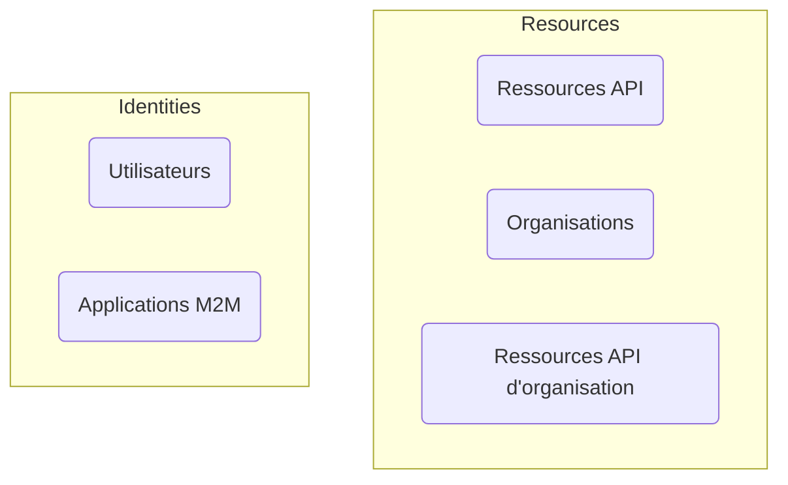

# Authentification vs. autorisation

La différence entre **l'authentification** et **l'autorisation** peut être résumée comme suit :

- **Authentification (Authentication)** répond à la question "Quelle identité possédez-vous ?"
- **Autorisation (Authorization)** répond à la question "Que pouvez-vous faire ?"

Pour une introduction complète à la gestion des identités et des accès des clients (CIAM), vous pouvez vous référer à notre série CIAM :

- [CIAM 101 : Authentification, Identité, SSO](https://blog.logto.io/ciam-101-intro-authn-sso/)
- [CIAM 102 : Autorisation & Contrôle d’accès basé sur les rôles (RBAC)](https://blog.logto.io/ciam-102-authz-and-rbac/)

## Authentification \{#authentication}

Logto prend en charge diverses méthodes d'authentification interactives et non interactives, par exemple :

- **Expérience de connexion** : Le processus d'authentification pour les utilisateurs finaux.
- **Authentification machine à machine (M2M)** : Le processus d'authentification pour les services ou les applications.

L'objectif ultime de l'authentification est extrêmement simple : vérifier et obtenir l'identifiant unique de l'entité (dans Logto, un utilisateur ou une application).

## Autorisation \{#authorization}

Dans Logto, l'autorisation est effectuée via le contrôle d’accès basé sur les rôles (RBAC). Cela vous donne un contrôle complet pour gérer l'accès de vos utilisateurs ou applications M2M aux éléments suivants :

- **Ressources API** : Une entité globale représentée par un URI absolu.
- **Organisations** : Un groupe d'utilisateurs ou d'applications.
- **Ressources API d'organisation** : Une ressource API qui appartient à une organisation.

Pour en savoir plus sur ces concepts, vous pouvez vous référer aux ressources suivantes :

- [Contrôle d’accès basé sur les rôles (RBAC)](/authorization/role-based-access-control)
- [Organisations (Multi-tenancy)](/organizations)

Voici une représentation visuelle de la relation entre ces concepts :

En résumé, l'autorisation consiste à définir les règles qui déterminent quelles entités du groupe "Identités" peuvent accéder aux entités du groupe "Resources".

## Questions fréquemment posées \{#frequently-asked-questions}

### Je dois spécifier quels utilisateurs peuvent se connecter à une application \{#i-need-to-specify-which-users-can-sign-in-to-an-application}

En raison de la nature de l'authentification unique (SSO), Logto ne prend actuellement pas en charge l'utilisation des applications en tant que ressources. Au lieu de cela, vous pouvez définir des ressources API et des permissions pour contrôler l'accès à vos ressources.

### Je veux que mes utilisateurs se connectent à une organisation \{#i-need-my-users-to-sign-in-to-an-organization}

Comme mentionné précédemment, l'authentification implique la vérification de l'identité d'une entité, tandis que le contrôle d'accès est géré par l'autorisation. Par conséquent :

- Déterminer à quelle(s) organisation(s) un utilisateur appartient est une question d'autorisation.
- Le processus de connexion est une question d'authentification.

Cela signifie qu'il n'y a pas de concept de "connexion à une organisation" dans Logto. Une fois qu'un utilisateur est authentifié, il peut être autorisé à accéder à toutes les ressources (y compris les ressources d'organisation) en fonction des permissions définies.

Ce modèle est efficace et clair, car il sépare les préoccupations de l'authentification et de l'autorisation. Toutes les applications SaaS modernes, telles que GitHub et Notion, suivent ce modèle.

Cependant, il existe certains cas où vous devez établir des correspondances 1-1 entre les sources d'utilisateurs et les organisations. Dans ce cas, [SSO d’entreprise](/end-user-flows/enterprise-sso) et [approvisionnement Just-in-Time (JIT) d'organisation](/organizations/just-in-time-provisioning) peuvent être utiles.

### Nos clients ont besoin d'une personnalisation de marque pour leurs pages de connexion \{#our-customers-need-custom-branding-for-their-sign-in-pages}

Veuillez consulter [personnalisation spécifique à l'application](/customization/match-your-brand/#app-specific-branding) et [personnalisation spécifique à l'organisation](/customization/match-your-brand/#organization-specific-branding) pour les configurations associées.
