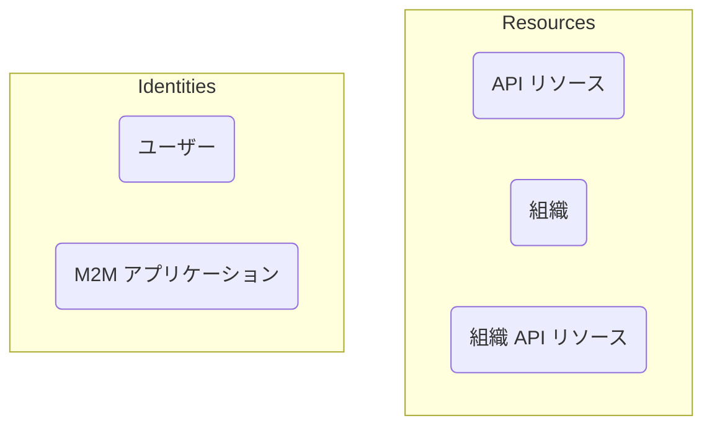

# 認証 (Authentication) と認可 (Authorization)

**認証 (Authentication)** と **認可 (Authorization)** の違いは次のように要約できます：

- **認証 (Authentication)** は「どのアイデンティティを所有していますか？」という質問に答えます。
- **認可 (Authorization)** は「何ができますか？」という質問に答えます。

完全な顧客アイデンティティとアクセス管理 (CIAM) の紹介については、CIAM シリーズを参照できます：

- [CIAM 101: 認証 (Authentication)、アイデンティティ、シングルサインオン (SSO)](https://blog.logto.io/ciam-101-intro-authn-sso/)
- [CIAM 102: 認可 (Authorization) とロールベースのアクセス制御 (RBAC)](https://blog.logto.io/ciam-102-authz-and-rbac/)

## 認証 (Authentication) \{#authentication}

Logto は、さまざまなインタラクティブおよび非インタラクティブな認証 (Authentication) 方法をサポートしています。例えば：

- **サインイン体験**：エンドユーザーのための認証 (Authentication) プロセス。
- **マシン間通信 (M2M) 認証 (Authentication)**：サービスまたはアプリケーションのための認証 (Authentication) プロセス。

認証 (Authentication) の究極の目標は非常にシンプルです：エンティティ（Logto ではユーザーまたはアプリケーション）の一意の識別子を確認し取得することです。

## 認可 (Authorization) \{#authorization}

Logto では、認可 (Authorization) はロールベースのアクセス制御 (RBAC) を通じて行われます。これにより、次のアクセスを管理するための完全なコントロールが可能になります：

- **API リソース**：絶対 URI で表されるグローバルエンティティ。
- **組織 (Organizations)**：ユーザーまたはアプリケーションのグループ。
- **組織 API リソース**：組織に属する API リソース。

これらの概念について詳しく知るには、次のリソースを参照してください：

- [ロールベースのアクセス制御 (RBAC)](/authorization/role-based-access-control)
- [組織 (マルチテナンシー)](/organizations)

これらの概念間の関係を視覚的に表現したものがこちらです：

要するに、認可 (Authorization) は「Identities」グループのエンティティが「Resources」グループのエンティティにアクセスできるかどうかを決定するルールを定義することです。

## よくある質問 \{#frequently-asked-questions}

### アプリケーションにサインインできるユーザーを指定する必要があります \{#i-need-to-specify-which-users-can-sign-in-to-an-application}

シングルサインオン (SSO) の性質上、Logto は現在、アプリケーションをリソースとして使用することをサポートしていません。代わりに、API リソースと権限を定義してリソースへのアクセスを制御できます。

### ユーザーが組織にサインインする必要があります \{#i-need-my-users-to-sign-in-to-an-organization}

前述のように、認証 (Authentication) はエンティティのアイデンティティを確認することであり、アクセス制御は認可 (Authorization) によって処理されます。したがって：

- ユーザーがどの組織に属しているかを決定することは、認可 (Authorization) の問題です。
- サインインプロセスは、認証 (Authentication) の問題です。

これは、Logto には「組織にサインインする」という概念がないことを意味します。ユーザーが認証 (Authentication) されると、定義された権限に基づいてすべてのリソース（組織リソースを含む）にアクセスする権限が与えられます。

このモデルは、認証 (Authentication) と認可 (Authorization) の問題を分離するため、効率的で明確です。GitHub や Notion などのすべての最新の SaaS アプリケーションは、このモデルに従っています。

ただし、ユーザーソースと組織の間に 1 対 1 のマッピングを確立する必要がある場合もあります。この場合、[エンタープライズシングルサインオン (SSO)](/end-user-flows/enterprise-sso) と [組織のジャストインタイム (JIT) プロビジョニング](/organizations/just-in-time-provisioning) が役立ちます。

### 顧客はサインインページにカスタムブランディングを必要としています \{#our-customers-need-custom-branding-for-their-sign-in-pages}

関連する設定については、[アプリ固有のブランディング](/customization/match-your-brand/#app-specific-branding) と [組織固有のブランディング](/customization/match-your-brand/#organization-specific-branding) を確認してください。
