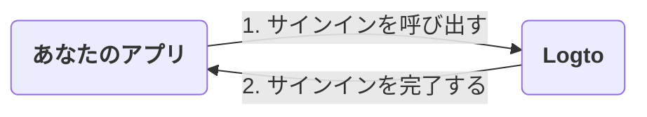
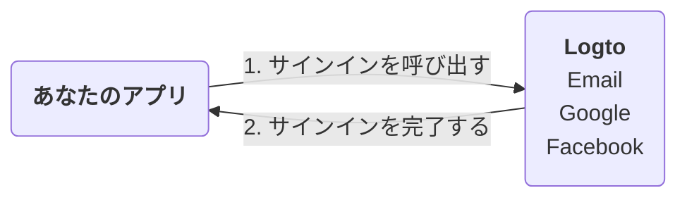
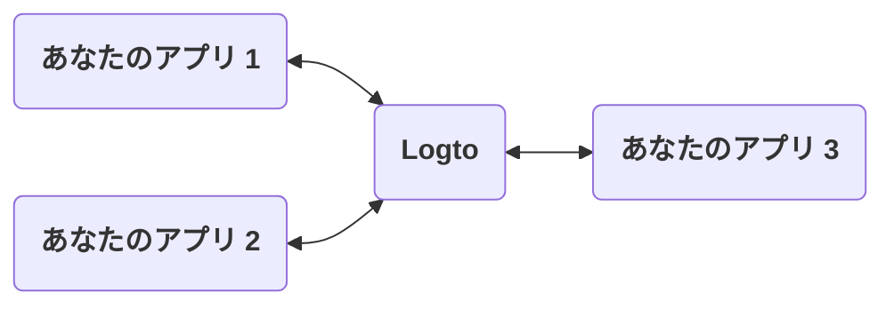
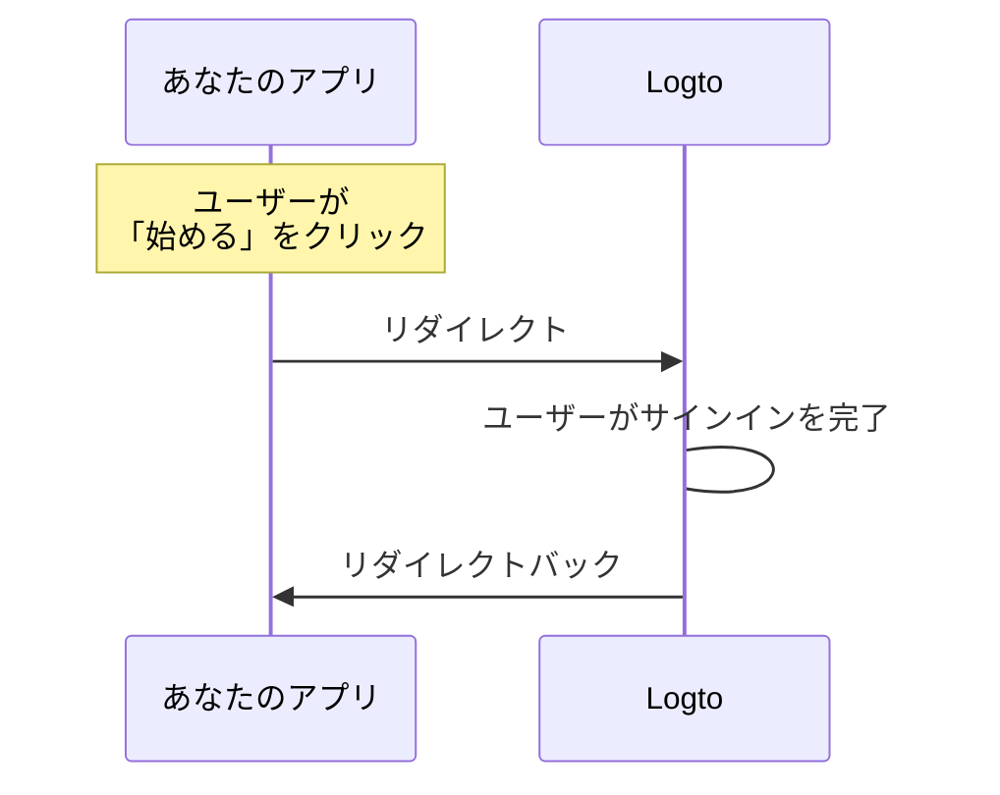
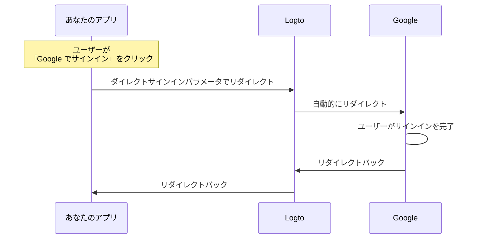

# サインイン体験の説明

このページでは、Logto におけるサインイン体験とその設計理由について説明します。

## はじめに \{#introduction}

サインイン体験は、Logto におけるユーザー認証 (Authentication) プロセスです。このプロセスは次のように簡略化できます：



1. あなたのアプリがサインインメソッドを呼び出します。
2. ユーザーは Logto のサインインページにリダイレクトされます。ネイティブアプリの場合、システムブラウザが開かれます。
3. ユーザーがサインインし、あなたのアプリにリダイレクトされます（Logto で「リダイレクト URI」として設定されています）。

プロセスはシンプルですが、リダイレクト部分が時には過剰に見えることがあります。しかし、多くの点で有益で安全です。以下のセクションでその理由を説明します。

## なぜリダイレクトするのか？ \{#why-redirect}

### 柔軟性 \{#flexibility}

リダイレクトにより、認証 (Authentication) プロセスをアプリから分離できます。ビジネスが成長しても、アプリを変更せずに同じ認証 (Authentication) プロセスを維持できます。例えば、多要素認証 (MFA) を追加したり、サインイン方法を変更したりすることができます。



### 複数アプリのサポート \{#multi-app-support}

複数のアプリがある場合、ユーザーは一度サインインすれば、再度サインインすることなくすべてのアプリにアクセスできます。これは、SaaS ビジネスや複数のサービスを持つ企業に特に有用です。



### ネイティブアプリ \{#native-apps}

ネイティブアプリの場合、システムブラウザへのリダイレクトはユーザーを認証 (Authentication) するための安全な方法であり、iOS と Android の両方で組み込みサポートがあります。

- **iOS**：Apple は安全な認証 (Authentication) のために [ASWebAuthenticationSession](https://developer.apple.com/documentation/authenticationservices/aswebauthenticationsession) を提供しています。
- **Android**：Google はシームレスな体験のために [Custom Tabs](https://developer.chrome.com/docs/android/custom-tabs) を提供しています。

### セキュリティ \{#security}

内部的には、Logto は [OpenID Connect (OIDC)](https://openid.net/specs/openid-connect-core-1_0.html) プロバイダーです。OIDC はユーザー認証 (Authentication) のための広く採用されている標準です。

Logto は、[PKCE](https://tools.ietf.org/html/rfc7636) などの厳格なセキュリティ対策を強制し、インプリシットフローのような安全でないフローを無効にしています。リダイレクトはユーザーを認証 (Authentication) するための安全な方法であり、多くの一般的な攻撃を防ぐことができます。

## アプリにサインインコンポーネントを表示する必要がある場合は？ \{#what-if-i-need-to-show-some-sign-in-components-in-my-app}

時には、アプリ内に「Google でサインイン」ボタンのようなサインインコンポーネントを表示したい場合があります。これは、Logto の「ダイレクトサインイン」機能を使用することで実現できます。

### どのように機能するのか？ \{#how-does-it-work}

アプリに「始める」と「Google でサインイン」の 2 つのコールトゥアクションボタンがあるとします。これらのボタンは次のように設計されています：

- 「始める」：通常のサインインページにリダイレクトします。
- 「Google でサインイン」：Google のサインインページにリダイレクトします。

どちらのアクションもサインインプロセスを完了し、アプリにリダイレクトする必要があります。

---

#### 「始める」をクリックした場合のプロセス \{#process-of-clicking-get-started}

この場合、サインイン体験はデフォルトと同じです。ユーザーは Logto のサインインページにリダイレクトされ、その後アプリに戻ります。



:::note
Logto でソーシャルサインイン方法（例：Google、Facebook）を設定している場合、ユーザーは対応するサインインページにリダイレクトされることがあります。図では、簡潔さのために一般的なフローのみを示しています。
:::

---

#### 「Google でサインイン」をクリックした場合のプロセス \{#process-of-clicking-sign-in-with-google}

この場合、ユーザーは Logto のサインインページと対話することなく、自動的に Google のサインインページにリダイレクトされます。この自動リダイレクトの速度はほぼ瞬時で、ユーザーはリダイレクトに気付かないかもしれません。



---

要するに、ダイレクトサインイン機能は、セキュリティレベルを変更せずにサインイン体験の一部の操作を自動化する方法です。

### アプリでダイレクトサインインを使用する \{#use-direct-sign-in-in-your-app}

ダイレクトサインインを使用するには、サインインメソッドを呼び出す際に `direct_sign_in` パラメータを渡す必要があります。この値は、Logto が認識する特定の形式で構成されている必要があります。例えば、Google でサインインするには、値は `social:google` である必要があります。

Logto の公式 SDK の一部には、ダイレクトサインイン用の専用オプションがあります。以下は、`@logto/client` JavaScript SDK でダイレクトサインインを使用する例です：

```ts
client.signIn({
  redirectUri: 'https://some-redirect-uri',
  directSignIn: { method: 'social', target: 'google' },
});
```

詳細については、[ダイレクトサインイン](/end-user-flows/authentication-parameters/direct-sign-in) を参照してください。

:::info
この機能は、すべての Logto 公式 SDK で段階的に展開されています。SDK にこの機能が見当たらない場合は、お気軽にお問い合わせください。
:::

## ユーザーにアプリ内で資格情報を入力させる必要がある場合 \{#i-need-my-users-to-fill-in-their-credentials-in-my-app}

ユーザーにアプリ内で直接資格情報（メールやパスワードなど）を入力させる必要がある場合、現時点ではお手伝いできません。歴史的には「リソースオーナーパスワード資格情報」グラントがありましたが、現在では安全でないとされ、[OAuth 2.1 で正式に廃止されました](https://datatracker.ietf.org/doc/html/draft-ietf-oauth-security-topics#name-resource-owner-password-cre)。

ROPC グラントタイプのセキュリティリスクについて詳しく知るには、ブログ記事 [ROPC グラントタイプを廃止すべき理由](https://blog.logto.io/deprecated-ropc-grant-type/) をご覧ください。

## 関連リソース \{#related-resources}

<Url href="https://blog.logto.io/oauth-2-1/">OAuth 2.1 が登場：知っておくべきこと</Url>
<Url href="https://blog.logto.io/how-pkce-protects-the-authorization-code-flow-for-native-apps">
  PKCE とは何か：基本概念から深い理解まで
</Url>
