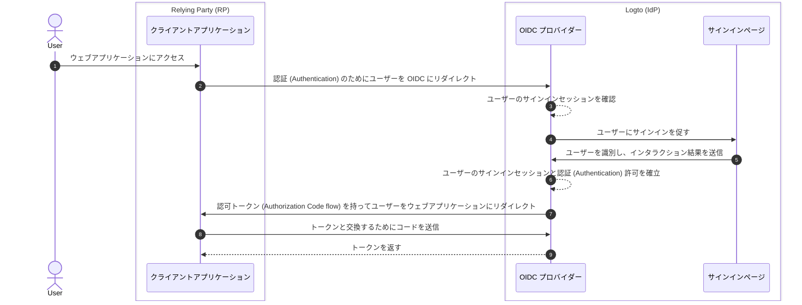

# サインアウト

Logto におけるサインアウトプロセスは、OIDC ベースのアイデンティティプロバイダーとして、Logto によって管理される集中型のサインインセッションと、クライアントアプリケーションによって管理される分散型の認証 (Authentication) 状態の両方が関与するため、多面的な概念です。

## サインインセッション \{#sign-in-session}

サインアウトプロセスをよりよく理解するためには、まず Logto におけるユーザーのサインインセッションとその認証 (Authentication) 状態がどのように管理されているかを理解することが重要です。



1. ユーザーがウェブアプリケーション (RP) にアクセスします。
2. クライアントアプリケーションは、[認証 (Authentication)](https://auth.wiki/authentication) のためにユーザーを Logto (IdP) にリダイレクトします。
3. OIDC プロバイダーはユーザーのサインインセッションの状態を確認します。セッションが存在しないか、セッションが期限切れの場合、ユーザーにサインインを促します。
4. ユーザーはサインインページとインタラクションして認証 (Authentication) されます。
5. サインインが成功すると、Logto はユーザーのために新しいセッションを作成し、認可コードを持ってクライアントアプリケーションにリダイレクトします。
6. OIDC プロバイダーはユーザーのために新しいサインインセッションと認証 (Authentication) 許可を作成します。
7. OIDC プロバイダーは認可コード ([Authorization Code flow](https://auth.wiki/authorization-code-flow)) を持ってユーザーをクライアントにリダイレクトします。
8. クライアントは認可コードを受け取り、ユーザー情報にアクセスするためのトークンと交換します。
9. クライアントアプリケーションにトークンを付与します。

## コンポーネント \{#components}

### Logto によって管理される集中型サインインセッション \{#centralized-sign-in-session-managed-by-logto}

上記のフローでは、集中型サインインセッションは Logto によって管理されます。ユーザーが正常にサインインするとセッションが作成され、ユーザーがサインアウトするとセッションが破棄されます。ユーザーのセッションが期限切れになると、セッションも破棄されます。

Logto のサインインセッションはセッションクッキーを使用して管理されます。ユーザーがサインインするとセッションクッキーが設定されます。すべての認証 (Authentication) リクエストはセッションクッキーに対して検証されます。セッションクッキーが存在し有効であれば、ユーザーは自動的に認証 (Authentication) され、認可コードを持ってクライアントアプリケーションに直接リダイレクトされます。そうでない場合、ユーザーはサインインを促されます。

1. 共有 Logto セッションクッキー
   同じユーザーエージェント（例：ブラウザ）から複数のクライアントアプリケーションにサインインするユーザーは、Logto ドメイン下で共有セッションクッキーを持ちます。これにより、ユーザーは一度サインインするだけで、他のクライアントアプリケーションに自動的に認証 (Authentication) されます。

   ```mermaid
    flowchart TD
    subgraph User [ユーザーエージェント A]
      U[ユーザー]

      subgraph Layer1 [クライアントドメイン A]
        A[クライアントアプリケーション A]
      end

      subgraph Layer1 [クライアントドメイン B]
        B[クライアントアプリケーション B]
      end

      subgraph Layer2 [Logto ドメイン]
          C{{Logto サインインセッション?}}
          D[サインインページ]
      end
    end

    U --> |サインイン| A
    A --> |Logto にリダイレクト| C
    U --> |サインイン| B
    B --> |Logto にリダイレクト| C
    C --> |いいえ| D
    D --> |セッション作成| C
   ```

2. 分離された Logto セッションクッキー
   異なるデバイスやブラウザから異なるクライアントアプリケーションにサインインするユーザーは、Logto ドメイン下で分離されたセッションクッキーを持ちます。これにより、ユーザーは各クライアントアプリケーションごとに個別にサインインする必要があります。

   ```mermaid
    flowchart TD
    U[ユーザー]

    subgraph DeviceA [ユーザーエージェント A]
      subgraph Layer1 [クライアントドメイン A]
        A[クライアントアプリケーション A]
      end

      subgraph Layer2 [Logto ドメイン]
          C{{Logto サインインセッション?}}
          D[サインインページ]
      end
    end

    subgraph DeviceB [ユーザーエージェント B]
      subgraph Layer3 [クライアントドメイン B]
        B[クライアントアプリケーション B]
      end

      subgraph Layer4 [Logto ドメイン]
          E{{Logto サインインセッション?}}
          F[サインインページ]
      end
    end

    U --> |サインイン| A
    A --> |Logto にリダイレクト| C
    U --> |サインイン| B
    B --> |Logto にリダイレクト| E
    C --> |いいえ| D
    E --> |いいえ| F
    D --> |セッション作成| C
    F --> |セッション作成| E
   ```

## クライアントアプリケーションによって管理される分散型認証 (Authentication) 状態 \{#distributed-authentication-status-managed-by-the-client-applications}

各クライアントアプリケーションは独自の認証 (Authentication) 状態を維持します。ネイティブ、SPA、またはウェブアプリケーションのいずれであっても、すべてがユーザーの認証 (Authentication) 状態を管理する独自の方法を持っています。

サインインが成功すると、クライアントアプリケーションは [ID トークン](https://auth.wiki/id-token) と [アクセス トークン](https://auth.wiki/access-token) を受け取ることがあります。クライアントアプリケーションは ID トークンを使用してユーザーのアイデンティティを確認し、アクセス トークンを使用してユーザーのリソースにアクセスできます。ユーザーの認証 (Authentication) 状態は、アクセス トークンの有効期限によって表されます。

- ネイティブおよび SPA アプリケーション：
  クライアントアプリケーションは、これらのトークンを安全に保存し管理する必要があります。例：トークンをローカルストレージまたはセッションストレージに保存し、ユーザーがサインアウトしたときにトークンをクリアします。
- ウェブアプリケーション：
  Next.js などのフレームワークで構築されたウェブアプリは、Logto によって発行されたトークンとともにログインしたユーザーのための独自のセッションを管理することがよくあります。ユーザーがサインインし、Logto からトークンを受け取ると、SPA アプリケーションと同様にクライアント側にトークンを保存するか、サーバー側にトークンを保存し、クッキーや他のメカニズムを使用してセッションを管理することができます。

## サインアウトメカニズム \{#sign-out-mechanisms}

### クライアント側でトークンとローカルセッションをクリア \{#clear-tokens-and-local-session-at-the-client-side}

クライアント側では、単純なサインアウトはローカルセッションをクリアし、ローカルストレージまたはセッションストレージからトークン（ID トークン、アクセス トークン、リフレッシュ トークン）を削除することを含みます。これにより、クライアント側のみのサインアウトが行われ、集中型セッションはそのまま残ります。この方法でサインアウトしたユーザーは、集中型セッションが期限切れになるか積極的に破棄されるまで、同じ認可サーバーセッション下の他のアプリケーションにアクセスできる可能性があります。

### Logto でサインインセッションをクリア \{#clear-sign-in-session-at-logto}

ユーザーを明示的にサインアウトし、Logto でセッションをクリアするには、クライアントアプリケーションはユーザーを Logto の **エンドセッションエンドポイント** にリダイレクトする必要があります。

例：`https://{your-logto-domain}/oidc/session/end`

**エンドセッションエンドポイント** は、クライアントアプリケーションがユーザーがサインアウトしたことを認可サーバーに通知するための標準的な OIDC エンドポイントです。このエンドポイントは Logto で集中型サインインセッションをクリアします。

セッションがクリアされると、以降の認可リクエストではユーザーが再度サインインする必要があります。

**ポストログアウトリダイレクト URI** が提供されている場合、セッションがクリアされた後にユーザーは指定された URI にリダイレクトされます。そうでない場合、ユーザーは Logto によってホストされるデフォルトのポストログアウトページにリダイレクトされます。

## フェデレーテッドサインアウト：バックチャネルログアウト \{#federated-sign-out-back-channel-logout}

より一貫したサインアウト管理のために、Logto は [バックチャネルログアウト](https://openid.net/specs/openid-connect-backchannel-1_0-final.html) をサポートしています。バックチャネルログアウトは、ユーザーがサインアウトしたときに、同じサインインセッション下のすべてのクライアントアプリケーションに Logto が通知するメカニズムです。

これは、ユーザーがあるクライアントアプリケーションからサインアウトし、同じ Logto サインインセッション下の他のすべてのクライアントアプリケーションからもサインアウトされることを期待するシナリオで特に有用です。

クライアントアプリケーションのバックチャネルログアウトを有効にするには、Logto ダッシュボードのアプリケーション詳細ページに移動し、バックチャネルログアウト URI を登録します。ユーザーが任意のクライアントアプリケーションからサインアウトリクエストを開始すると、Logto は登録されたすべての URI にログアウトトークンを送信します。

クライアントアプリケーションがログアウトトークンにサインインセッションを含める必要がある場合、バックチャネルログアウト設定で `Is session required` 設定をオンにします。Logto でのユーザーのサインインセッションを識別するために、ログアウトトークンに `sid` クレームが含まれます。

1. ユーザーがあるクライアントアプリケーションからサインアウトリクエストを開始します。
2. Logto はエンドセッションリクエストを受け取り、ログアウトトークンを生成し、登録されたすべてのバックチャネルログアウト URI にログアウトトークンを送信します。
3. 各クライアントアプリケーションはログアウトトークンを受け取り、サインアウトアクションを実行します。

各クライアントアプリケーションがログアウトトークンを受け取ったときのサインアウトアクション：

- ログアウトトークンを検証します。
- ローカルセッションをクリアし、ローカルストレージまたはセッションストレージからトークンを削除します。

## Logto SDK におけるサインアウト方法 \{#sign-out-methods-in-logto-sdks}

Logto の SDK を使用してクライアントアプリケーションと統合している場合：

- SPA およびウェブアプリケーションの場合、`client.signOut()` メソッドはローカルトークンストレージをクリアし、ユーザーを Logto のエンドセッションエンドポイントにリダイレクトします。セッションがクリアされた後にユーザーをリダイレクトするための **ポストログアウトリダイレクト URI** を指定できます。
- ネイティブアプリケーション（**React Native** や **Flutter** などのハイブリッドアプリを含む）の場合、ローカルトークンストレージのみがクリアされます。これは、ネイティブアプリケーションでは、サインインプロセスを処理するためにセッションレスの WebView を使用するためです。ネイティブブラウザにはセッションクッキーが保存されないため、Logto でサインインセッションをクリアする必要はありません。各認証 (Authentication) リクエストは、セッションクッキーを持たない独立したリクエストです。

:::note
セッションレス WebView をサポートしていないネイティブアプリケーションや `emphasized` 設定を認識しないアプリケーション（**React Native** や **Flutter** SDK を使用する Android アプリ）では、認可リクエストに `prompt=login` パラメータを渡すことで、ユーザーに再度サインインを促すことができます。
:::

## よくある質問 \{#faqs}

<details>
  <summary>

### バックチャネルログアウト通知を受け取っていません。 \{#im-not-receiving-the-back-channel-logout-notifications}

</summary>

- Logto ダッシュボードでバックチャネルログアウト URI が正しく登録されていることを確認してください。
- クライアントアプリケーションに有効なアクティブなサインインセッションがあり、サインアウトリクエストを開始したセッションと同じであることを確認してください。

</details>

## 関連リソース \{#related-resources}

<Url href="https://blog.logto.io/oidc-back-channel-logout/">
  OIDC バックチャネルログアウトを理解する。
</Url>
