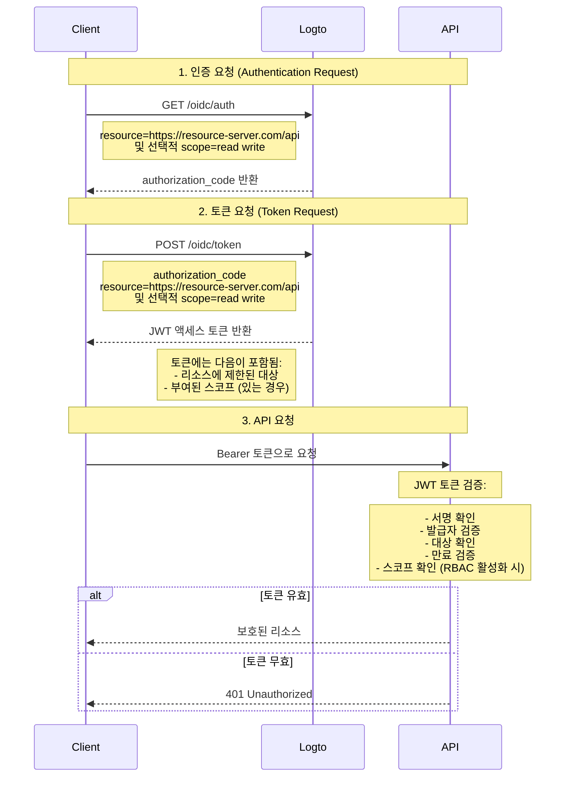

# API 보호하기

유연하고 세분화된 접근 제어 정책이 필요하지 않다면, API를 직접 보호할 수 있습니다. 우리는 시퀀스 다이어그램과 필요한 단계를 통해 앱에 접근 제어를 통합하는 방법을 안내할 것입니다.



이 튜토리얼에서

- Logto 엔드포인트: `https://tenant-id.logto.app`
- 클라이언트 애플리케이션: `https://client.example.org`
- API 리소스 서버: `https://resource-server.com/api`

구현할 때 실제 엔드포인트로 대체해야 합니다.

## 인증 요청 \{#authentication-request}

[인증 요청 (Authentication Request)](https://openid.net/specs/openid-connect-core-1_0.html#AuthRequest)에서 리소스 지표 매개변수 목록을 제공합니다. 이는 사용자가 요청할 수 있는 모든 보호된 리소스를 나타냅니다.

```bash
GET https://tenant-id.logto.app/oidc/auth?response_type=code
    &client_id=s6BhdRkqt3
    &state=tNwzQ87pC6llebpmac_IDeeq-mCR2wLDYljHUZUAWuI
    &redirect_uri=https%3A%2F%2Fclient.example.org%2Fcb
    &resource=https%3A%2F%2Fresource-server.com%2Fapi
    &scope=read%20write
```

Logto는 이러한 리소스 지표를 검증하고 저장합니다. `authorization_code`가 부여되고 지정된 리소스에 제한된 스코프와 함께 반환됩니다.

Logto SDK의 예제 구성:

```tsx
const config: LogtoConfig = {
  // ...other configs
  resources: ['https://resource-server.com/api'],
  scopes: ['read', 'write'],
};
```

## 토큰 요청 \{#token-request}

리소스 매개변수가 위에서 부여된 `authorization_code`와 함께 [토큰 요청 (Token Request)](https://openid.net/specs/openid-connect-core-1_0.html#TokenRequest)에 존재할 때, 액세스 토큰의 대상 API 리소스 대상을 지정합니다.

```bash
POST https://tenant-id.logto.app/oidc/token HTTP/1.1
Content-Type: application/x-www-form-urlencoded

grant_type=authorization_code&redirect_uri=https%3A%2F%2Fclient.example.org%2Fcb&code=10esc29BWC2qZB0acc9v8zAv9ltc2pko105tQauZ&resource=https%3A%2F%2Fresource-server.com%2Fapi
```

Logto는 이 요청된 리소스에 제한된 대상을 가진 암호화된 액세스 토큰을 부여합니다. 토큰은 요청의 인가 상태를 나타내는 데 필요한 모든 데이터를 포함합니다. 예를 들어, 요청 사용자의 아이덴티티와 역할, 토큰의 대상 및 만료 시간.

Logto SDK의 예제 코드:

```tsx
const accessToken = await logtoClient.getAccessToken('https://resource-server.com/api');
```

accessToken의 페이로드는 다음을 포함합니다:

```tsx
{
  iss: '<your-logto-endpoint>/oidc',
  aud: 'https://resource-server.com/api',
  scope: 'read write'
}
```

## API 리소스에 대한 요청 \{#request-to-the-api-resource}

클라이언트 사용자는 Authorization 헤더에 주어진 `access_token`을 제시하여 API 리소스에 요청을 보냅니다.

```bash
GET https://resource-server.com/api/users
Authorization: Bearer eyJhbGciOiJIUz...
```

Logto는 표준 토큰 기반 인가 프로토콜을 따라 API 리소스를 보호합니다. OAuth 2.0에 대해 더 알고 싶다면, OAuth 2.0의 [공식 문서](https://datatracker.ietf.org/doc/html/rfc6749#section-1.3.1)를 참조하세요.

## API 요청에 대한 인가 토큰 검증 \{#validate-authorization-tokens-for-api-requests}

Logto는 각 인가된 API 요청에 대해 표준 [JWT](https://datatracker.ietf.org/doc/html/rfc7519) 형식의 인가 토큰을 발급합니다. 토큰은 [JWS](https://datatracker.ietf.org/doc/html/rfc7515) 토큰으로 암호화되고 서명됩니다.

#### JWS 토큰 이해하기 \{#understanding-jws-token}

인코딩된 [JWS](https://datatracker.ietf.org/doc/html/rfc7515) 토큰은 세 부분으로 구성됩니다:

- JOSE 헤더: 코드 유형 및 인코딩 알고리즘 선언
- JWS 페이로드: 모든 토큰의 클레임 포함
- JWS 서명: [JWK](https://datatracker.ietf.org/doc/html/rfc7517)로 서명된 서명

Logto가 발급한 JWS 페이로드의 표준 스키마: (클레임은 사용자 정의 OIDC 구성에 따라 다를 수 있음)

| key       | description              |
| --------- | ------------------------ |
| jti       | 고유한 JWT ID            |
| sub       | 주체, 일반적으로 user-id |
| iat       | 토큰 발행 시각           |
| exp       | 토큰 만료 시각           |
| client_id | 애플리케이션 ID          |
| iss       | 토큰 발급자 아이덴티티   |
| aud       | 토큰의 대상              |
| scope     | 토큰의 스코프 (권한)     |

:::note

개발을 위해 JWT 토큰을 시각적으로 검사하려면, [JWT Decoder tool](https://www.jstoolset.com/jwt)을 방문하여 받은 토큰을 디코드하고 확인할 수 있습니다. 프로덕션 환경의 토큰은 주의하거나 절대 사용하지 마세요. 이는 제3자가 제공하는 공개 온라인 서비스이므로, 토큰이 노출될 수 있습니다.

:::

#### 인가 토큰 검증하기 \{#validate-the-authorization-token}

1. [JWT 검증](https://datatracker.ietf.org/doc/html/rfc7519#section-7.2)
2. [JWS 서명 검증](https://datatracker.ietf.org/doc/html/rfc7515#section-5.2)
3. 토큰의 발급자는 `https://<your-logto-domain>/oidc` (Logto 인증 서버에서 발급)
4. 토큰의 대상은 Logto 관리 콘솔에 등록된 현재 수신자의 리소스 지표와 동일
5. 토큰이 만료 시간 내에 있음
6. ([RBAC](/authorization/role-based-access-control/protect-api-resources-with-rbac)만 해당) 토큰에 원하는 `scope`가 있음

다양한 오픈 소스 라이브러리와 패키지가 JWT 토큰을 쉽게 검증하고 디코드하는 데 도움을 줄 수 있습니다. 사용하는 언어와 프레임워크에 따라 하나를 선택하여 백엔드 애플리케이션에 통합할 수 있습니다. 다음은 우리가 제공하는 몇 가지 예제입니다:

- [Node (Express)](/authorization/api-resources/node-express)
- [Spring Boot](/authorization/api-resources/spring-boot)
- [Python](/authorization/api-resources/python)

## 참고 자료 \{#reference}

Logto는 코드 기반 OAuth 2.0 인가 프로토콜을 사용하여 API 요청을 안전하게 만듭니다. 그 뒤의 전략에 관심이 있다면, OAuth 2.0의 [명세](https://datatracker.ietf.org/doc/html/rfc6749#section-1.3.1)를 참조하여 자세한 내용을 확인하세요.

## 자주 묻는 질문 \{#faqs}

<details>

<summary>

### 클라이언트를 구축하지 않고 클라이언트 측, Logto 및 서버 측 상호작용을 테스트하는 방법 \{#how-to-test-the-client-side-logto-and-server-side-interaction-without-building-the-client}

</summary>

클라이언트를 구축할 필요 없이 이 과정을 자동화할 수 있습니다. 한 가지 옵션은 개인 액세스 토큰 (PAT)을 사용하는 것입니다. PAT는 특정 사용자를 나타내어 클라이언트 측 인증을 시뮬레이션할 수 있으며, 다양한 역할과 권한을 가질 수 있습니다. 이를 통해 완전히 구축된 클라이언트가 필요 없이 서버 측 로직, 예를 들어 액세스 토큰 또는 JWT 검증을 테스트할 수 있습니다. 시작하려면 [개인 액세스 토큰](/user-management/personal-access-token)을 참조하세요.

</details>
