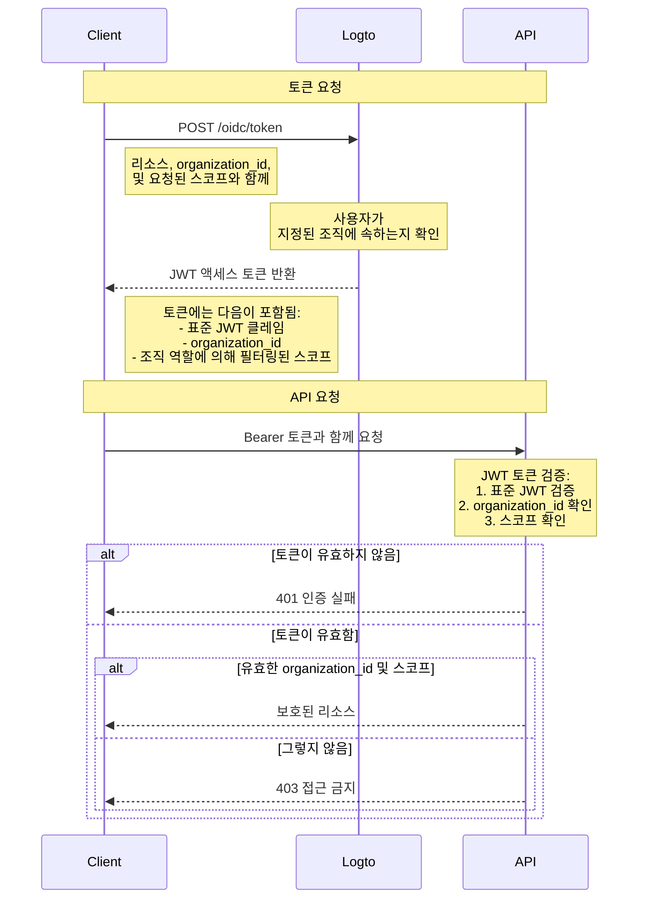

# 조직 템플릿으로 API 리소스 보호하기

유효한 JWT가 존재하는지 확인하여 리소스를 보호하는 [API 보호하기](/authorization/api-resources/protect-your-api) 외에도, 조직 역할을 적용하여 스코프를 필터링할 수 있습니다. 이 글에서는 조직 역할이 인증 (Authentication) 흐름에서 스코프 위임 및 검증에 어떻게 영향을 미치는지에 중점을 두겠습니다.



## 추가적인 `organization_id` 매개변수 \{#the-additional-organization_id-parameter}

일반적인 액세스 토큰 부여 요청 외에도, 다이어그램에서는 추가적인 `organization_id` 매개변수를 추가하여 Logto가 특정 조직의 역할로 스코프를 좁히도록 합니다.

## 클라이언트 설정 \{#client-setup}

Logto의 SDK를 사용하는 경우, `getAccessToken` 메서드의 두 번째 매개변수로 `organization_id`를 추가할 수 있습니다.

```tsx
const accessToken = await logto.getAccessToken('https://my-resource.com/api', 'org_1');

// 또는 클레임을 직접 가져오기
const accessTokenClaims = await logto.getAccessTokenClaims('https://my-resource.com/api', 'org_1');
console.log(accessTokenClaims.organization_id); // 'org_1'
console.log(accessTokenClaims.aud); // 'https://my-resource.com/api'
```

그러면 이 조직의 역할에서 상속된 스코프만 액세스 토큰에 포함되며, 추가적인 클레임 `organization_id`도 포함됩니다.

## API 서버 검증 \{#api-server-validation}

일반적인 JWT 액세스 토큰 검증 외에도, `organization_id`가 존재하고 유효한지 확인하는 추가 단계를 추가해야 합니다.
