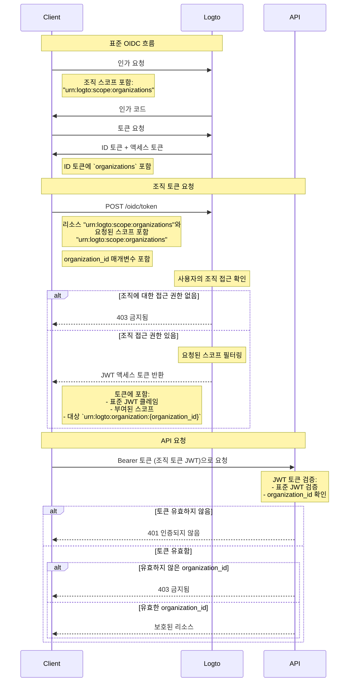

import TabItem from '@theme/TabItem';
import Tabs from '@theme/Tabs';

# 조직 리소스 보호하기

API를 리소스로 사용하는 [API 보호하기](/authorization/api-resources/protect-your-api) 외에도, 조직도 리소스가 될 수 있으며, 동일한 방식으로 조직 리소스를 보호할 수 있습니다. 이 글에서는 조직 리소스를 보호하는 방법에 대해 집중적으로 다루겠습니다.



## 1단계: OIDC 흐름에서 조직 ID 가져오기 \{#step-1-get-organization-ids-from-oidc-flow}

Logto는 표준 [OpenID Connect](https://openid.net/specs/openid-connect-core-1_0.html) 프로토콜을 확장하여 앱이 사용자로부터 조직 정보를 얻을 수 있도록 합니다. 이를 수행하는 방법은 두 가지가 있습니다:

- Organizations 지원이 있는 Logto SDK를 사용하는 경우, `urn:logto:scope:organizations` 스코프를 구성 객체의 `scopes` 매개변수에 추가할 수 있습니다. 일반적으로 SDK에는 이 스코프에 대한 열거형이 있으며, 예를 들어 [Logto JS SDKs](https://github.com/logto-io/js)에서는 `UserScope.Organizations`입니다.

<Tabs groupId="sdk">

  <TabItem value="js" label="JavaScript">

```ts
import { LogtoClient, UserScope } from '@logto/browser'; // 또는 @logto/node, @logto/client

const logto = new LogtoClient({
  // ...
  scopes: [UserScope.Organizations],
});
```

  </TabItem>
  <TabItem value="react" label="React">

```tsx
import { LogtoProvider, UserScope } from '@logto/react';

const App = () => (
  <LogtoProvider
    config={{
      // ...
      scopes: [UserScope.Organizations],
    }}
  >
    {/* ... */}
  </LogtoProvider>
);
```

  </TabItem>
  <TabItem value="python" label="Python">

```python
from logto import UserInfoScope

client = LogtoClient(
    LogtoConfig(
        # ...
        scopes=[UserInfoScope.organizations],
    )
)
```

  </TabItem>
  <TabItem value="php" label="PHP">

```php
use Logto\Sdk\Constants\UserScope;

$client = new LogtoClient(
  new LogtoConfig(
    // ...
    scopes: [UserScope::organizations],
  )
);
```

  </TabItem>
  <TabItem value="swift" label="Swift">

```swift
import Logto
import LogtoClient

let config = try? LogtoConfig(
    // ...
    scopes: [
        UserScope.organizations.rawValue,
    ],
    // ...
)
let client = LogtoClient(useConfig: config)
```

  </TabItem>
  <TabItem value="others" label="Others">

```ts
const config = {
  // ...
  scope: 'openid offline_access urn:logto:scope:organizations',
};
```

  </TabItem>

</Tabs>
    
- 다른 경우에는 `urn:logto:scope:organizations` 스코프를 SDK 구성 (또는 인증 요청)의 `scope` 매개변수에 추가해야 합니다.

사용자가 인증 흐름을 완료하면, `idToken`에서 조직 정보를 얻을 수 있습니다:

```tsx
// JavaScript를 예로 사용
const idToken = await logto.getIdTokenClaims();

console.log(idToken.organizations); // 조직 ID의 문자열 배열
```

`organizations` 필드 (클레임)는 [UserInfo 엔드포인트](https://openid.net/specs/openid-connect-core-1_0.html#UserInfo) 응답에도 포함됩니다.

### 선택 사항: 조직 역할 가져오기 \{#optional-get-organization-roles}

아직 조직 역할을 설정하지 않았다면, [이 섹션](/authorization/organization-template/configure-organization-template/#create-organization-role)을 참조하세요.

현재 사용자의 모든 조직 역할을 얻으려면:

- Organizations 지원이 있는 Logto SDK를 사용하는 경우, `urn:logto:scope:organization_roles` 스코프를 구성 객체의 `scopes` 매개변수에 추가할 수 있습니다. 일반적으로 SDK에는 이 스코프에 대한 열거형이 있으며, 예를 들어 [Logto JS SDKs](https://github.com/logto-io/js)에서는 `UserScope.OrganizationRoles`입니다.
- 다른 경우에는 `urn:logto:scope:organization_roles` 스코프를 SDK 구성 (또는 인증 요청)의 `scope` 매개변수에 추가해야 합니다.

그런 다음 `idToken`에서 조직 역할을 얻을 수 있습니다:

```tsx
// JavaScript를 예로 사용
const idToken = await logto.getIdTokenClaims();

console.log(idToken.organization_roles); // 조직 역할의 문자열 배열
```

배열의 각 문자열은 `organization_id:role_id` 형식입니다. 예를 들어, `org_123:admin`은 사용자가 ID `org_123`인 조직에서 `admin` 역할을 가지고 있음을 의미합니다.

`organization_roles` 필드 (클레임)는 [UserInfo 엔드포인트](https://openid.net/specs/openid-connect-core-1_0.html#UserInfo) 응답에도 포함됩니다.

## 2단계. 조직 토큰 가져오기 \{#step-2-fetch-organization-token}

조직의 컨텍스트에서 작업을 수행하려면, 사용자는 해당 조직에 대한 액세스 토큰 (조직 토큰)을 부여받아야 합니다. 조직 토큰은 조직 ID와 조직 내 사용자의 권한 (스코프)을 포함하는 JWT 토큰입니다.

### 인증 요청에 매개변수 추가하기 \{#add-parameters-to-the-authentication-request}

- Organizations 지원이 있는 Logto SDK를 사용하는 경우, [현재 사용자의 조직 ID 가져오기](/authorization/organization-template/protect-organization-resources/#step-1-get-organization-ids-from-oidc-flow)와 동일한 방식으로 구성 객체의 `scopes` 매개변수에 `urn:logto:scope:organizations` 스코프를 추가할 수 있습니다.
  - Organizations 지원이 있는 Logto SDK는 나머지 구성을 자동으로 처리합니다.
- 다른 경우에는 `offline_access` 및 `urn:logto:scope:organizations` 스코프를 `scope` 매개변수에 추가하고, `urn:logto:resource:organizations` 리소스를 SDK 구성 (또는 인증 요청)의 `resource` 매개변수에 추가해야 합니다.
  - 참고: `offline_access`는 조직 토큰을 가져오는 데 사용할 수 있는 `refresh_token`을 얻기 위해 필요합니다.

```tsx
// 다른 경우에만 해당. Logto SDK의 경우 위를 참조하세요.
const config = {
  // ...
  scope: 'openid offline_access urn:logto:scope:organizations',
  resource: 'urn:logto:resource:organizations',
};
```

:::note

`urn:logto:resource:organizations` 리소스는 조직 템플릿을 나타내는 특별한 리소스입니다.

:::

### 조직 토큰 가져오기 \{#fetch-the-organization-token}

Logto는 표준 `refresh_token` grant 유형을 확장하여 앱이 조직 토큰을 가져올 수 있도록 합니다.

- Organizations 지원이 있는 Logto SDK를 사용하는 경우, SDK의 `getOrganizationToken()` 메서드 (또는 `getOrganizationTokenClaims()` 메서드)를 호출할 수 있습니다.
- 다른 경우에는 다음 매개변수를 사용하여 토큰 엔드포인트를 호출해야 합니다:
  - `grant_type`: `refresh_token`.
  - `client_id`: 사용자가 인증에 사용한 앱 ID.
  - `refresh_token`: 인증 흐름에서 얻은 `refresh_token`.
  - `organization_id`: 토큰을 얻고자 하는 조직의 ID.
  - `scope` (선택 사항): 조직 내 사용자에게 부여할 스코프. 지정하지 않으면, 인가 서버는 인증 흐름과 동일한 스코프를 부여하려고 시도합니다.

<Tabs groupId="sdk">

  <TabItem value="js" label="JavaScript">

```ts
const token = await logto.getOrganizationToken('<organization-id>');
```

  </TabItem>
  <TabItem value="react" label="React">

```tsx
const App = () => {
  const { getOrganizationToken } = useLogto();

  const getToken = async () => {
    const token = await getOrganizationToken('<organization-id>');
  };

  return <button onClick={getToken}>Get organization token</button>;
};
```

  </TabItem>
  <TabItem value="python" label="Python">

```python
token = await client.getOrganizationToken("<organization-id>")
# 또는
claims = await client.getOrganizationTokenClaims("<organization-id>")
```

  </TabItem>
  <TabItem value="php" label="PHP">

```php
$token = $client->getOrganizationToken('<organization-id>');
// 또는
$claims = $client->getOrganizationTokenClaims('<organization-id>');
```

  </TabItem>
  <TabItem value="swift" label="Swift">

```swift
let token = try await client.getOrganizationToken(forId: "<organization-id>")
```

  </TabItem>
  <TabItem value="others" label="Others">

```ts
// JavaScript를 예로 사용

const params = new URLSearchParams();

params.append('grant_type', 'refresh_token');
params.append('client_id', 'YOUR_CLIENT_ID');
params.append('refresh_token', 'REFRESH_TOKEN');
params.append('organization_id', 'org_123');

const response = await fetch('https://YOUR_LOGTO_ENDPOINT/oidc/token', {
  method: 'POST',
  headers: {
    'Content-Type': 'application/x-www-form-urlencoded',
  },
  body: params,
});
```

  </TabItem>

</Tabs>

응답은 [표준 토큰 엔드포인트](https://openid.net/specs/openid-connect-core-1_0.html#TokenEndpoint)와 동일한 형식으로 제공되며, `access_token`은 JWT 형식의 조직 토큰입니다.

일반적인 액세스 토큰의 클레임 외에도, 조직 토큰에는 다음과 같은 클레임이 포함됩니다:

- `aud`: 조직 토큰의 대상은 `urn:logto:organization:{organization_id}`입니다.
- `scope`: 조직 내 사용자에게 부여된 스코프, 공백으로 구분됩니다.

### 예시 \{#example}

좋은 예시는 천 마디 말보다 낫습니다. 우리의 조직 템플릿이 다음과 같이 설정되어 있다고 가정해 봅시다:

- 권한: `read:logs`, `write:logs`, `read:users`, `write:users`.
- 역할: `admin`, `member`.
  - `admin` 역할은 모든 권한을 가집니다.
  - `member` 역할은 `read:logs` 및 `read:users` 권한을 가집니다.

그리고 사용자는 다음과 같이 설정되어 있습니다:

- 조직 ID: `org_1`, `org_2`.
- 조직 역할: `org_1:admin`, `org_2:member`.

Logto SDK 구성 (또는 인증 요청)에서 다른 것들을 적절히 설정하고, 다음 스코프를 추가했습니다:

- `urn:logto:scope:organizations`
- `openid`
- `offline_access`
- `read:logs`
- `write:logs`

이제 사용자가 인증 흐름을 완료하면, `idToken`에서 조직 ID를 얻을 수 있습니다:

```tsx
// JavaScript를 예로 사용
const idToken = await logto.getIdTokenClaims();

console.log(idToken.organizations); // ['org_1', 'org_2']
```

조직 토큰을 얻고 싶다면:

```tsx
// JavaScript를 예로 사용
const org1Token = await logto.getOrganizationTokenClaims('org_1');
const org2Token = await logto.getOrganizationTokenClaims('org_2');

console.log(org1Token.aud); // 'urn:logto:organization:org_1'
console.log(org1Token.scope); // 'read:logs write:logs'
console.log(org2Token.aud); // 'urn:logto:organization:org_2'
console.log(org2Token.scope); // 'read:logs'

const org3Token = await logto.getOrganizationTokenClaims('org_3'); // 오류: 사용자가 조직의 멤버가 아님
```

설명:

- `org_1`의 경우, 사용자는 `admin` 역할을 가지고 있으므로 조직 토큰은 모든 사용 가능한 권한 (스코프)을 가져야 합니다.
- `org_2`의 경우, 사용자는 `member` 역할을 가지고 있으므로 조직 토큰은 `read:logs` 및 `read:users` 권한 (스코프)을 가져야 합니다.

인증 흐름에서 `read:logs` 및 `write:logs` 스코프만 요청했기 때문에, 조직 토큰은 요청된 스코프와 사용 가능한 스코프의 교차점에 따라 "다운스코프"되었습니다.

### 기계 간 애플리케이션을 위한 조직 토큰 가져오기 \{#fetch-organization-token-for-a-machine-to-machine-application}

사용자를 위한 조직 토큰을 가져오는 것과 유사하게, 기계 간 애플리케이션을 위한 조직 토큰도 가져올 수 있습니다. 유일한 차이점은 `refresh_token` grant 유형 대신 `client_credentials` grant 유형을 사용해야 한다는 것입니다.

기계 간 애플리케이션에 대해 더 알아보려면, [기계 간: Logto로 인증하기](/quick-starts/m2m/)를 참조하세요.

## 3단계. 조직 토큰 검증하기 \{#step-3-verify-organization-tokens}

앱이 조직 토큰을 얻으면, 일반 액세스 토큰과 동일한 방식으로 토큰을 사용할 수 있습니다. 예를 들어, `Authorization` 헤더에 `Bearer {token}` 형식으로 토큰을 포함하여 API를 호출할 수 있습니다.

API에서 조직 토큰을 검증하는 방법은 [API 보호하기](/authorization/api-resources/protect-your-api/#validate-authorization-tokens-for-api-requests)와 매우 유사합니다. 주요 차이점:

- API 리소스에 대한 액세스 토큰과 달리, 사용자가 조직의 멤버가 아닌 경우 조직 토큰을 얻을 수 없습니다.
- 조직 토큰의 대상은 `urn:logto:organization:{organization_id}`입니다.
- 특정 권한 (스코프)에 대해서는, 조직 토큰의 `scope` 클레임을 공백으로 구분하여 확인해야 합니다.
