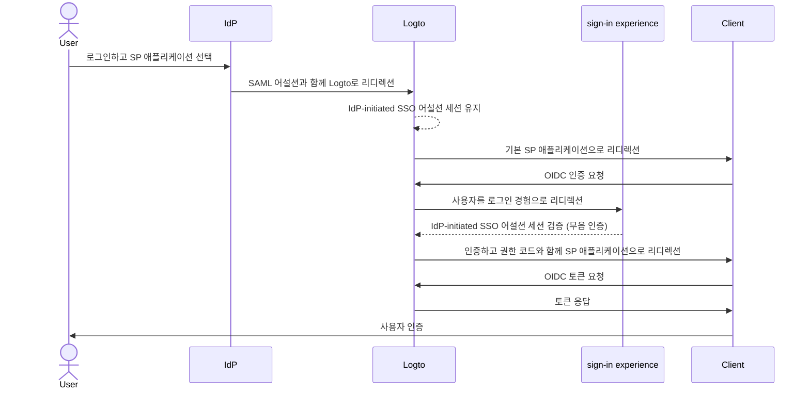
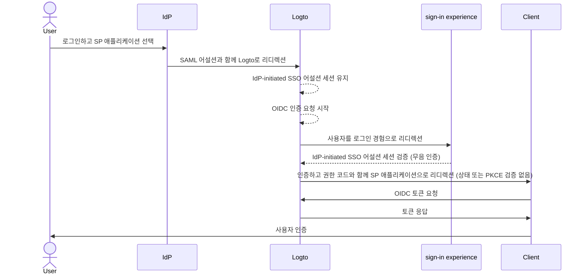

import Availability from '@components/Availability';

<Availability cloud="comingSoon" oss={false} />

# IdP-initiated SSO (SAML 전용)

IdP-initiated SSO는 아이덴티티 제공자 (IdP)가 주로 인증 흐름을 제어하는 싱글 사인온 (SSO) 프로세스입니다. 이 프로세스는 사용자가 회사 포털이나 중앙 아이덴티티 대시보드와 같은 IdP의 플랫폼에 로그인할 때 시작됩니다. 인증이 완료되면, IdP는 SAML 어설션을 생성하고 사용자를 서비스 제공자 (SP)로 안내하여 애플리케이션이나 서비스에 접근할 수 있도록 합니다.


## 위험 및 고려 사항 \{#risks-and-considerations}

IdP-initiated SSO는 조직이 인지해야 할 여러 보안 취약점을 도입할 수 있습니다. 인증 프로세스가 사용자의 직접적인 요청 없이 IdP에 의해 시작되기 때문에, [크로스 사이트 요청 위조](https://blog.logto.io/csrf) (CSRF)와 같은 다양한 공격에 취약할 수 있습니다.

사용자 주도의 인증이 부족하면 적절한 안전 장치가 없는 경우 무단 접근으로 이어질 수 있습니다. 또한, 단일 인증 지점에 의존하는 것은 보안 침해의 위험을 증가시킵니다. IdP가 손상되면 연결된 모든 애플리케이션이 노출될 수 있기 때문입니다.

따라서, 사용자들이 서비스에 대한 접근을 명시적으로 요청할 수 있는 보다 안전하고 통제된 인증 흐름을 제공하는 SP-initiated SSO를 사용하는 것이 강력히 권장됩니다.

## Logto OIDC 애플리케이션과 IdP-initiated SSO 연결하기 \{#connect-idp-initiated-sso-with-logto-oidc-applications}

Logto는 OpenID Connect (OIDC) 제공자로서 IdP-initiated SSO를 지원하지 않습니다. 그러나 Logto를 SP로 구성하여 SAML을 사용하여 엔터프라이즈 IdP와 IdP-initiated SSO를 지원할 수 있습니다. 이 설정을 통해 IdP의 인증 흐름 제어를 유지하면서 Logto의 인증 기능을 활용할 수 있습니다.

:::note
기본적으로 이 기능은 Logto에서 활성화되어 있지 않습니다. 테넌트에 대해 IdP-initiated SSO가 필요하다면, [지원 팀](https://logto.io/contact?src=docs.sso)에 문의하세요.
:::

### 사전 준비 사항 \{#prerequisites}

IdP-initiated SSO를 구성하기 전에 SAML 커넥터를 먼저 생성해야 합니다. <CloudLink to="/enterprise-sso">콘솔 > 엔터프라이즈 SSO</CloudLink>로 이동하여 IdP와 [SAML](/integrations/saml-sso/) 커넥터를 설정하는 단계별 가이드를 따르세요.

SAML 커넥터가 설정되면, <CloudLink to="/sign-in-experience">로그인 경험</CloudLink> 섹션에서 SSO 로그인 방법을 활성화하고, SP-initiated SSO 흐름을 테스트하여 구성이 올바른지 확인하세요. IdP-initiated SSO를 진행하기 전에 SP-initiated SSO가 예상대로 작동하는지 확인하세요.

### IdP-initiated SSO 활성화 \{#enable-idp-initiated-sso}

테넌트에 대해 IdP-initiated SSO 기능이 활성화되면, SAML 커넥터의 설정 페이지에 **IdP-initiated SSO**라는 추가 탭이 표시됩니다. **IdP-initiated SSO** 토글을 활성화하여 커넥터에 대한 기능을 활성화하세요.

### SP 애플리케이션 선택 \{#select-the-sp-application}

SP-initiated SSO와 달리, 인증 흐름이 SP에서 시작되는 것이 아니라, IdP-initiated SSO는 인증 프로세스 후 사용자를 리디렉션할 클라이언트 측 SP 애플리케이션이 필요합니다. **기본 애플리케이션** 드롭다운에서 등록된 애플리케이션 목록에서 SP 애플리케이션을 선택할 수 있습니다.

IdP-initiated SSO는 **전통적인 웹 앱**과 **싱글 페이지 앱** 애플리케이션만 지원합니다. 사용 사례에 따라 적절한 애플리케이션 유형을 선택하세요.

:::note
IdP 측에서는 IdP-initiated SSO 흐름이 올바르게 작동하도록 `RelayState` 매개변수를 **비워둡니다**. Logto는 선택된 기본 SP 애플리케이션에 따라 리디렉션을 처리합니다.
:::

## IdP-initiated 인증 흐름 구성 \{#configure-idp-initiated-authentication-flow}

IdP-initiated SAML SSO를 OIDC와 연결하기 위해, Logto는 인증 요청을 처리하기 위한 두 가지 구성 옵션을 제공합니다.

### 옵션 A: 기본 SP 애플리케이션으로 리디렉션 (권장) \{#option-a-redirect-to-the-default-sp-application-recommended}

IdP가 SSO 흐름을 시작하고 SAML 어설션을 Logto로 보낼 때, IdP-initiated SSO 어설션 세션이 생성됩니다. Logto는 사용자를 기본 SP 애플리케이션으로 리디렉션하여 클라이언트 측에서 표준 OIDC 인증 요청을 시작합니다.



이 옵션을 설정하려면, SAML 커넥터 설정의 **IdP-initiated SSO** 탭에서 **클라이언트로 리디렉션하여 SP-initiated 인증** 카드를 선택하세요.


1. IdP-initiated SSO 흐름 후 사용자를 기본 SP 애플리케이션으로 리디렉션할 **클라이언트 리디렉션 URL**을 제공합니다. Logto는 이 URL에 `?ssoConnectorId={connectorId}` 쿼리 매개변수를 추가하여 사용자를 리디렉션합니다. 클라이언트 애플리케이션은 리디렉션을 처리하고 OIDC 인증 요청을 시작해야 합니다. (IdP-initiated SSO 인증 요청을 처리하기 위해 클라이언트 애플리케이션에 전용 경로 또는 페이지를 사용하는 것이 좋습니다.)

2. 클라이언트 측에서 `ssoConnectorId` 쿼리 매개변수를 사용하여 IdP-initiated SSO 인증 흐름을 시작한 SAML 커넥터를 식별하여 OIDC 인증 요청을 처리합니다.

3. SSO 인증 흐름을 완료하기 위해 Logto에 로그인 요청에서 [직접 로그인](/end-user-flows/authentication-parameters/direct-sign-in/) 인증 매개변수를 전달합니다.

```typescript
// React 예제
import { Prompt, useLogto } from '@logto/react';
import { useEffect } from 'react';
import { useNavigate, useSearchParams } from 'react-router-dom';

const SsoDirectSignIn = () => {
  const { signIn } = useLogto();
  const [searchParams] = useSearchParams();

  useEffect(() => {
    const ssoConnectorId = searchParams.get('ssoConnectorId');
    if (ssoConnectorId) {
      void signIn({
        redirectUri,
        prompt: Prompt.Login,
        directSignIn: {
          method: 'sso',
          target: ssoConnectorId,
        },
      });
    }
  }, [searchParams, signIn]);
};
```

- `redirectUri`: OIDC 인증 흐름이 완료된 후 사용자를 리디렉션할 `redirect_uri`.
- `prompt=login`: 사용자가 IdP-initiated SSO 아이덴티티를 사용하여 로그인하도록 강제합니다.
- `directSignIn=sso:{connectorId}`: 직접 로그인 방법을 `sso`로 지정하고 대상 SAML 커넥터 ID를 지정합니다. 이 매개변수는 로그인 페이지를 표시하지 않고 SSO 인증 흐름을 직접 트리거합니다. 커넥터 ID가 일치하고 세션이 유효한 경우, 보존된 IdP-initiated SSO 어설션 세션을 사용하여 사용자가 자동으로 인증됩니다.

이 방법은 인증 흐름이 안전하고 표준 OIDC 프로토콜을 따르면서 IdP의 인증 프로세스 제어를 유지하도록 보장합니다. 클라이언트 앱은 추가 로그인 단계 없이 IdP-initiated SSO 어설션 세션을 활용하여 사용자를 인증할 수 있으며, 인증 흐름을 안전하고 통제된 상태로 유지할 수 있습니다. 클라이언트 앱은 여전히 인증 요청이 안전한지 확인하기 위해 `state` 및 `PKCE` 매개변수를 검증할 수 있습니다.

:::note
이 방법은 **전통적인 웹 앱**과 **싱글 페이지 앱** 애플리케이션 모두에서 사용할 수 있습니다. 모든 사용 사례에 권장됩니다.
:::

### 옵션 B: IdP-initiated SSO로 사용자를 직접 인증 \{#option-b-directly-authenticate-the-user-with-idp-initiated-sso}

특정 상황에서는 SP가 IdP-initiated SSO 콜백을 처리하고 OIDC 인증 요청을 시작할 수 없을 수 있습니다. 이 경우, Logto는 IdP-initiated SSO 어설션 세션으로 사용자를 직접 인증할 수 있는 대체 옵션을 제공합니다.

이 옵션은 덜 안전하다고 간주되며 권장되지 않습니다. 인증 흐름은 표준 OIDC 프로토콜을 우회합니다. 인증 요청이 IdP에 의해 시작되므로, 클라이언트 앱은 인증 요청을 안전하게 검증할 수 없을 수 있습니다. 예를 들어, 클라이언트 앱은 인증 요청이 안전한지 확인하기 위해 `state` 및 `PKCE` 매개변수를 검증할 수 없습니다.

:::warning
이 방법은 **싱글 페이지 앱** 애플리케이션에서는 사용할 수 없습니다. 클라이언트 앱이 `PKCE` 매개변수를 사용하여 인증 요청을 안전하게 처리해야 하기 때문입니다. SPA 애플리케이션에 대해 IdP-initiated SSO를 구현해야 하는 경우, 위의 옵션을 사용하세요.
:::



이 옵션을 구성하려면, SAML 커넥터 설정의 **IdP-initiated SSO** 탭에서 **IdP-initiated SSO를 사용하여 직접 로그인** 옵션을 선택하세요.


1. 성공적인 인증 후 사용자를 클라이언트 애플리케이션으로 다시 리디렉션할 **로그인 후 리디렉션 URI**를 선택합니다. 이 URL은 OIDC 인증 요청에서 `redirect_uri`로 사용됩니다. URI는 클라이언트 애플리케이션에 등록된 허용된 리디렉션 URI 중 하나여야 합니다.

   :::note
   IdP-initiated SSO를 위해 전용 **리디렉션 URI**를 사용하는 것이 강력히 권장됩니다. 인증 요청이 자발적이지 않기 때문에, 클라이언트 애플리케이션은 표준 SP-initiated 인증 흐름과 별도로 응답을 독립적으로 관리해야 합니다.
   :::

2. **추가 인증 매개변수** JSON 편집기를 사용하여 필요에 따라 인증 요청 매개변수를 사용자 정의합니다 (타입 `Map<string,string>`을 따름).

   예를 들어, 기본적으로 Logto는 `openid` 및 `profile` 스코프만 요청합니다. 인증 요청에 추가 스코프나 매개변수를 추가할 수 있습니다.

   ```json
   {
     "scope": "email offline_access"
   }
   ```

   - 사용자의 이메일 주소를 요청하기 위해 추가 `email` 스코프를 추가합니다.
   - 리프레시 토큰을 요청하기 위해 `offline_access` 스코프를 추가합니다.

   또한 인증 응답을 안전하게 검증하기 위해 사용자 정의 `state` 매개변수를 제공하는 것이 좋습니다.

   ```json
   {
     "state": "custom-state-value"
   }
   ```

   클라이언트 앱은 인증 요청이 유효한지 확인하기 위해 권한 코드 응답에서 `state` 매개변수를 검증해야 합니다.
