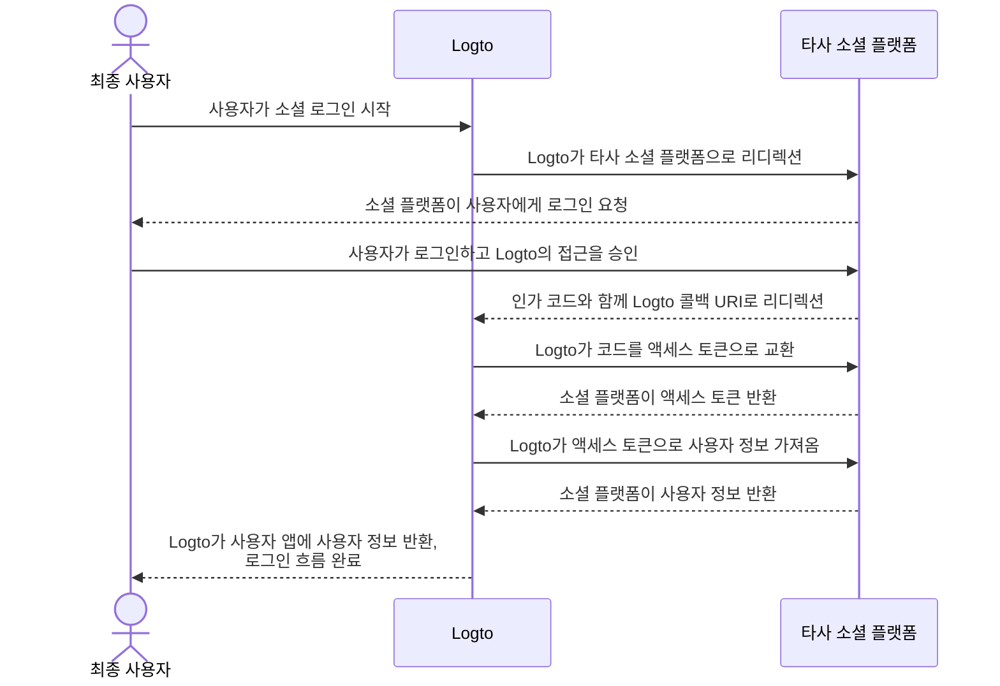

# 커넥터 구현

커넥터의 파일 구조를 살펴본 후, 커넥터 개발의 구현 및 주요 아이디어에 대해 논의해 보겠습니다.

소셜 및 패스워드리스 커넥터에 대한 간단한 예제를 통해 거의 동일한 아이디어로 커넥터를 구축할 수 있도록 하겠습니다.

이 부분에서는 특정 매개변수 (예: `config`)의 세부 사항에 깊이 들어가지 않습니다. 이는 이 가이드의 목적이 아닙니다. 새로운 커넥터를 구현하는 개발자는 타사 서비스 제공업체가 제공하는 문서를 읽어야 하며, 해당 문서에서는 매개변수에 대한 세부 사항을 설명해야 합니다.

## 소셜 커넥터 구축 \{#build-a-social-connector}

GitHub 커넥터를 예로 들어보겠습니다.

대부분의 소셜 커넥터의 인가 흐름은 [OAuth 인가 코드 흐름](https://openid.net/specs/openid-connect-basic-1_0.html)을 따릅니다.

:::note
대부분의 *소셜 커넥터*는 최종 사용자의 인증을 통해 사용자 프로필을 얻는 두 단계의 스킴을 따릅니다 (모든 단계가 성공한다고 가정):

1. 인증 요청을 시작하고 사용자의 인증을 얻습니다.
2. 커넥터 공급업체가 부여한 `authCode`를 사용하여 `액세스 토큰 (accessToken)`을 가져옵니다.
3. `액세스 토큰 (accessToken)`을 사용하여 공개적으로 접근 가능한 사용자 프로필을 요청합니다.

:::



이 흐름을 완료하기 위해 다음 세 가지 메서드가 필요합니다:

### getAuthorizationUri \{#getauthorizationuri}

`getAuthorizationUri`는 최종 사용자를 인증이 필요한 페이지로 리디렉션할 수 있는 URL을 생성합니다.

인터페이스는 [`@logto/connector-kit`](https://github.com/logto-io/logto/blob/master/packages/toolkit/connector-kit/src/types/social.ts)에서 `GetAuthorizationUri`로 정의됩니다.

`getUserInfo` 메서드를 위해 `setSession` ( `GetAuthorizationUri`의 두 번째 입력 매개변수)을 사용하여 로그인 관련 필수 정보를 저장할 수 있습니다.

필수 매개변수는 다음과 같습니다:

- `authorizationEndpoint`는 GitHub OAuth 문서 사이트에서 찾을 수 있으며, 최종 사용자가 인증을 위해 가야 하는 페이지입니다.
- `config`, GitHub 시나리오에서 `clientId`와 `clientSecret`을 포함합니다.
- CSRF를 증명하기 위한 임의의 문자열인 `state`
- 최종 사용자의 성공적인 인증 후 랜딩 페이지의 `redirectUri`

```typescript
const getAuthorizationUri = async ({ state, redirectUri }) => {
  const queryParameters = new URLSearchParams({
    client_id: config.clientId, // `config`는 GitHub 애플리케이션 자격 증명을 포함합니다.
    redirect_uri: redirectUri,
    state,
  });

  return `${authorizationEndpoint}?${queryParameters.toString()}`;
};
```

### getAccessToken \{#getaccesstoken}

`getAccessToken`은 최종 사용자의 성공적인 인증 후 발급된 인가 코드를 사용하여 액세스 토큰을 가져옵니다.

이전 `getAuthorizationUri` 메서드에서 언급한 `config` 외에도 다음을 얻고자 합니다:

- 리디렉션 랜딩 페이지로 가져온 매개변수에서 인가 `code`
- 인가 코드로 액세스 토큰을 얻기 위한 `accessTokenEndpoint`

```typescript
const getAccessToken = async (config: GithubConfig, code: string) => {
  const { clientId: client_id, clientSecret: client_secret } = config;

  const httpResponse = await got.post({
    url: accessTokenEndpoint,
    json: {
      client_id,
      client_secret,
      code,
    },
    timeout: defaultTimeout,
  });

  const result = accessTokenResponseGuard.safeParse(qs.parse(httpResponse.body));

  if (!result.success) {
    throw new ConnectorError(ConnectorErrorCodes.InvalidResponse, result.error);
  }

  const { access_token: accessToken } = result.data;

  assert(accessToken, new ConnectorError(ConnectorErrorCodes.SocialAuthCodeInvalid));

  return { accessToken };
};
```

### getUserInfo \{#getuserinfo}

`getUserInfo`는 이전 단계에서 얻은 액세스 토큰으로 사용자 정보를 가져옵니다.

인터페이스는 [`@logto/connector-kit`](https://github.com/logto-io/logto/blob/master/packages/toolkit/connector-kit/src/types/social.ts)에서 `GetUserInfo`로 정의됩니다.

로그인 목적을 위해 `getSession` 함수를 사용하여 필요한 정보를 검색할 수 있습니다.

`userInfoEndpoint`는 사용자 정보를 얻기 위해 사용되는 엔드포인트입니다.

공식 문서를 확인하여 사용자 정보 엔드포인트에서 접근할 수 있는 특정 사용자 정보와 해당 스코프를 찾을 수 있습니다.

커넥터의 아이덴티티 제공자 (이 경우 GitHub)에 의해 할당된 `id`는 필수이며, 다른 정보는 선택 사항입니다. 사용자 프로필에서 `email` 또는 `phone`을 얻을 수 있다면, 반드시 "확인된" 상태여야 합니다. 또한 반환되는 키를 [Logto 사용자 프로필](/user-management/user-data/#basic-data)의 필드 이름과 일치시켜야 합니다.

```typescript
const getUserInfo = async (
  data: { code: string; config: GithubConfig },
  getSession: GetSession,
  { set: SetStorageValue, get: GetStorageValue }
) => {
  const { code, config } = data;
  const { accessToken } = await getAccessToken(config, code);

  try {
    const httpResponse = await got.get(userInfoEndpoint, {
      headers: {
        authorization: `token ${accessToken}`,
      },
      timeout: defaultTimeout,
    });

    const result = userInfoResponseGuard.safeParse(parseJson(httpResponse.body));

    if (!result.success) {
      throw new ConnectorError(ConnectorErrorCodes.InvalidResponse, result.error);
    }

    const { id, avatar_url: avatar, email, name } = result.data;

    return {
      id: String(id),
      avatar: conditional(avatar),
      email: conditional(email),
      name: conditional(name),
    };
  } catch (error: unknown) {
    if (error instanceof HTTPError) {
      const { statusCode, body: rawBody } = error.response;

      if (statusCode === 401) {
        throw new ConnectorError(ConnectorErrorCodes.SocialAccessTokenInvalid);
      }

      throw new ConnectorError(ConnectorErrorCodes.General, JSON.stringify(rawBody));
    }

    throw error;
  }
};
```

완전한 구현은 [여기](https://github.com/logto-io/connectors/blob/master/packages/connector-github/src/index.ts)에서 찾을 수 있습니다.

구성 가능한 매개변수에 대한 자세한 내용은 GitHub 커넥터 README 또는 GitHub 공식 문서를 참조하세요.

:::note
우리가 논의한 예제는 Logto의 GitHub 커넥터에서 사용되는 OAuth 프로토콜의 인가 코드 부여 유형을 기반으로 합니다. 그러나 사용자의 프로필을 검색하기 위해 또 다른 부여 유형인 암시적 부여 유형도 사용할 수 있으며, 실제로 인증 응답에서 직접 액세스 토큰을 제공합니다. 이러한 편리함에도 불구하고, 인가 코드 부여 유형은 일반적으로 암시적 유형보다 더 강력한 보안 때문에 권장됩니다.

또한 OIDC 또는 다른 오픈 프로토콜을 기반으로 커넥터를 구축할 수도 있으며, 이는 연결하려는 소셜 공급업체의 호환성뿐만 아니라 사용 사례에 따라 다릅니다.
:::

## 패스워드리스 커넥터 구축 \{#build-a-passwordless-connector}

패스워드리스 커넥터를 구축하는 과정을 이해하기 위해 Aliyun 다이렉트 메일 커넥터의 구현을 살펴보겠습니다.

패스워드리스 커넥터는 최종 사용자의 이메일 또는 전화로 임의의 코드를 보내는 데 사용됩니다. 결과적으로 `sendMessage` 메서드가 필요합니다.

### sendMessage \{#sendmessage}

메시지를 보내기 위해서는 `config`와 `endpoint`가 올바르게 설정되어야 합니다.

- `endpoint`는 API 호출이 연결되는 엔드포인트입니다.
- `config`는 `templates` (다양한 사용자 흐름에서 패스코드를 보내기 위한 콘텐츠 템플릿), `clientId` 및 `clientSecret` (API 요청에 접근하기 위한)을 포함합니다.

```typescript
const sendMessage = async (data, inputConfig) => {
  const { to, type, payload } = data;
  const config = inputConfig ?? (await getConfig(defaultMetadata.id));
  validateConfig<AliyunDmConfig>(config, aliyunDmConfigGuard);
  const { accessKeyId, accessKeySecret, accountName, fromAlias, templates } = config;
  const template = templates.find((template) => template.usageType === type);

  assert(
    template,
    new ConnectorError(
      ConnectorErrorCodes.TemplateNotFound,
      `Cannot find template for type: ${type}`
    )
  );

  const parameters = {
    AccessKeyId: accessKeyId,
    AccountName: accountName,
    ReplyToAddress: 'false',
    AddressType: '1',
    ToAddress: to,
    FromAlias: fromAlias,
    Subject: template.subject,
    HtmlBody:
      typeof payload.code === 'string'
        ? template.content.replace(/{{code}}/g, payload.code)
        : template.content,
  };

  try {
    const httpResponse = await request(
      endpoint,
      { Action: 'SingleSendMail', ...staticConfigs, ...parameters },
      accessKeySecret
    );

    const result = sendEmailResponseGuard.safeParse(parseJson(httpResponse.body));

    if (!result.success) {
      throw new ConnectorError(ConnectorErrorCodes.InvalidResponse, result.error);
    }

    return result.data;
  } catch (error: unknown) {
    if (error instanceof HTTPError) {
      const {
        response: { body: rawBody },
      } = error;

      assert(typeof rawBody === 'string', new ConnectorError(ConnectorErrorCodes.InvalidResponse));

      errorHandler(rawBody);
    }

    throw error;
  }
};

const request = async (
  url: string,
  parameters: PublicParameters & Record<string, string>,
  accessKeySecret: string
) => {
  const finalParameters: Record<string, string> = {
    ...parameters,
    SignatureNonce: String(Math.random()),
    Timestamp: new Date().toISOString(),
  };
  const signature = getSignature(finalParameters, accessKeySecret, 'POST');

  const payload = new URLSearchParams();

  for (const [key, value] of Object.entries(finalParameters)) {
    payload.append(key, value);
  }
  payload.append('Signature', signature);

  return got.post({
    url,
    headers: {
      'Content-Type': 'application/x-www-form-urlencoded',
    },
    form: payload,
  });
};
```

완전한 구현은 [여기](https://github.com/logto-io/connectors/blob/master/packages/connector-aliyun-dm/src/index.ts)에서 찾을 수 있습니다.

구성 가능한 매개변수에 대한 자세한 내용은 Aliyun 다이렉트 메일 커넥터 README 또는 Aliyun 다이렉트 메일 공식 문서를 참조하세요.

## 그 외에 더 알아야 할 것들 \{#whats-more}

커넥터 메서드의 정의를 보고 커넥터 인터페이스 설계의 그림을 그리려면 [`@logto/connector-kit`](https://github.com/logto-io/logto/tree/master/packages/toolkit/connector-kit)를 참조하세요. 또한 "[커넥터 - ConnectorMetadata](/connectors/connector-data-structure/#connectors-local-storage-connectormetadata)" 및 "[커넥터 파일 구조](/logto-oss/develop-your-connector/connector-file-structure/)"에서 _ConnectorMetadata_ 참조를 찾을 수 있으며, 이를 통해 구현을 어떻게 조직할지 파악할 수 있습니다.

- 모든 커넥터에 대해 _Zod_ 스키마의 커넥터 `config`가 필수입니다. 이는 `config`를 DB에 저장하고 `config` 정보가 필요한 API를 호출하기 전에 타입 검사를 수행하기 때문에 매우 중요합니다.
- 모든 _SMS 커넥터_ 및 *이메일 커넥터*는 데이터베이스의 구성 정보를 사용하여 서비스 제공업체의 메시지 전송 API를 호출하기 위한 `sendMessage` 메서드가 필요합니다. 개발자는 또한 Admin Console에서 커넥터를 설정할 때 저장되지 않은 구성으로 테스트 메시지를 보내기 위해 이 메서드를 재사용할 수 있습니다.
- 인가 URL 생성기 `getAuthorizationUri`와 사용자 프로필 검색기 `getUserInfo`는 모든 *소셜 커넥터*에 필요합니다 ( `getAccessToken`은 `getUserInfo`의 선택적 단계로 간주됩니다).
- 모든 커넥터의 메서드는 API 호출을 통해 작동하므로, 커넥터 개발자는 문서를 확인하고 API 호출이 실패할 수 있는 응답을 처리해야 합니다.

## 자체 커넥터 설치 \{#install-your-own-connectors}

자체 커넥터 구축을 완료했다고 가정합니다. 다음 단계를 통해 수동으로 설치하세요:

1. 구현한 커넥터 폴더를 [`logto-io/logto`](https://github.com/logto-io/logto)의 `/packages/connectors` 디렉토리에 복사합니다.
2. logto 폴더의 루트 경로에서 `pnpm pnpm:devPreinstall && pnpm i`를 입력하여 커넥터 저장소의 종속성을 설치합니다.
3. `pnpm connectors build`로 커넥터를 빌드합니다.
4. `pnpm cli connector link`를 사용하여 로컬 커넥터를 연결합니다.
5. `logto-io/logto`의 루트 디렉토리에서 `pnpm dev`로 Logto 인스턴스를 재시작하고, 커넥터가 성공적으로 설치된 것을 확인할 수 있습니다.

이제 커넥터가 예상대로 작동하는지 테스트하고 시도해 볼 수 있습니다.

이미 NPM 또는 Logto 공식 커넥터에 게시된 커넥터를 추가하려면 [Logto CLI 사용 - 커넥터 관리](/logto-oss/using-cli/manage-connectors/#add-connectors)를 확인하세요.
