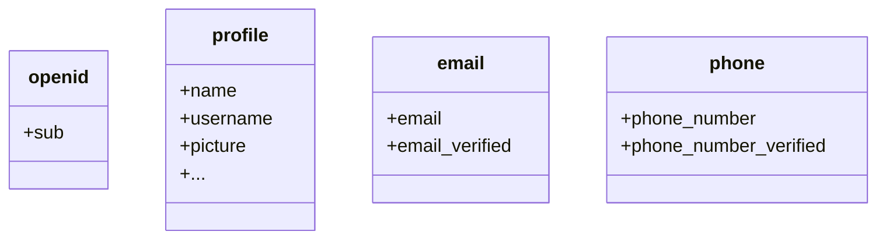

기본적으로 제한된 클레임 (Claim)만 반환됩니다. 더 많은 정보를 원하시면, 추가적인 스코프 (Scope)를 요청하여 더 많은 클레임에 접근할 수 있습니다.

:::info
"클레임 (Claim)"은 주체에 대해 주장하는 내용이며, "스코프 (Scope)"는 클레임의 그룹입니다. 현재의 경우, 클레임은 사용자에 대한 정보입니다.
:::

다음은 스코프 - 클레임 관계의 비규범적 예시입니다:

:::tip
"sub" 클레임은 "주체"를 의미하며, 이는 사용자의 고유 식별자 (즉, 사용자 ID)입니다.
:::

Logto SDK는 항상 세 가지 스코프를 요청합니다: `openid`, `profile`, 그리고 `offline_access`.
