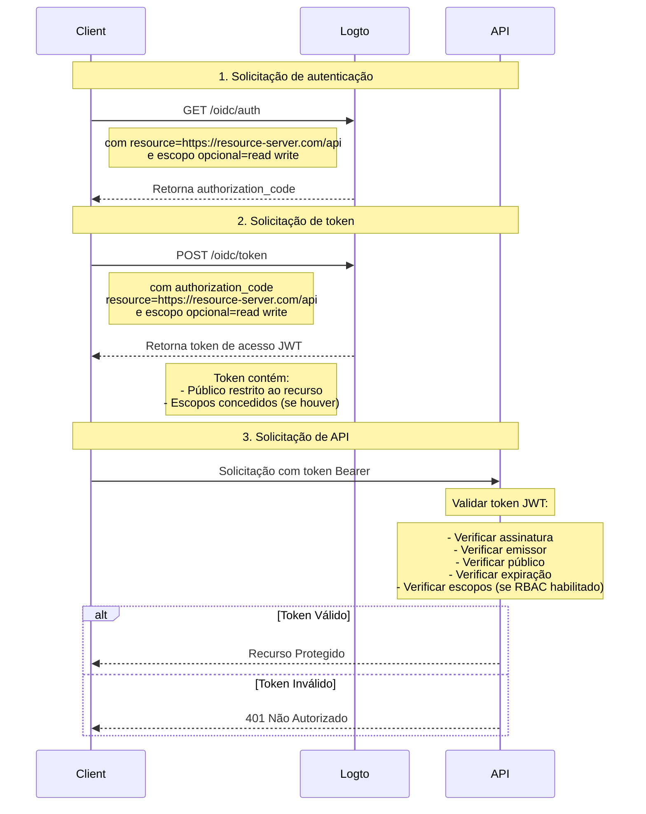

# Proteja sua API

Se você não precisa de políticas de controle de acesso flexíveis e granulares, pode simplesmente proteger sua API diretamente. Vamos guiá-lo através de um diagrama de sequência e os passos necessários para mostrar como integrar o controle de acesso em seu aplicativo.



Neste tutorial

- Endpoint do Logto: `https://tenant-id.logto.app`
- Aplicativo cliente: `https://client.example.org`
- Servidor de recursos da API: `https://resource-server.com/api`

Você deve substituir esses endpoints pelos seus reais ao implementar.

## Solicitação de autenticação \{#authentication-request}

Forneça uma lista de parâmetros de indicador de recurso em uma [Solicitação de Autenticação](https://openid.net/specs/openid-connect-core-1_0.html#AuthRequest). Isso indicará todos os recursos protegidos que o usuário pode solicitar.

```bash
GET https://tenant-id.logto.app/oidc/auth?response_type=code
    &client_id=s6BhdRkqt3
    &state=tNwzQ87pC6llebpmac_IDeeq-mCR2wLDYljHUZUAWuI
    &redirect_uri=https%3A%2F%2Fclient.example.org%2Fcb
    &resource=https%3A%2F%2Fresource-server.com%2Fapi
    &scope=read%20write
```

Logto validará e armazenará esses indicadores de recurso. Um `authorization_code` será concedido e retornado com escopos restritos a esses recursos especificados.

Exemplo de configuração do Logto SDK:

```tsx
const config: LogtoConfig = {
  // ...outras configurações
  resources: ['https://resource-server.com/api'],
  scopes: ['read', 'write'],
};
```

## Solicitação de token \{#token-request}

Quando o parâmetro de recurso está presente em uma [Solicitação de Token](https://openid.net/specs/openid-connect-core-1_0.html#TokenRequest) junto com o `authorization_code` concedido acima, ele especificará o público do recurso da API alvo do token de acesso solicitado.

```bash
POST https://tenant-id.logto.app/oidc/token HTTP/1.1
Content-Type: application/x-www-form-urlencoded

grant_type=authorization_code&redirect_uri=https%3A%2F%2Fclient.example.org%2Fcb&code=10esc29BWC2qZB0acc9v8zAv9ltc2pko105tQauZ&resource=https%3A%2F%2Fresource-server.com%2Fapi
```

Um token de acesso criptografado com o público restrito a este recurso solicitado será concedido pelo Logto. O token carrega todos os dados necessários para representar o status de autorização da solicitação. Por exemplo, a identidade e o papel do usuário solicitante, o público do token e o tempo de expiração.

Exemplo de código do Logto SDK:

```tsx
const accessToken = await logtoClient.getAccessToken('https://resource-server.com/api');
```

O payload do accessToken conterá:

```tsx
{
  iss: '<your-logto-endpoint>/oidc',
  aud: 'https://resource-server.com/api',
  scope: 'read write'
}
```

## Solicitação ao recurso da API \{#request-to-the-api-resource}

O usuário cliente enviou uma solicitação ao Recurso da API apresentando o `access_token` fornecido no cabeçalho de Autorização.

```bash
GET https://resource-server.com/api/users
Authorization: Bearer eyJhbGciOiJIUz...
```

Logto segue o protocolo padrão de autorização baseado em token para proteger seus Recursos de API. Para saber mais sobre OAuth 2.0, consulte o [documento oficial](https://datatracker.ietf.org/doc/html/rfc6749#section-1.3.1) do OAuth 2.0.

## Validar tokens de autorização para solicitações de API \{#validate-authorization-tokens-for-api-requests}

Logto emite um token de autorização no formato padrão [JWT](https://datatracker.ietf.org/doc/html/rfc7519) para cada solicitação de API autorizada. O token é criptografado e assinado como um token [JWS](https://datatracker.ietf.org/doc/html/rfc7515).

#### Entendendo o token JWS \{#understanding-jws-token}

Um token [JWS](https://datatracker.ietf.org/doc/html/rfc7515) codificado é construído com três partes:

- Cabeçalho JOSE: Declara o tipo de código e o algoritmo de codificação
- Payload JWS: Inclui todas as reivindicações do token
- Assinatura JWS: Assinatura assinada com [JWK](https://datatracker.ietf.org/doc/html/rfc7517)

Um esquema padrão do Payload JWS emitido pelo Logto: (as reivindicações podem variar, com base na sua configuração OIDC personalizada)

| chave     | descrição                         |
| --------- | --------------------------------- |
| jti       | ID único do JWT                   |
| sub       | sujeito, geralmente user-id       |
| iat       | timestamp do momento de emissão   |
| exp       | timestamp do momento de expiração |
| client_id | id do aplicativo                  |
| iss       | identidade do emissor do token    |
| aud       | público do token                  |
| scope     | escopos (permissões) do token     |

:::note

Para desenvolvimento, para inspecionar visualmente um token JWT, você pode visitar uma [ferramenta de decodificação de JWT](https://www.jstoolset.com/jwt) para decodificar e verificar os tokens que você recebeu. Tenha cuidado ou nunca use os tokens de um ambiente de produção. Como este é um serviço online público fornecido por terceiros, seu token pode ser exposto.

:::

#### Validar o token de autorização \{#validate-the-authorization-token}

1. [Validando um JWT](https://datatracker.ietf.org/doc/html/rfc7519#section-7.2)
2. [Validando a assinatura JWS](https://datatracker.ietf.org/doc/html/rfc7515#section-5.2)
3. O emissor do token é `https://<your-logto-domain>/oidc` (emitido pelo seu servidor de autenticação Logto)
4. O público do token é igual ao indicador de recurso do receptor atual registrado no Console de Administração do Logto
5. O token está dentro do seu tempo de expiração
6. (Somente [RBAC](/authorization/role-based-access-control/protect-api-resources-with-rbac)) O token possui o `scope` desejado

Existem várias bibliotecas e pacotes de código aberto que podem ajudá-lo a validar e decodificar um token JWT facilmente. Você pode escolher um e integrá-lo ao seu aplicativo backend com base na linguagem e framework que está usando. Por favor, confira alguns dos exemplos que temos:

- [Node (Express)](/authorization/api-resources/node-express)
- [Spring Boot](/authorization/api-resources/spring-boot)
- [Python](/authorization/api-resources/python)

## Referência \{#reference}

Logto usa o Protocolo de Autorização OAuth 2.0 baseado em código para tornar sua solicitação de API segura. Se você estiver interessado na estratégia por trás disso, consulte a [especificação](https://datatracker.ietf.org/doc/html/rfc6749#section-1.3.1) do OAuth 2.0 para mais detalhes.

## FAQs \{#faqs}

<details>

<summary>

### Como testar a interação do lado do cliente, Logto e servidor sem construir o cliente? \{#how-to-test-the-client-side-logto-and-server-side-interaction-without-building-the-client}

</summary>

Você pode automatizar esse processo sem precisar construir o cliente. Uma opção é usar um Token de Acesso Pessoal (PAT). Um PAT permite simular a autenticação do lado do cliente representando um usuário específico, com diferentes papéis e permissões. Isso pode ser usado para testar sua lógica do lado do servidor, como validação de token de acesso ou JWT, sem a necessidade de um cliente totalmente construído. Para começar, consulte o [Token de acesso pessoal](/user-management/personal-access-token).

</details>
