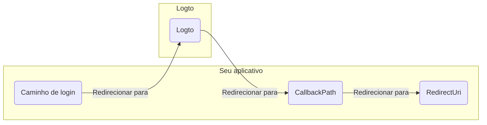

import RegardingRedirectBasedSignIn from '../../fragments/_regarding-redirect-based-sign-in.mdx';

Antes de prosseguirmos, há dois termos confusos no middleware de autenticação do .NET Core que precisamos esclarecer:

1. **CallbackPath**: O URI para o qual o Logto redirecionará o usuário após o usuário ter feito login (o "URI de redirecionamento" no Logto)
2. **RedirectUri**: O URI para o qual será redirecionado após as ações necessárias terem sido realizadas no middleware de autenticação do Logto.

O processo de login pode ser ilustrado da seguinte forma:

 

Da mesma forma, o .NET Core também possui **SignedOutCallbackPath** e **RedirectUri** para o fluxo de logout.

Para maior clareza, nos referiremos a eles da seguinte forma:

| Termo que usamos                            | Termo do .NET Core    |
| ------------------------------------------- | --------------------- |
| URI de redirecionamento do Logto            | CallbackPath          |
| URI de redirecionamento pós logout do Logto | SignedOutCallbackPath |
| URI de redirecionamento do aplicativo       | RedirectUri           |

<RegardingRedirectBasedSignIn />
