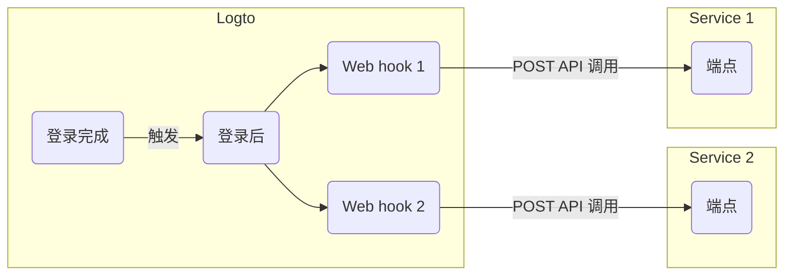

# Webhook

Logto [Webhook](https://auth.wiki/webhook) 提供各种事件的实时通知，包括 [用户账户](/user-management/user-data)、[角色](/authorization/role-based-access-control#roles)、[权限](/authorization/role-based-access-control#permissionsscopes)、[组织 (Organization)](/organizations/organization-data)、[组织角色](/authorization/organization-template#organization-role)、[组织权限](/authorization/organization-template#organization-permission) 和 [用户交互](/end-user-flows) 的变更。

当事件被触发时，Logto 会向你提供的 Endpoint URL 发送一个 HTTP 请求，其中包含有关事件的详细信息，如用户 ID、用户名、电子邮件和其他相关细节（有关负载和头中包含的数据的更多信息，请参阅 [Webhook 请求](/developers/webhooks/webhooks-request)）。你的应用程序可以处理此请求并采取自定义操作，例如发送电子邮件或更新数据库中的数据。

我们会根据用户需求不断添加更多事件。如果你对业务有特定要求，请告诉我们。

## 为什么使用 Webhook？ \{#why-use-webhook}

Webhook 提供应用程序之间的实时通信，消除了轮询的需要，并实现了即时数据更新。它们简化了应用程序集成和工作流自动化，而无需复杂的代码或专有 API。

以下是一些常见的 CIAM Webhook 用例示例：

- **发送电子邮件**：配置一个 Webhook，在新用户注册时发送欢迎邮件，或在用户从新设备或位置登录时通知管理员。
- **发送通知**：配置一个 Webhook，触发与你的 CRM 系统的虚拟助手，以便在用户注册时提供实时客户支持。
- **执行额外的 API 调用**：配置一个 Webhook，通过检查用户的电子邮件域或 IP 地址来验证用户访问权限，然后使用 Logto Management API 分配具有资源权限的适当角色。
- **数据同步**：配置 Webhook 以保持应用程序更新有关用户账户暂停或删除等更改的信息。
- **生成报告**：设置一个 Webhook 以接收用户登录活动数据，并利用这些数据创建用户参与或使用模式的报告。

## 术语 \{#terms}

| 项目                                                                                                                  | 描述                                                                                                                               |
| --------------------------------------------------------------------------------------------------------------------- | ---------------------------------------------------------------------------------------------------------------------------------- |
| 事件                                                                                                                  | 当特定操作完成时，它将触发具有特定类型的钩子事件。例如，当用户完成注册过程并创建新账户时，Logto 将发出一个 PostRegister 钩子事件。 |
| 钩子                                                                                                                  | 钩接到特定事件的单个或一系列操作。操作可以是调用 API、执行代码片段等。                                                             |
| Webhook                                                                                                               | 一种钩子的子类型，表示使用事件负载调用 API。                                                                                       |
| 假设开发人员希望在用户通过新设备登录时发送通知，开发人员可以为 PostSignIn 事件添加一个调用其安全服务 API 的 webhook。 |

以下是在 Logto 中为 `PostSignIn` 事件启用两个 web hook 的示例：

## 常见问题解答 \{#faqs}

### Logto 支持同步 webhooks 吗？ \{#does-logto-support-synced-webhooks}

虽然同步 webhooks 会使用户登录流程更顺畅，但我们目前还不支持（未来会支持）。因此，依赖同步 webhooks 的场景目前都需要不同的解决方案。如果你有任何问题，请随时联系我们。

### 如何处理用户权限变更？ \{#how-to-deal-with-user-permission-change}

请参阅 [管理用户权限变更](/authorization/role-based-access-control/protect-api-resources-with-rbac/#optional-handle-user-permission-change) 指南。

### 如何调试 webhook 超时？ \{#how-to-debug-webhook-timeout}

对于接收 Webhooks 的端点，它应尽快返回 2xx 响应，以告知 Logto Webhook 已成功接收。由于不同用户对 Webhooks 的处理逻辑差异很大，过于复杂的任务可能需要几秒钟，导致 Logto Webhook 超时。最佳实践是维护你自己的事件队列；在接收到 Logto Webhook 后，将事件插入队列并返回 2xx 响应给 Logto。然后让你自己的工作程序逐步处理队列中的任务。如果工作程序遇到错误，请在你自己的服务器上处理。

### 我可以从 `PostSignIn` webhooks 获取客户端 IP 地址吗？ \{#can-i-get-the-client-ip-address-from-postsignin-webhooks}

可以，你可以在 Webhook 负载中获取 IP 地址、用户代理等信息。如果你需要当前不支持的信息，可以在 GitHub 问题中创建功能请求，或联系我们。

## 相关资源 \{#related-resources}

<Url href="https://blog.logto.io/webhooks-vs-polling">Webhooks vs. polling</Url>
