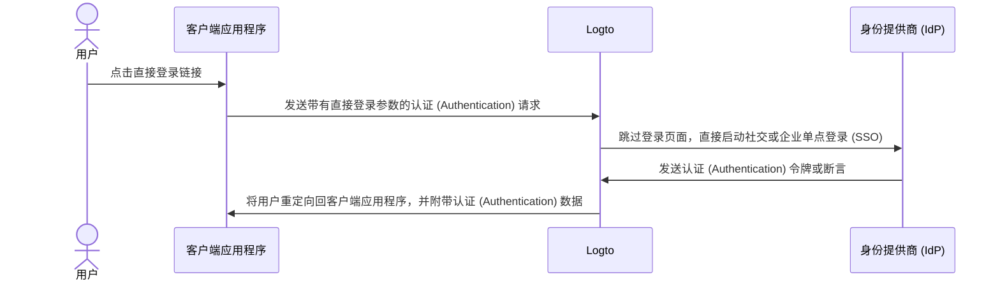

# 直接登录

直接登录是 Logto 特有的[认证 (Authentication) 参数](/end-user-flows/authentication-parameters)，它使你能够直接启动社交登录或企业单点登录 (SSO)，绕过默认的 Logto 通用登录页面。

如果你在网站上嵌入了自定义登录页面或 IdP 登录入口点（查看用例），此功能特别有用。通过使用直接登录，你可以将用户直接重定向到 IdP 的登录页面。



## 社交登录 \{#social-sign-in}

传递 `direct_sign_in` 参数，值为 `social:<idp-name>`，以直接启动社交登录过程。

### 在哪里找到连接器 IdP 名称 \{#where-to-find-the-connector-idp-name}

1. 导航到 <CloudLink to="/connectors/social">控制台 > 连接器 > 社交连接器</CloudLink>
2. 点击你想使用的[社交连接器](/connectors/social-connectors)。
3. 在连接器设置页面顶部找到身份提供商名称。


### 示例 \{#example}

使用 `direct_sign_in` 参数构建你自己的认证 (Authentication) 请求 URL：

```sh
curl --location \
  --request GET 'https://[tenant-id].logto.app/oidc/auth?client_id=1234567890&...&direct_sign_in=social:google'
```

在支持的 Logto SDK 中，你可以在调用 `signIn` 方法时设置 `directSignIn` 参数：

```javascript
const authResult = await logto.signIn({
  redirectUri: 'https://your-app.com/callback',
  directSignIn: 'social:google',
});
```

## 企业单点登录 (SSO) \{#enterprise-sso}

传递 `direct_sign_in` 参数，值为 `sso:<connector-id>`，以直接启动企业单点登录 (SSO) 过程。

### 在哪里找到企业单点登录 (SSO) 连接器 ID \{#where-to-find-the-enterprise-sso-connector-id}

1. 导航到 <CloudLink to="/enterprise-sso">控制台 > 企业单点登录 (SSO)</CloudLink>
2. 点击你想使用的[企业连接器](/connectors/enterprise-connectors)。
3. 在连接器设置页面顶部找到连接器 ID。


### 示例 \{#example-1}

使用 `direct_sign_in` 参数构建你自己的认证 (Authentication) 请求 URL：

```sh
curl --location \
  --request GET 'https://[tenant-id].logto.app/oidc/auth?client_id=1234567890&...&direct_sign_in=sso:1234567890'
```

在支持的 Logto SDK 中，你可以在调用 `signIn` 方法时设置 `directSignIn` 参数：

```javascript
logtoClient.signIn({
  redirectUri: 'https://your-app.com/callback',
  directSignIn: 'sso:1234567890',
});
```

## 回退到登录页面 \{#fallback-to-the-sign-in-page}

如果直接登录过程失败，例如找不到或未启用连接器，用户将被重定向到标准登录页面。

:::note
我们正在逐步为所有 Logto SDK 添加对 direct_sign_in 参数的支持。如果你在你的 SDK 中没有看到它，请打开一个问题或联系我们。
:::

## 常见问题解答 \{#faqs}

<details>
  <summary>

### 直接登录与 API 认证 (Authentication) 相同吗？ \{#is-direct-sign-in-the-same-as-api-authentication}

</summary>

不，直接登录是一个用户流参数，允许你跳过默认的 Logto 登录页面，并将用户直接重定向到社交或企业单点登录 (SSO) 提供商的登录页面。与基于 API 的认证 (Authentication) 不同，用户仍然需要首先重定向到 Logto 认证 (Authentication) 端点以启动登录过程。

</details>
