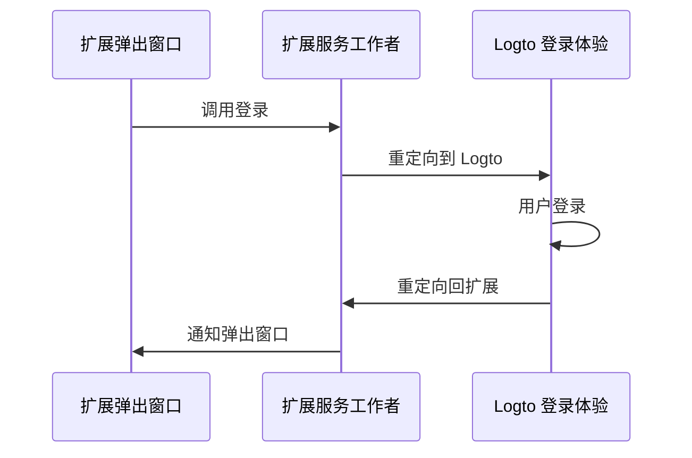

import RegardingRedirectBasedSignIn from '../../fragments/_regarding-redirect-based-sign-in.mdx';

### 认证 (Authentication) 流程 \{#the-authentication-flow}

假设你在 Chrome 扩展的弹出窗口中放置了一个“登录”按钮，认证 (Authentication) 流程将如下所示：



对于扩展中的其他交互页面，你只需将 `Extension popup` 参与者替换为页面的名称。在本教程中，我们将专注于弹出页面。

<RegardingRedirectBasedSignIn />

### 更新 `manifest.json` \{#update-the-manifestjson}

Logto SDK 需要在 `manifest.json` 中的以下权限：

```json title="manifest.json"
{
  "permissions": ["identity", "storage"],
  "host_permissions": ["https://*.logto.app/*"]
}
```

- `permissions.identity`: Chrome Identity API 所需，用于登录和注销。
- `permissions.storage`: 用于存储用户的会话。
- `host_permissions`: Logto SDK 与 Logto API 通信所需。

:::note
如果你在 Logto Cloud 上使用自定义域名，你需要更新 `host_permissions` 以匹配你的域名。
:::

### 设置后台脚本（服务工作者）\{#set-up-a-background-script-service-worker}

在你的 Chrome 扩展的后台脚本中，初始化 Logto SDK：

```js title="service-worker.js"
import LogtoClient from '@logto/chrome-extension';

export const logtoClient = new LogtoClient({
  endpoint: '<your-logto-endpoint>'
  appId: '<your-logto-app-id>',
});
```

将 `<your-logto-endpoint>` 和 `<your-logto-app-id>` 替换为实际值。你可以在 Logto Console 中刚创建的应用页面中找到这些值。

如果你没有后台脚本，可以按照 [官方指南](https://developer.chrome.com/docs/extensions/develop/concepts/service-workers/basics) 创建一个。

:::info
**为什么我们需要后台脚本？**

普通扩展页面如弹出窗口或选项页面无法在后台运行，并且在认证 (Authentication) 过程中可能会被关闭。后台脚本确保认证 (Authentication) 过程可以被正确处理。
:::

然后，我们需要监听来自其他扩展页面的消息并处理认证 (Authentication) 过程：

```js title="service-worker.js"
chrome.runtime.onMessage.addListener((message, sender, sendResponse) => {
  // 在下面的代码中，由于我们为每个操作返回 `true`，我们需要调用 `sendResponse`
  // 来通知发送者。你也可以在这里处理错误，或使用其他方式通知发送者。

  if (message.action === 'signIn') {
    const redirectUri = chrome.identity.getRedirectURL('/callback');
    logtoClient.signIn(redirectUri).finally(sendResponse);
    return true;
  }

  if (message.action === 'signOut') {
    const redirectUri = chrome.identity.getRedirectURL();
    logtoClient.signOut(redirectUri).finally(sendResponse);
    return true;
  }

  return false;
});
```

你可能注意到上面的代码中使用了两个重定向 URI。它们都是由 `chrome.identity.getRedirectURL` 创建的，这是一个 [Chrome 内置 API](https://developer.chrome.com/docs/extensions/reference/api/identity#method-getRedirectURL)，用于为认证 (Authentication) 流程生成重定向 URL。这两个 URI 将是：

- `https://<extension-id>.chromiumapp.org/callback` 用于登录。
- `https://<extension-id>.chromiumapp.org/` 用于注销。

注意，这些 URI 是不可访问的，它们仅用于 Chrome 触发认证 (Authentication) 过程的特定操作。

### 更新 Logto 应用设置 \{#update-logto-application-settings}

现在我们需要更新 Logto 应用设置以允许我们刚创建的重定向 URI。

1. 转到 Logto Console 中的应用页面。
2. 在“重定向 URI”部分，添加 URI：`https://<extension-id>.chromiumapp.org/callback`。
3. 在“注销后重定向 URI”部分，添加 URI：`https://<extension-id>.chromiumapp.org/`。
4. 在“CORS 允许的来源”部分，添加 URI：`chrome-extension://<extension-id>`。Chrome 扩展中的 SDK 将使用此来源与 Logto API 通信。
5. 点击 **保存更改**。

记得将 `<extension-id>` 替换为你的实际扩展 ID。你可以在 `chrome://extensions` 页面找到扩展 ID。

### 向弹出窗口添加登录和注销按钮 \{#add-sign-in-and-sign-out-buttons-to-the-popup}

我们快完成了！让我们在弹出页面中添加登录和注销按钮以及其他必要的逻辑。

在 `popup.html` 文件中：

```html title="popup.html"
<button id="sign-in">登录</button> <button id="sign-out">注销</button>
```

在 `popup.js` 文件中（假设 `popup.js` 已包含在 `popup.html` 中）：

```js title="popup.js"
document.getElementById('sign-in').addEventListener('click', async () => {
  await chrome.runtime.sendMessage({ action: 'signIn' });
  // 登录完成（或失败），你可以在这里更新 UI。
});

document.getElementById('sign-out').addEventListener('click', async () => {
  await chrome.runtime.sendMessage({ action: 'signOut' });
  // 注销完成（或失败），你可以在这里更新 UI。
});
```

### 检查点：测试认证 (Authentication) 流程 \{#checkpoint-test-the-authentication-flow}

现在你可以在你的 Chrome 扩展中测试认证 (Authentication) 流程：

1. 打开扩展弹出窗口。
2. 点击“登录”按钮。
3. 你将被重定向到 Logto 登录页面。
4. 使用你的 Logto 账户登录。
5. 你将被重定向回 Chrome。

### 检查认证 (Authentication) 状态 \{#check-authentication-state}

由于 Chrome 提供统一的存储 API，除了登录和注销流程之外，所有其他 Logto SDK 方法都可以直接在弹出页面中使用。

在你的 `popup.js` 中，你可以重用在后台脚本中创建的 `LogtoClient` 实例，或使用相同的配置创建一个新实例：

```js title="popup.js"
import LogtoClient from '@logto/chrome-extension';

const logtoClient = new LogtoClient({
  endpoint: '<your-logto-endpoint>'
  appId: '<your-logto-app-id>',
});

// 或重用在后台脚本中创建的 logtoClient 实例
import { logtoClient } from './service-worker.js';
```

然后你可以创建一个函数来加载认证 (Authentication) 状态和用户的个人资料：

```js title="popup.js"
const loadAuthenticationState = async () => {
  const isAuthenticated = await logtoClient.isAuthenticated();
  // 根据认证 (Authentication) 状态更新 UI

  if (isAuthenticated) {
    const user = await logtoClient.getIdTokenClaims(); // { sub: '...', email: '...', ... }
    // 使用用户的个人资料更新 UI
  }
};
```

你还可以将 `loadAuthenticationState` 函数与登录和注销逻辑结合起来：

```js title="popup.js"
document.getElementById('sign-in').addEventListener('click', async () => {
  await chrome.runtime.sendMessage({ action: 'signIn' });
  await loadAuthenticationState();
});

document.getElementById('sign-out').addEventListener('click', async () => {
  await chrome.runtime.sendMessage({ action: 'signOut' });
  await loadAuthenticationState();
});
```

以下是带有认证 (Authentication) 状态的弹出页面示例：


### 其他注意事项 \{#other-considerations}

- **服务工作者打包**：如果你使用像 Webpack 或 Rollup 这样的打包工具，你需要显式将目标设置为 `browser` 或类似选项，以避免不必要的 Node.js 模块打包。
- **模块解析**：Logto Chrome 扩展 SDK 是一个仅支持 ESM 的模块。

查看我们的 [示例项目](https://github.com/logto-io/js/tree/HEAD/packages/chrome-extension-sample)，以获取完整的 TypeScript、Rollup 和其他配置示例。
