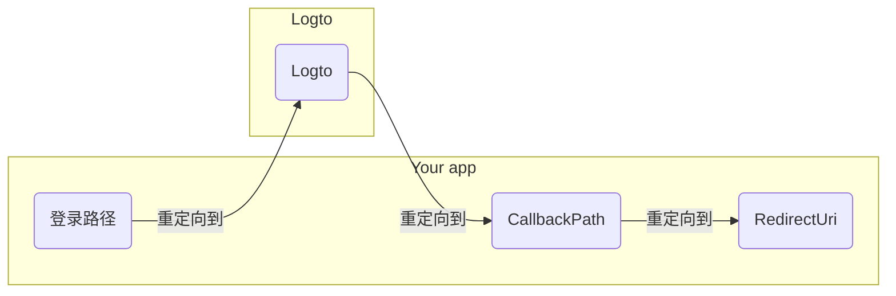

import RegardingRedirectBasedSignIn from '../../fragments/_regarding-redirect-based-sign-in.mdx';

在我们继续之前，需要澄清 .NET Core 认证中间件中的两个容易混淆的术语：

1. **CallbackPath**：用户登录后，Logto 将用户重定向回来的 URI（在 Logto 中称为“重定向 URI”）
2. **RedirectUri**：在 Logto 认证中间件中完成必要操作后，将重定向到的 URI。

登录过程可以如下图所示：

 

类似地，.NET Core 也有用于注销流程的 **SignedOutCallbackPath** 和 **RedirectUri**。

为了清晰起见，我们将它们称为：

| 我们使用的术语         | .NET Core 术语        |
| ---------------------- | --------------------- |
| Logto 重定向 URI       | CallbackPath          |
| Logto 注销后重定向 URI | SignedOutCallbackPath |
| 应用程序重定向 URI     | RedirectUri           |

<RegardingRedirectBasedSignIn />
