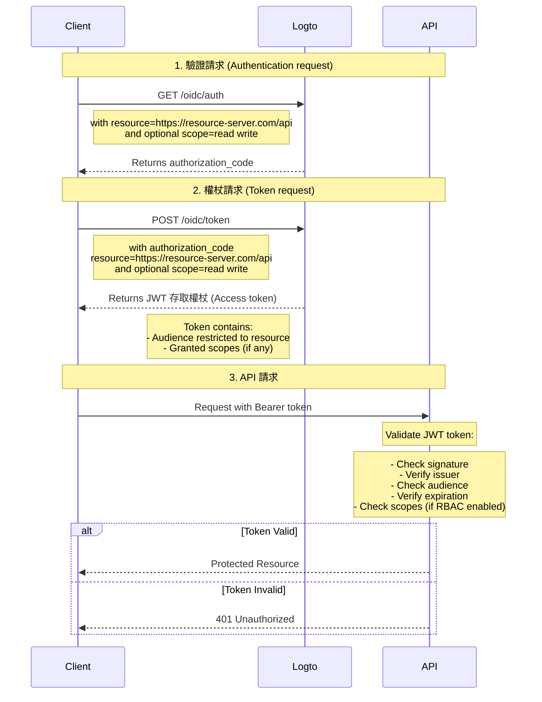

# 保護你的 API

如果你不需要靈活、細緻的存取控制策略，可以直接保護你的 API。我們將透過序列圖和必要步驟，指導你如何將存取控制整合到應用程式中。



在本教程中

- Logto 端點：`https://tenant-id.logto.app`
- 客戶端應用程式：`https://client.example.org`
- API 資源伺服器：`https://resource-server.com/api`

實作時應替換為你的實際端點。

## 驗證請求 (Authentication request) \{#authentication-request}

在 [驗證請求 (Authentication Request)](https://openid.net/specs/openid-connect-core-1_0.html#AuthRequest) 中提供資源標示符參數列表。這將指示使用者可能請求的所有受保護資源。

```bash
GET https://tenant-id.logto.app/oidc/auth?response_type=code
    &client_id=s6BhdRkqt3
    &state=tNwzQ87pC6llebpmac_IDeeq-mCR2wLDYljHUZUAWuI
    &redirect_uri=https%3A%2F%2Fclient.example.org%2Fcb
    &resource=https%3A%2F%2Fresource-server.com%2Fapi
    &scope=read%20write
```

Logto 將驗證並儲存這些資源標示符。`authorization_code` 將被授予並返回，權限範圍限制在這些指定資源上。

Logto SDK 的範例配置：

```tsx
const config: LogtoConfig = {
  // ...other configs
  resources: ['https://resource-server.com/api'],
  scopes: ['read', 'write'],
};
```

## 權杖請求 (Token request) \{#token-request}

當資源參數與上述授予的 `authorization_code` 一同出現在 [權杖請求 (Token Request)](https://openid.net/specs/openid-connect-core-1_0.html#TokenRequest) 中時，將指定存取權杖的目標 API 資源受眾。

```bash
POST https://tenant-id.logto.app/oidc/token HTTP/1.1
Content-Type: application/x-www-form-urlencoded

grant_type=authorization_code&redirect_uri=https%3A%2F%2Fclient.example.org%2Fcb&code=10esc29BWC2qZB0acc9v8zAv9ltc2pko105tQauZ&resource=https%3A%2F%2Fresource-server.com%2Fapi
```

Logto 將授予一個受眾限制在此請求資源的加密存取權杖。權杖攜帶所有你需要的數據來表示請求的授權狀態。例如，請求使用者的身分和角色、權杖的受眾和過期時間。

Logto SDK 的範例代碼：

```tsx
const accessToken = await logtoClient.getAccessToken('https://resource-server.com/api');
```

accessToken 的內容將包含：

```tsx
{
  iss: '<your-logto-endpoint>/oidc',
  aud: 'https://resource-server.com/api',
  scope: 'read write'
}
```

## 向 API 資源發送請求 \{#request-to-the-api-resource}

客戶端使用者透過在 Authorization 標頭中提供給定的 `access_token` 向 API 資源發送請求。

```bash
GET https://resource-server.com/api/users
Authorization: Bearer eyJhbGciOiJIUz...
```

Logto 遵循標準的基於權杖的授權協議來保護你的 API 資源。要了解更多關於 OAuth 2.0 的資訊，請參閱 OAuth 2.0 的[官方文件](https://datatracker.ietf.org/doc/html/rfc6749#section-1.3.1)。

## 驗證 API 請求的授權權杖 \{#validate-authorization-tokens-for-api-requests}

Logto 為每個授權的 API 請求發行標準 [JWT](https://datatracker.ietf.org/doc/html/rfc7519) 格式的授權權杖。權杖被加密並簽名為 [JWS](https://datatracker.ietf.org/doc/html/rfc7515) 權杖。

#### 理解 JWS 權杖 \{#understanding-jws-token}

一個編碼的 [JWS](https://datatracker.ietf.org/doc/html/rfc7515) 權杖由三部分構成：

- JOSE Header：宣告代碼類型和編碼算法
- JWS Payload：包含所有權杖的宣告
- JWS Signature：使用 [JWK](https://datatracker.ietf.org/doc/html/rfc7517) 簽名的簽名

Logto 發行的 JWS Payload 的標準結構：（宣告可能會根據你的自訂 OIDC 配置而有所不同）

| key       | description                   |
| --------- | ----------------------------- |
| jti       | 唯一的 JWT ID                 |
| sub       | 主體，通常是使用者 ID         |
| iat       | 權杖發行的時間戳              |
| exp       | 權杖過期的時間戳              |
| client_id | 應用程式 ID                   |
| iss       | 權杖簽發者身分                |
| aud       | 權杖的受眾                    |
| scope     | 權杖的權限範圍（permissions） |

:::note

在開發過程中，若要直觀地檢查 JWT 權杖，你可以訪問 [JWT 解碼工具](https://www.jstoolset.com/jwt) 來解碼並檢查你收到的權杖。請謹慎或避免使用來自生產環境的權杖。由於這是第三方提供的公共在線服務，你的權杖可能會被暴露。

:::

#### 驗證授權權杖 \{#validate-the-authorization-token}

1. [驗證 JWT](https://datatracker.ietf.org/doc/html/rfc7519#section-7.2)
2. [驗證 JWS 簽名](https://datatracker.ietf.org/doc/html/rfc7515#section-5.2)
3. 權杖的簽發者是 `https://<your-logto-domain>/oidc`（由你的 Logto 驗證伺服器簽發）
4. 權杖的受眾等於 Logto 管理控制台中註冊的當前接收者的資源標示符
5. 權杖在其過期時間內
6. （僅限 [RBAC](/authorization/role-based-access-control/protect-api-resources-with-rbac)）權杖具有所需的 `scope`

有多種開源庫和套件可以幫助你輕鬆驗證和解碼 JWT 權杖。你可以根據使用的語言和框架選擇一個並整合到你的後端應用程式中。請查看我們的一些範例：

- [Node (Express)](/authorization/api-resources/node-express)
- [Spring Boot](/authorization/api-resources/spring-boot)
- [Python](/authorization/api-resources/python)

## 參考資料 \{#reference}

Logto 使用基於代碼的 OAuth 2.0 授權協議來確保你的 API 請求安全。如果你對其背後的策略感興趣，請參閱 OAuth 2.0 的[規範](https://datatracker.ietf.org/doc/html/rfc6749#section-1.3.1)以獲取更多詳細資訊。

## 常見問題 \{#faqs}

<details>

<summary>

### 如何在不構建客戶端的情況下測試客戶端、Logto 和伺服器端的互動？ \{#how-to-test-the-client-side-logto-and-server-side-interaction-without-building-the-client}

</summary>

你可以在不需要構建客戶端的情況下自動化此過程。一個選擇是使用個人存取權杖 (PAT, Personal Access Token)。PAT 允許你通過表示特定使用者（具有不同的角色和權限）來模擬客戶端驗證。這可以用來測試你的伺服器端邏輯，例如存取權杖或 JWT 驗證，而不需要完全構建的客戶端。要開始，請參閱 [個人存取權杖](/user-management/personal-access-token)。

</details>
