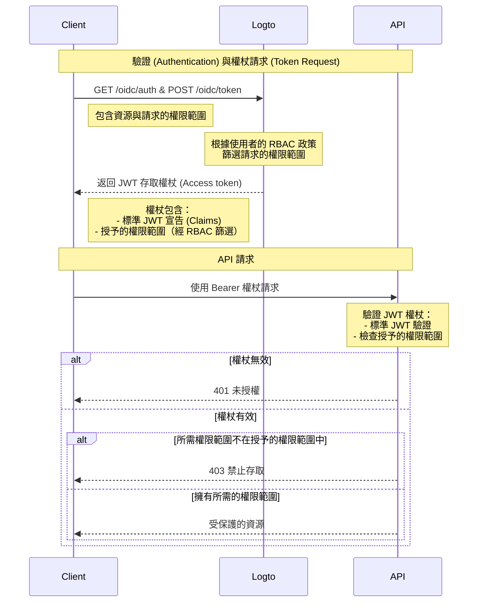

# 使用 RBAC 保護 API 資源

除了 [保護你的 API](/authorization/api-resources/protect-your-api) 以確保資源安全並驗證有效的 JWT 外，還可以應用角色型存取控制 (RBAC, Role-Based Access Control)。

在本文中，我們將專注於 RBAC 如何影響驗證流程中的權限範圍委派與驗證。

## 授權流程圖 \{#authorization-flow-diagram}



如圖所示，與基本 API 保護的主要區別在於權限範圍的處理。Logto 不再直接授予所有請求的權限範圍，而是根據使用者的 RBAC 政策進行篩選。JWT 權杖將僅包含使用者透過其角色授予的權限範圍。在 API 端，驗證權杖的真實性後，還需額外檢查權杖是否包含請求資源所需的權限範圍。

## 可選：處理使用者權限變更 \{#optional-handle-user-permission-change}

使用者權限可能在會話期間發生變更，例如，他們可能被分配新角色或修改現有角色權限。在這些情況下，可能需要檢測這些變更並更新應用程式 UI。

當使用者權限變更時會發生什麼？有兩種情況。

### 系統中未引入新權限 \{#no-new-permissions-introduced-into-the-system}

即使使用者的權限發生變更，目前的存取權杖仍將保持有效，直到它們過期。然而，新權限將反映在後續的存取權杖中，任何被撤銷的權限將被省略。

以下是一些 **建議的行動**：

**選項 1：使用短期存取權杖過期時間**

短期存取權杖可確保更頻繁地更新使用者權限。在 Console 的 [API 資源](/authorization/api-resources/#logto-api-resource-schema) 設定中配置權杖過期設定。缺點是這會增加你的權杖使用量。

**選項 2：動態檢查權限**

定期呼叫 [Logto Management API](/integrate-logto/interact-with-management-api) 端點（例如，SWR）或使用 WebSocket 等技術實現長期連接以動態獲取使用者權限。檢測到變更時，清除現有的存取權杖，新發行的權杖將自動反映權限範圍變更。- API：User-role - API：Role-permission

    當檢測到權限變更時，先從存儲中清除存取權杖，然後調用 SDK 方法 `getAccessToken()` 以獲取新權杖。新發行的存取權杖應反映權限變更。

### 系統中引入新權限並分配給使用者 \{#new-permission-is-introduced-into-the-system-and-assigned-to-a-user}

當系統中引入新權限時會發生這種情況。在這種情況下，你需要在初始化 Logto 客戶端時首先包含新引入的權限範圍。例如：

```tsx
new LogtoClient({
  appId: 'your-app-id',
  endpoint: 'your-logto-endpoint',
  resources: ['your-api-resource'],
  scopes: [
    // ... 你現有的權限範圍,
    'new-scope',
  ],
});
```

其次，你的每個客戶端應用程式需要重新同意或重新登入使用者，以接收新的權限變更。然後，新權限範圍將反映在新的存取權杖中。

重新同意的代碼示例：

```tsx
signIn({ redirectUri: 'your-redirect-url', prompt: 'consent' });
```

## 相關資源 \{#related-resources}

<Url href="https://blog.logto.io/logto-x-cloudflare-workers">
  Logto x Cloudflare Workers：如何保護你的 workers 免受公共訪問？
</Url>

<Url href="https://blog.logto.io/secure-api-for-machine-to-machine">
  保護你的 API 資源以進行機器對機器通信
</Url>
