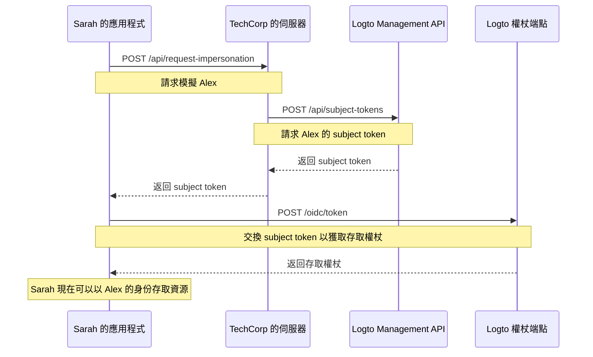

# 使用者模擬 (User impersonation)

想像一下，TechCorp 的支援工程師 Sarah 收到客戶 Alex 的緊急工單，Alex 無法存取關鍵資源。為了有效診斷和解決問題，Sarah 需要看到系統中 Alex 所見的內容。這時，Logto 的使用者模擬功能就派上用場了。

使用者模擬允許像 Sarah 這樣的授權使用者在系統中暫時以其他使用者（如 Alex）的身份行事。這項強大的功能對於故障排除、提供客戶支援和執行管理任務非常有價值。

## 如何運作？\{#how-it-works}



模擬過程涉及三個主要步驟：

1. Sarah 通過 TechCorp 的後端伺服器請求模擬
2. TechCorp 的伺服器從 Logto 的 Management API 獲取 subject token
3. Sarah 的應用程式將此 subject token 交換為存取權杖

讓我們看看 Sarah 如何使用此功能來幫助 Alex。

### 步驟 1：請求模擬 \{#step-1-requesting-impersonation}

首先，Sarah 的支援應用程式需要從 TechCorp 的後端伺服器請求模擬。

**請求（Sarah 的應用程式到 TechCorp 的伺服器）**

```bash
POST /api/request-impersonation HTTP/1.1
Host: api.techcorp.com
Authorization: Bearer <Sarah 的存取權杖>
Content-Type: application/json

{
  "userId": "alex123",
  "reason": "調查資源存取問題",
  "ticketId": "TECH-1234"
}
```

在此 API 中，後端應進行適當的授權檢查，以確保 Sarah 擁有模擬 Alex 的必要權限。

### 步驟 2：獲取 subject token \{#step-2-obtaining-a-subject-token}

TechCorp 的伺服器在驗證 Sarah 的請求後，將調用 Logto 的 [Management API](/integrate-logto/interact-with-management-api) 以獲取 subject token。

**請求（TechCorp 的伺服器到 Logto 的 Management API）**

```bash
POST /api/subject-tokens HTTP/1.1
Host: techcorp.logto.app
Authorization: Bearer <TechCorp_m2m_access_token>
Content-Type: application/json

{
  "userId": "alex123",
  "context": {
    "ticketId": "TECH-1234",
    "reason": "資源存取問題",
    "supportEngineerId": "sarah789"
  }
}
```

**回應（Logto 到 TechCorp 的伺服器）**

```json
{
  "subjectToken": "sub_7h32jf8sK3j2",
  "expiresIn": 600
}
```

TechCorp 的伺服器應將此 subject token 返回給 Sarah 的應用程式。

**回應（TechCorp 的伺服器到 Sarah 的應用程式）**

```json
{
  "subjectToken": "sub_7h32jf8sK3j2",
  "expiresIn": 600
}
```

### 步驟 3：將 subject token 交換為存取權杖 \{#step-3-exchanging-the-subject-token-for-an-access-token}

現在，Sarah 的應用程式將此 subject token 交換為代表 Alex 的存取權杖，並指定權杖將使用的資源。

**請求（Sarah 的應用程式到 Logto 的權杖端點）**

```bash
POST /oidc/token HTTP/1.1
Host: techcorp.logto.app
Content-Type: application/x-www-form-urlencoded

grant_type=urn:ietf:params:oauth:grant-type:token-exchange
&client_id=techcorp_support_app
&scope=resource:read
&subject_token=alx_7h32jf8sK3j2
&subject_token_type=urn:ietf:params:oauth:token-type:access_token
&resource=https://api.techcorp.com/customer-data
```

**回應（Logto 到 Sarah 的應用程式）**

```json
{
  "access_token": "eyJhbG...<truncated>",
  "issued_token_type": "urn:ietf:params:oauth:token-type:access_token",
  "token_type": "Bearer",
  "expires_in": 3600,
  "scope": "resource:read"
}
```

返回的 `access_token` 將綁定到指定的資源，確保它只能用於 TechCorp 的客戶數據 API。

**注意**：對於傳統的 Web 應用程式，在權杖請求的標頭中包含 `client_id` 和 `client_secret` 以防止 401 invalid_client 錯誤。

以下是 Node.js 的範例：

```json
Authorization: `Basic ${Buffer.from(`${client_id}:${client_secret}`, 'utf8').toString('base64')}`
```

## 使用範例 \{#example-usage}

以下是 Sarah 如何在 Node.js 支援應用程式中使用此功能：

```jsx
interface ImpersonationResponse {
  subjectToken: string;
  expiresIn: number;
}

interface TokenExchangeResponse {
  access_token: string;
  issued_token_type: string;
  token_type: string;
  expires_in: number;
  scope: string;
}

async function impersonateUser(
  userId: string,
  clientId: string,
  ticketId: string,
  resource: string
): Promise<string> {
  try {
    // 步驟 1 & 2：請求模擬並獲取 subject token
    const impersonationResponse = await fetch(
      'https://api.techcorp.com/api/request-impersonation',
      {
        method: 'POST',
        headers: {
          Authorization: "Bearer <Sarah 的存取權杖>",
          'Content-Type': 'application/json',
        },
        body: JSON.stringify({
          userId,
          reason: '調查資源存取問題',
          ticketId,
        }),
      }
    );

    if (!impersonationResponse.ok) {
      throw new Error(`HTTP 錯誤發生。狀態：${impersonationResponse.status}`);
    }

    const { subjectToken } = (await impersonationResponse.json()) as ImpersonationResponse;

    // 步驟 3：將 subject token 交換為存取權杖
    const tokenExchangeBody = new URLSearchParams({
      grant_type: 'urn:ietf:params:oauth:grant-type:token-exchange',
      client_id: clientId,
      scope: 'openid profile resource.read',
      subject_token: subjectToken,
      subject_token_type: 'urn:ietf:params:oauth:token-type:access_token',
      resource: resource,
    });

    const tokenExchangeResponse = await fetch('https://techcorp.logto.app/oidc/token', {
      method: 'POST',
      headers: { 'Content-Type': 'application/x-www-form-urlencoded' },
      body: tokenExchangeBody,
    });

    if (!tokenExchangeResponse.ok) {
      throw new Error(`HTTP 錯誤！狀態：${tokenExchangeResponse.status}`);
    }

    const tokenData = (await tokenExchangeResponse.json()) as TokenExchangeResponse;
    return tokenData.access_token;
  } catch (error) {
    console.error('模擬失敗：', error);
    throw error;
  }
}

// Sarah 使用此函數來模擬 Alex
async function performImpersonation(): Promise<void> {
  try {
    const accessToken = await impersonateUser(
      'alex123',
      'techcorp_support_app',
      'TECH-1234',
      'https://api.techcorp.com/customer-data'
    );
    console.log('Alex 的模擬存取權杖：', accessToken);
  } catch (error) {
    console.error('執行模擬失敗：', error);
  }
}

// 執行模擬
void performImpersonation()
```

:::note

1. subject token 是短期有效且一次性使用。
2. 模擬存取權杖不附帶 [重新整理權杖 (Refresh token)](https://auth.wiki/refresh-token)。如果權杖在 Sarah 解決 Alex 的問題之前過期，Sarah 需要重複此過程。
3. TechCorp 的後端伺服器必須實施適當的授權檢查，以確保只有像 Sarah 這樣的授權支援人員可以請求模擬。

:::

## `act` 宣告 (Claim) \{#act-claim}

在使用權杖交換流程進行模擬時，發出的存取權杖可以包含額外的 `act`（actor）宣告。此宣告表示「行動方」的身分——在我們的例子中，Sarah 正在進行模擬。

要包含 `act` 宣告，Sarah 的應用程式需要在權杖交換請求中提供 `actor_token`。此權杖應為具有 `openid` 權限範圍的 Sarah 的有效存取權杖。以下是如何在權杖交換請求中包含它：

```bash
POST /oidc/token HTTP/1.1
Host: techcorp.logto.app
Content-Type: application/x-www-form-urlencoded

grant_type=urn:ietf:params:oauth:grant-type:token-exchange
&client_id=techcorp_support_app
&scope=resource:read
&subject_token=alx_7h32jf8sK3j2
&subject_token_type=urn:ietf:params:oauth:token-type:access_token
&actor_token=sarah_access_token
&actor_token_type=urn:ietf:params:oauth:token-type:access_token
&resource=https://api.techcorp.com/customer-data
```

如果提供了 `actor_token`，則生成的存取權杖將包含如下的 `act` 宣告：

```json
{
  "aud": "https://api.techcorp.com",
  "iss": "https://techcorp.logto.app",
  "exp": 1443904177,
  "sub": "alex123",
  "act": {
    "sub": "sarah789"
  }
}
```

此 `act` 宣告清楚地表明 Sarah (sarah789) 正在代表 Alex (alex123) 行事。`act` 宣告對於審計和追踪模擬操作非常有用。

## 自訂權杖宣告 \{#customizing-token-claims}

Logto 允許你為模擬權杖 [自訂權杖宣告](/developers/custom-token-claims)。這對於在模擬過程中添加額外的上下文或元數據非常有用，例如模擬的原因或相關的支援工單。

當 TechCorp 的伺服器從 Logto 的 Management API 請求 subject token 時，可以包含一個 `context` 物件：

```json
{
  "userId": "alex123",
  "context": {
    "ticketId": "TECH-1234",
    "reason": "資源存取問題",
    "supportEngineerId": "sarah789"
  }
}
```

此 [context](/developers/custom-token-claims/create-script#context-only-available-for-user-access-token) 可以在 `getCustomJwtClaims()` 函數中使用，以將特定宣告添加到最終的存取權杖中。以下是如何實現的範例：

```tsx
const getCustomJwtClaims = async ({ token, context, environmentVariables }) => {
  if (context.grant?.type === 'urn:ietf:params:oauth:grant-type:token-exchange') {
    const { ticketId, reason, supportEngineerId } = context.grant.subjectTokenContext;
    return {
      impersonation_context: {
        ticket_id: ticketId,
        reason: reason,
        support_engineer: supportEngineerId,
      },
    };
  }
  return {};
};
```

Sarah 接收到的最終存取權杖可能如下所示：

```json
{
  "sub": "alex123",
  "aud": "https://api.techcorp.com/customer-data",
  "impersonation_context": {
    "ticket_id": "TECH-1234",
    "reason": "資源存取問題",
    "support_engineer": "sarah789"
  }
  // ... 其他標準宣告
}
```

通過這種方式自訂存取權杖宣告，TechCorp 可以包含有關模擬上下文的有價值信息，使其更容易在系統中審計和理解模擬活動。

:::note
在向權杖添加自訂宣告時要謹慎。避免包含敏感信息，因為如果權杖被攔截或洩露，可能會帶來安全風險。JWT 是簽名的，但未加密，因此任何擁有權杖的人都可以看到宣告。
:::
