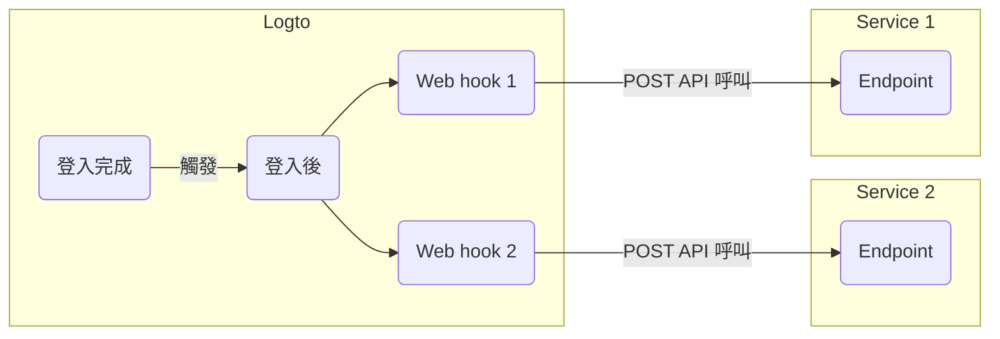

# Webhooks

Logto [Webhook](https://auth.wiki/webhook) 提供各種事件的即時通知，包括 [使用者帳戶](/user-management/user-data)、[角色](/authorization/role-based-access-control#roles)、[權限](/authorization/role-based-access-control#permissionsscopes)、[組織](/organizations/organization-data)、[組織角色](/authorization/organization-template#organization-role)、[組織權限](/authorization/organization-template#organization-permission) 和 [使用者互動](/end-user-flows) 的變更。

當事件觸發時，Logto 會向你提供的 Endpoint URL 發送 HTTP 請求，包含事件的詳細資訊，如使用者 ID、使用者名稱、電子郵件及其他相關細節（關於 payload 和 header 中包含的數據，請參閱 [Webhook request](/developers/webhooks/webhooks-request)）。你的應用程式可以處理此請求並採取自訂動作，例如發送電子郵件或更新資料庫中的數據。

我們會根據使用者需求持續新增更多事件。如果你有特定的業務需求，請告訴我們。

## 為什麼使用 Webhook？\{#why-use-webhook}

Webhooks 提供應用程式間的即時通訊，消除了輪詢的需求，並啟用即時數據更新。它們簡化了應用程式整合和工作流程自動化，無需複雜的程式碼或專有 API。

以下是一些常見的 CIAM Webhook 使用案例：

- **發送電子郵件**：配置 Webhook 以在新使用者註冊時發送歡迎電子郵件，或在使用者從新設備或位置登入時通知管理員。
- **發送通知**：配置 Webhook 以觸發與 CRM 系統的虛擬助手，當使用者註冊時提供即時客戶支援。
- **執行額外的 API 呼叫**：配置 Webhook 以通過檢查使用者的電子郵件域或 IP 地址來驗證使用者存取，然後使用 Logto Management API 分配具有資源權限的適當角色。
- **數據同步**：配置 Webhook 以保持應用程式更新有關變更，例如使用者帳戶暫停或刪除。
- **生成報告**：設置 Webhook 以接收使用者登入活動數據，並利用它來創建使用者參與或使用模式的報告。

## 術語 \{#terms}

| 項目                                                                                                                  | 描述                                                                                                                              |
| --------------------------------------------------------------------------------------------------------------------- | --------------------------------------------------------------------------------------------------------------------------------- |
| 事件 (Event)                                                                                                          | 當特定操作完成時，會觸發具有特定類型的 hook 事件。例如，當使用者完成註冊流程並創建新帳戶時，Logto 會發出 PostRegister hook 事件。 |
| Hook                                                                                                                  | 連接到特定事件的單個或一系列操作。操作可以是呼叫 API、執行程式碼片段等。                                                          |
| Webhook                                                                                                               | 一種 hook 的子類型，表示使用事件 payload 呼叫 API。                                                                               |
| 假設開發者希望在使用者通過新設備登入時發送通知，開發者可以在 PostSignIn 事件中添加一個呼叫其安全服務 API 的 webhook。 |

以下是啟用 Logto 中 `PostSignIn` 事件的兩個 web hook 的示例：

## 常見問題 \{#faqs}

### Logto 支援同步 webhooks 嗎？\{#does-logto-support-synced-webhooks}

雖然同步 webhooks 可以使使用者登入流程更順暢，但我們目前尚未支援（未來會支援）。因此，目前依賴同步 webhooks 的場景都需要不同的解決方案。如果你有任何問題，請隨時聯繫我們。

### 如何處理使用者權限變更？\{#how-to-deal-with-user-permission-change}

請參閱 [管理使用者權限變更](/authorization/role-based-access-control/protect-api-resources-with-rbac/#optional-handle-user-permission-change) 指南。

### 如何調試 webhook 超時？\{#how-to-debug-webhook-timeout}

對於接收 Webhooks 的 endpoint，應盡快返回 2xx 響應以告訴 Logto Webhook 已成功接收。由於不同使用者對 Webhooks 的處理邏輯差異很大，過於複雜的任務可能需要幾秒鐘，導致 Logto Webhook 超時。最佳做法是維護自己的事件隊列；在接收到 Logto Webhook 後，將事件插入隊列並返回 2xx 響應給 Logto。然後讓自己的工作程序逐步處理隊列中的任務。如果工作程序遇到錯誤，請在自己的伺服器上處理。

### 我可以從 `PostSignIn` webhooks 獲取客戶端 IP 地址嗎？\{#can-i-get-the-client-ip-address-from-postsignin-webhooks}

是的，你可以在 Webhook payload 中獲取 IP 地址、使用者代理等。如果你需要目前不支援的資訊，可以在 GitHub 問題中創建功能請求，或聯繫我們。

## 相關資源 \{#related-resources}

<Url href="https://blog.logto.io/webhooks-vs-polling">Webhooks vs. polling</Url>
