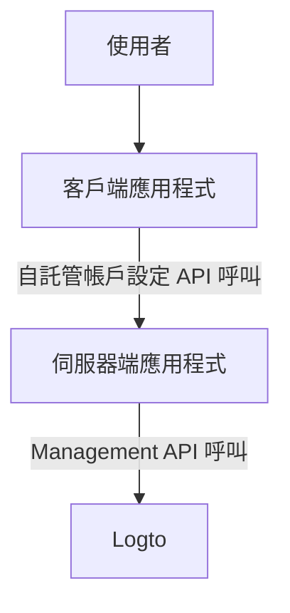
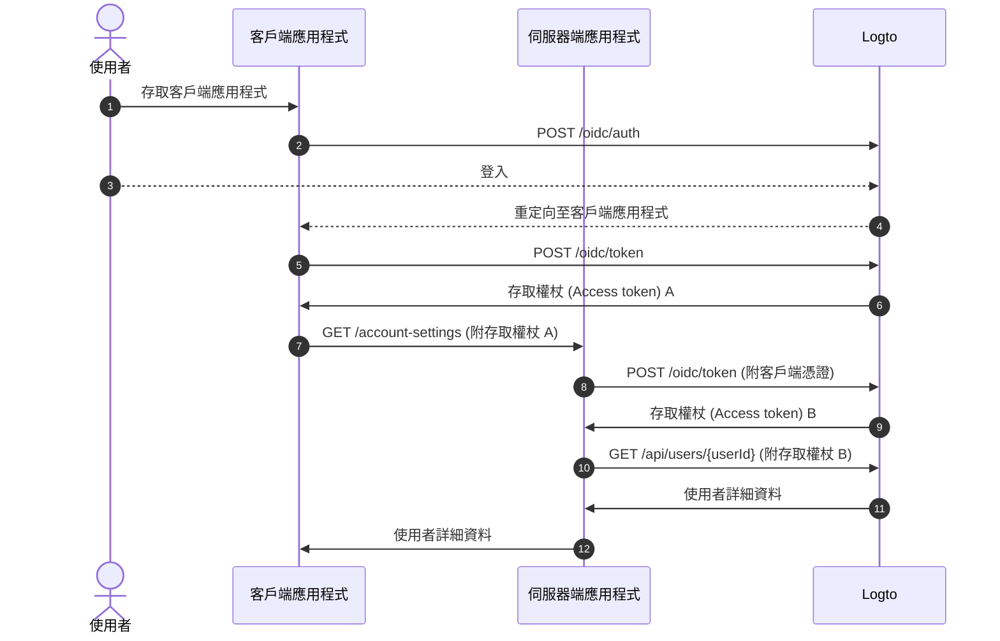
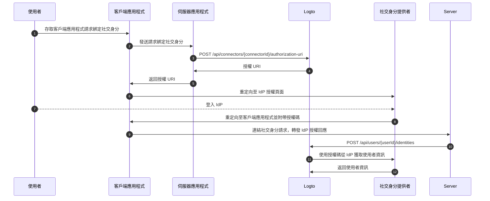

# 使用 Management API 管理帳戶設定

## 整合 \{#integrations}

Logto 提供多種 Management API 來管理使用者帳戶。你可以使用這些 API 為終端使用者建立自助帳戶設定頁面。

### 架構 \{#architecture}

1. **使用者**：需要存取和管理其帳戶設定的已驗證終端使用者。
2. **客戶端應用程式**：為使用者提供帳戶設定頁面的客戶端應用程式。
3. **伺服器端應用程式**：提供帳戶設定 API 給客戶端的伺服器端應用程式，與 Logto Management API 互動。
4. **Logto**：作為驗證 (Authentication) 和授權 (Authorization) 服務的 Logto，提供管理使用者帳戶的 Management API。

### 序列圖 \{#sequence-diagram}

1. 使用者存取客戶端應用程式。
2. 客戶端應用程式向 Logto 發送驗證請求，並將使用者重定向至 Logto 登入頁面。
3. 使用者登入 Logto。
4. 已驗證的使用者被重定向回客戶端應用程式，並附帶授權權杖。
5. 客戶端應用程式向 Logto 請求存取權杖以存取自託管帳戶設定 API。
6. Logto 向客戶端應用程式授予存取權杖。
7. 客戶端應用程式使用使用者存取權杖向伺服器端應用程式發送帳戶設定請求。
8. 伺服器端應用程式從使用者存取權杖中驗證請求者的身分和權限，然後向 Logto 請求 Management API 存取權杖。
9. Logto 向伺服器端應用程式授予 Management API 存取權杖。
10. 伺服器端應用程式使用 Management API 存取權杖向 Logto 請求使用者資料。
11. Logto 驗證伺服器的身分和 Management API 權限，並返回使用者資料。
12. 伺服器端應用程式根據請求者的權限處理使用者資料，並將使用者帳戶詳細資料返回給客戶端應用程式。

### 將 Management API 整合到伺服器端應用程式 \{#integrate-management-api-to-server-side-application}

查看 [Management API](/integrate-logto/interact-with-management-api/) 部分以了解如何將 Management API 與伺服器端應用程式整合。

## 使用者管理 API \{#user-management-apis}

### 使用者資料架構 \{#user-data-schema}

查看 [使用者資料和自訂資料](/user-management/user-data/) 部分以了解 Logto 中的使用者架構。

### 使用者資料和識別碼管理 API \{#user-profile-and-identifiers-management-apis}

使用者的資料和識別碼對於使用者管理至關重要。你可以使用以下 API 來管理使用者資料和識別碼。

| 方法  | 路徑                                                                                                     | 描述                               |
| ----- | -------------------------------------------------------------------------------------------------------- | ---------------------------------- |
| GET   | [/api/users/\{userId\}](https://openapi.logto.io/operation/operation-getuser)                            | 根據使用者 ID 獲取使用者詳細資料。 |
| PATCH | [/api/users/\{userId\}](https://openapi.logto.io/operation/operation-updateuser)                         | 更新使用者詳細資料。               |
| PATCH | [/api/users/\{userId\}/profile](https://openapi.logto.io/operation/operation-updateuserprofile)          | 根據使用者 ID 更新使用者資料欄位。 |
| GET   | [/api/users/\{userId\}/custom-data](https://openapi.logto.io/operation/operation-listusercustomdata)     | 根據使用者 ID 獲取使用者自訂資料。 |
| PATCH | [/api/users/\{userId\}/custom-data](https://openapi.logto.io/operation/operation-updateusercustomdata)   | 根據使用者 ID 更新使用者自訂資料。 |
| PATCH | [/api/users/\{userId\}/is-suspended](https://openapi.logto.io/operation/operation-updateuserissuspended) | 根據使用者 ID 更新使用者停用狀態。 |

### 電子郵件和電話號碼驗證 \{#email-and-phone-number-verification}

在 Logto 系統中，電子郵件地址和電話號碼都可以作為使用者識別碼，因此驗證它們是必要的。為此，我們提供了一組驗證碼 API 來幫助驗證提供的電子郵件或電話號碼。

:::note
在使用新電子郵件或電話號碼更新使用者資料之前，請確保驗證該電子郵件或電話號碼。
:::

| 方法 | 路徑                                                                                                                             | 描述                               |
| ---- | -------------------------------------------------------------------------------------------------------------------------------- | ---------------------------------- |
| POST | [/api/verifications/verification-code](https://openapi.logto.io/operation/operation-createverificationbyverificationcode)        | 發送電子郵件或電話號碼驗證碼。     |
| POST | [/api/verifications/verification-code/verify](https://openapi.logto.io/operation/operation-verifyverificationbyverificationcode) | 通過驗證碼驗證電子郵件或電話號碼。 |

### 使用者密碼管理 \{#user-password-management}

| 方法  | 路徑                                                                                                     | 描述                                 |
| ----- | -------------------------------------------------------------------------------------------------------- | ------------------------------------ |
| POST  | [/api/users/\{userId\}/password/verify](https://openapi.logto.io/operation/operation-verifyuserpassword) | 根據使用者 ID 驗證當前使用者密碼。   |
| PATCH | [/api/users/\{userId\}/password](https://openapi.logto.io/operation/operation-updateuserpassword)        | 根據使用者 ID 更新使用者密碼。       |
| GET   | [/api/users/\{userId\}/has-password](https://openapi.logto.io/operation/operation-getuserhaspassword)    | 根據使用者 ID 檢查使用者是否有密碼。 |

:::note
在更新使用者密碼之前，請確保驗證使用者的當前密碼。
:::

### 使用者社交身分管理 \{#user-social-identities-management}

| 方法   | 路徑                                                                                                                              | 描述                                                                     |
| ------ | --------------------------------------------------------------------------------------------------------------------------------- | ------------------------------------------------------------------------ |
| GET    | [/api/users/\{userId\}](https://openapi.logto.io/operation/operation-getuser)                                                     | 根據使用者 ID 獲取使用者詳細資料。社交身分可在 `identities` 欄位中找到。 |
| POST   | [/api/users/\{userId\}/identities](https://openapi.logto.io/operation/operation-createuseridentity)                               | 根據使用者 ID 將已驗證的社交身分連結到使用者。                           |
| DELETE | [/api/users/\{userId\}/identities](https://openapi.logto.io/operation/operation-deleteuseridentity)                               | 根據使用者 ID 從使用者中取消連結社交身分。                               |
| PUT    | [/api/users/\{userId\}/identities](https://openapi.logto.io/operation/operation-replaceuseridentity)                              | 根據使用者 ID 直接更新連結到使用者的社交身分。                           |
| POST   | [/api/connectors/\{connectorId\}/authorization-uri](https://openapi.logto.io/operation/operation-createconnectorauthorizationuri) | 獲取社交身分提供者的授權 URI。使用此 URI 來啟動新的社交身分連結。        |

1. 使用者存取客戶端應用程式並請求綁定社交身分。
2. 客戶端應用程式向伺服器發送請求以綁定社交身分。
3. 伺服器向 Logto 發送請求以獲取社交身分提供者的授權 URI。你需要在請求中提供自己的 `state` 參數和 `redirect_uri`。確保在社交身分提供者中註冊 `redirect_uri`。
4. Logto 將授權 URI 返回給伺服器。
5. 伺服器將授權 URI 返回給客戶端應用程式。
6. 客戶端應用程式將使用者重定向至 IdP 授權 URI。
7. 使用者登入 IdP。
8. IdP 使用 `redirect_uri` 和授權碼將使用者重定向回客戶端應用程式。
9. 客戶端應用程式驗證 `state` 並將 IdP 授權回應轉發給伺服器。
10. 伺服器向 Logto 發送請求以將社交身分連結到使用者。
11. Logto 使用授權碼從 IdP 獲取使用者資訊。
12. IdP 將使用者資訊返回給 Logto，Logto 將社交身分連結到使用者。

:::note
在將新社交身分連結到使用者時，有一些限制需要考慮：

- Management API 沒有任何會話上下文，任何需要活動會話以安全維護社交驗證狀態的社交連接器都不能通過 Management API 連結。不支援的連接器包括 apple、標準 OIDC 和標準 OAuth 2.0 連接器。
- 出於同樣的原因，Logto 無法驗證授權回應中的 `state` 參數。確保在客戶端應用程式中儲存 `state` 參數，並在收到授權回應時進行驗證。
- 你需要提前在社交身分提供者中註冊 `redirect_uri`。否則，社交 IdP 將不會將使用者重定向回你的客戶端應用程式。你的社交 IdP 必須接受多個回呼 `redirect_uri`，一個用於使用者登入，一個用於你自己的資料綁定頁面。

:::

### 使用者企業身分管理 \{#user-enterprise-identities-management}

| 方法 | 路徑                                                                                                    | 描述                                                                                                                                                      |
| ---- | ------------------------------------------------------------------------------------------------------- | --------------------------------------------------------------------------------------------------------------------------------------------------------- |
| GET  | [/api/users/\{userId\}?includeSsoIdentities=true](https://openapi.logto.io/operation/operation-getuser) | 根據使用者 ID 獲取使用者詳細資料。企業身分可在 `ssoIdentities` 欄位中找到。將 `includeSsoIdentities=true` 查詢參數添加到使用者詳細資料 API 中以包含它們。 |

目前，Management API 不支援將企業身分連結或取消連結到使用者。你只能顯示連結到使用者的企業身分。

### 個人存取權杖 \{#personal-access-token}

| 方法   | 路徑                                                                                                                                 | 描述                           |
| ------ | ------------------------------------------------------------------------------------------------------------------------------------ | ------------------------------ |
| GET    | [/api/users/\{userId\}/personal-access-tokens](https://openapi.logto.io/operation/operation-listuserpersonalaccesstokens)            | 獲取使用者的所有個人存取權杖。 |
| POST   | [/api/users/\{userId\}/personal-access-tokens](https://openapi.logto.io/operation/operation-createuserpersonalaccesstoken)           | 為使用者新增個人存取權杖。     |
| DELETE | [/api/users/\{userId\}/personal-access-tokens/\{name\}](https://openapi.logto.io/operation/operation-deleteuserpersonalaccesstoken)  | 根據名稱刪除使用者的權杖。     |
| PATCH  | [/api/users/\{userId\s}/personal-access-tokens/\{name\}](https://openapi.logto.io/operation/operation-updateuserpersonalaccesstoken) | 根據名稱更新使用者的權杖。     |

個人存取權杖為使用者提供了一種安全的方式來授予 [存取權杖 (Access token)](https://auth.wiki/access-token)，而無需使用其憑證和互動式登入。了解更多關於 [使用個人存取權杖](/user-management/personal-access-token)。

### 使用者多重要素驗證 (MFA) 設定管理 \{#user-mfa-settings-management}

| 方法   | 路徑                                                                                                                                 | 描述                                              |
| ------ | ------------------------------------------------------------------------------------------------------------------------------------ | ------------------------------------------------- |
| GET    | [/api/users/\{userId\}/mfa-verifications](https://openapi.logto.io/operation/operation-listusermfaverifications)                     | 根據使用者 ID 獲取使用者多重要素驗證 (MFA) 設定。 |
| POST   | [/api/users/\{userId\}/mfa-verifications](https://openapi.logto.io/operation/operation-createusermfaverification)                    | 根據使用者 ID 設定使用者多重要素驗證 (MFA)。      |
| DELETE | [/api/users/\{userId\}/mfa-verifications/\{verificationId\}](https://openapi.logto.io/operation/operation-deleteusermfaverification) | 根據 ID 刪除使用者多重要素驗證 (MFA)。            |

### 使用者帳戶刪除 \{#user-account-deletion}

| 方法   | 路徑                                                                             | 描述                       |
| ------ | -------------------------------------------------------------------------------- | -------------------------- |
| DELETE | [/api/users/\{userId\}](https://openapi.logto.io/operation/operation-deleteuser) | 根據使用者 ID 刪除使用者。 |
