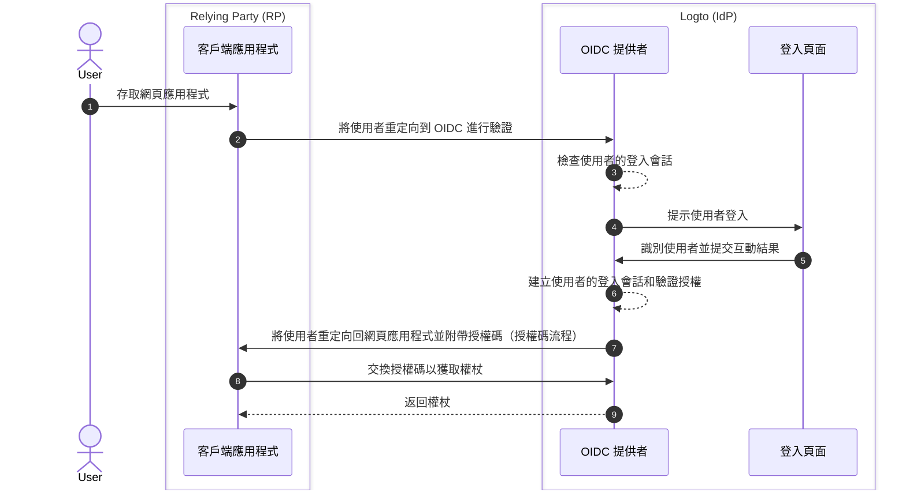

# 登出

在 Logto（作為基於 OIDC 的身分提供者）中，登出過程是一個多面向的概念，因為涉及到由 Logto 管理的集中式登入會話和由客戶端應用程式管理的分散式驗證狀態。

## 登入會話 \{#sign-in-session}

為了更好地理解登出過程，首先需要了解 Logto 如何管理使用者的登入會話及其驗證狀態。



1. 使用者存取網頁應用程式（RP）。
2. 客戶端應用程式將使用者重定向到 Logto（IdP）進行驗證。
3. OIDC 提供者檢查使用者的登入會話狀態。如果不存在會話或會話已過期，則提示使用者登入。
4. 使用者與登入頁面互動以完成驗證。
5. 登入成功後，Logto 為使用者建立新會話並重定向回客戶端應用程式，附帶授權碼。
6. OIDC 提供者為使用者建立新的登入會話和驗證授權。
7. OIDC 提供者將使用者重定向回客戶端，附帶授權碼（授權碼流程）。
8. 客戶端接收授權碼並交換以獲取權杖以存取使用者資訊。
9. 向客戶端應用程式授予權杖。

## 組件 \{#components}

### 由 Logto 管理的集中式登入會話 \{#centralized-sign-in-session-managed-by-logto}

在上述流程中，集中式登入會話由 Logto 管理。當使用者成功登入時，會建立會話；當使用者登出或會話過期時，會話將被銷毀。

Logto 登入會話是使用會話 cookie 管理的。當使用者登入時，會設置會話 cookie。所有驗證請求都會根據會話 cookie 進行驗證。如果會話 cookie 存在且有效，使用者將自動驗證並直接重定向到客戶端應用程式，附帶授權碼。否則，將提示使用者登入。

1. 共享的 Logto 會話 cookie
   對於從同一使用者代理（例如瀏覽器）登入多個客戶端應用程式的使用者，將在 Logto 域下擁有共享的會話 cookie。這意味著使用者只需登入一次，即可自動驗證其他客戶端應用程式。

   ```mermaid
    flowchart TD
    subgraph User [使用者代理 A]
      U[使用者]

      subgraph Layer1 [客戶端域 A]
        A[客戶端應用程式 A]
      end

      subgraph Layer1 [客戶端域 B]
        B[客戶端應用程式 B]
      end

      subgraph Layer2 [Logto 域]
          C{{Logto 登入會話？}}
          D[登入頁面]
      end
    end

    U --> |登入| A
    A --> |重定向到 Logto| C
    U --> |登入| B
    B --> |重定向到 Logto| C
    C --> |否| D
    D --> |建立會話| C
   ```

2. 隔離的 Logto 會話 cookie
   對於從不同設備或瀏覽器登入不同客戶端應用程式的使用者，將在 Logto 域下擁有隔離的會話 cookie。這意味著使用者需要為每個客戶端應用程式單獨登入。

   ```mermaid
    flowchart TD
    U[使用者]

    subgraph DeviceA [使用者代理 A]
      subgraph Layer1 [客戶端域 A]
        A[客戶端應用程式 A]
      end

      subgraph Layer2 [Logto 域]
          C{{Logto 登入會話？}}
          D[登入頁面]
      end
    end

    subgraph DeviceB [使用者代理 B]
      subgraph Layer3 [客戶端域 B]
        B[客戶端應用程式 B]
      end

      subgraph Layer4 [Logto 域]
          E{{Logto 登入會話？}}
          F[登入頁面]
      end
    end

    U --> |登入| A
    A --> |重定向到 Logto| C
    U --> |登入| B
    B --> |重定向到 Logto| E
    C --> |否| D
    E --> |否| F
    D --> |建立會話| C
    F --> |建立會話| E
   ```

## 由客戶端應用程式管理的分散式驗證狀態 \{#distributed-authentication-status-managed-by-the-client-applications}

每個客戶端應用程式維護自己的驗證狀態。無論是原生應用程式、SPA 還是 Web 應用程式，都有自己的方式來管理使用者的驗證狀態。

成功登入後，客戶端應用程式可能會收到 [ID 權杖](https://auth.wiki/id-token) 和 [存取權杖](https://auth.wiki/access-token)。客戶端應用程式可以使用 ID 權杖來確定使用者的身分，並使用存取權杖來存取使用者的資源。使用者的驗證狀態由存取權杖的過期時間表示。

- 原生和 SPA 應用程式：
  客戶端應用程式需要安全地存儲和管理這些權杖以維護使用者的驗證狀態。例如，將權杖存儲在本地存儲或會話存儲中，並在使用者登出時清除權杖。
- Web 應用程式：
  像使用 Next.js 等框架構建的 Web 應用程式通常會管理自己的登入使用者會話以及 Logto 發行的權杖。當使用者登入並且 Web 應用程式從 Logto 接收到權杖後，可以像 SPA 應用程式一樣在客戶端存儲權杖，或者可以在伺服器端存儲權杖並使用 cookie 或其他機制管理會話。

## 登出機制 \{#sign-out-mechanisms}

### 清除客戶端的權杖和本地會話 \{#clear-tokens-and-local-session-at-the-client-side}

在客戶端，簡單的登出涉及清除本地會話並從本地存儲或會話存儲中移除權杖（ID 權杖、存取權杖、重新整理權杖）。這會導致僅限客戶端的登出，而集中式會話仍然保持不變。以這種方式登出的使用者可能仍然能夠存取其他應用程式，直到集中式會話過期或被主動銷毀。

### 清除 Logto 的登入會話 \{#clear-sign-in-session-at-logto}

要明確登出使用者並清除 Logto 的會話，客戶端應用程式需要將使用者重定向到 Logto 的 **end session endpoint**。

例如：`https://{your-logto-domain}/oidc/session/end`

**end session endpoint** 是一個標準的 OIDC 端點，允許客戶端應用程式通知授權伺服器使用者已登出。該端點將清除 Logto 的集中式登入會話。

一旦會話被清除，任何後續的授權請求都將要求使用者重新登入。

如果提供了 **post-logout redirect URI**，使用者將在會話清除後被重定向到指定的 URI。否則，使用者將被重定向到 Logto 託管的預設登出後頁面。

## 聯邦登出：後台登出 \{#federated-sign-out-back-channel-logout}

為了更一致的登出管理，Logto 支援 [後台登出](https://openid.net/specs/openid-connect-backchannel-1_0-final.html)。後台登出是一種機制，允許 Logto 在使用者登出時通知所有在同一登入會話下的客戶端應用程式。

這在使用者從一個客戶端應用程式登出並希望從同一 Logto 登入會話下的所有其他客戶端應用程式中登出時特別有用。

要為你的客戶端應用程式啟用後台登出，請前往 Logto 儀表板中的應用程式詳細資訊頁面，並註冊一個後台登出 URI。當使用者從任何客戶端應用程式發起登出請求時，Logto 將向所有註冊的 URI 發送登出權杖。

如果你的客戶端應用程式需要在登出權杖中包含登入會話，請在後台登出配置中開啟 `Is session required` 設定。登出權杖中將包含一個 `sid` 宣告，以識別 Logto 中使用者的登入會話。

1. 使用者從一個客戶端應用程式發起登出請求。
2. Logto 接收到結束會話請求，生成登出權杖，並將登出權杖發送到所有註冊的後台登出 URI。
3. 每個客戶端應用程式接收到登出權杖並執行登出操作。

每個客戶端應用程式在接收到登出權杖時的登出操作：

- 驗證登出權杖。
- 清除本地會話並從本地存儲或會話存儲中移除權杖。

## Logto SDK 中的登出方法 \{#sign-out-methods-in-logto-sdks}

如果你正在使用 Logto 的 SDK 將 Logto 整合到你的客戶端應用程式中：

- 對於 SPA 和 Web 應用程式，`client.signOut()` 方法將清除本地權杖存儲並將使用者重定向到 Logto 的 end session endpoint。你可以指定一個 **post-logout redirect URI** 以在會話清除後重定向使用者。
- 對於原生應用程式（包括 **React Native** 和 **Flutter** 等混合應用程式），僅清除本地權杖存儲。這是因為在原生應用程式中，我們使用無會話的 webview 來處理登入過程。原生瀏覽器中不會存儲會話 cookie，因此無需清除 Logto 的登入會話。每個驗證請求都是獨立的請求，不攜帶任何會話 cookie。

:::note
對於不支援無會話 webview 或不識別 `emphasized` 設定的原生應用程式（使用 **React Native** 或 **Flutter** SDK 的 Android 應用程式），你可以在授權請求中傳遞 `prompt=login` 參數以強制使用者重新登入。
:::

## 常見問題 \{#faqs}

<details>
  <summary>

### 我沒有收到後台登出通知。 \{#im-not-receiving-the-back-channel-logout-notifications}

</summary>

- 確保在 Logto 儀表板中正確註冊了後台登出 URI。
- 確保你的客戶端應用程式有一個有效的活動登入會話，並且與發起登出請求的會話相同。

</details>

## 相關資源 \{#related-resources}

<Url href="https://blog.logto.io/oidc-back-channel-logout/">理解 OIDC 後台登出。</Url>
