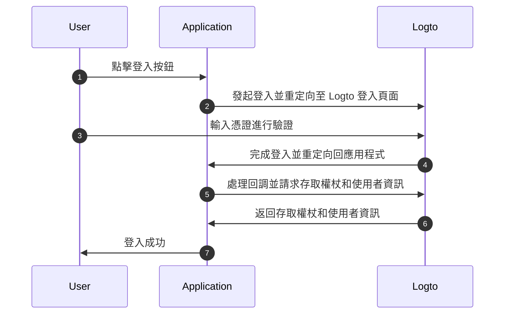
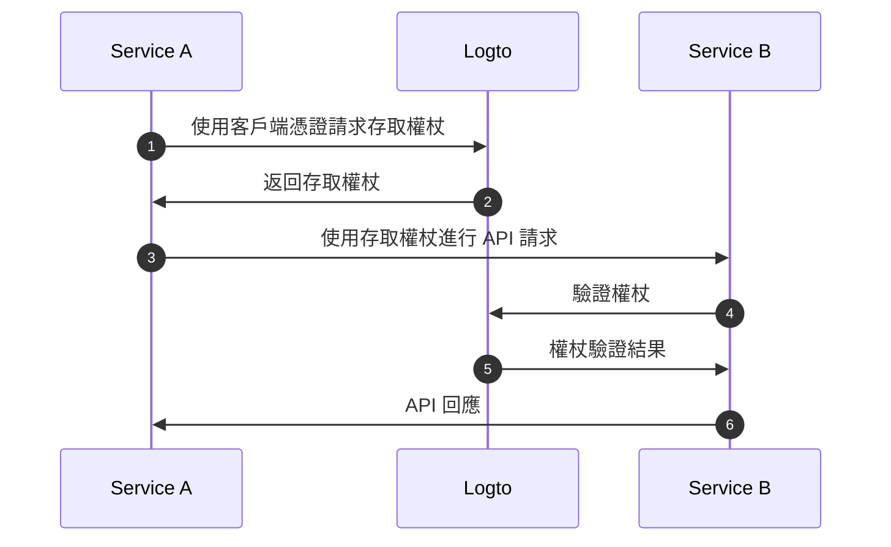
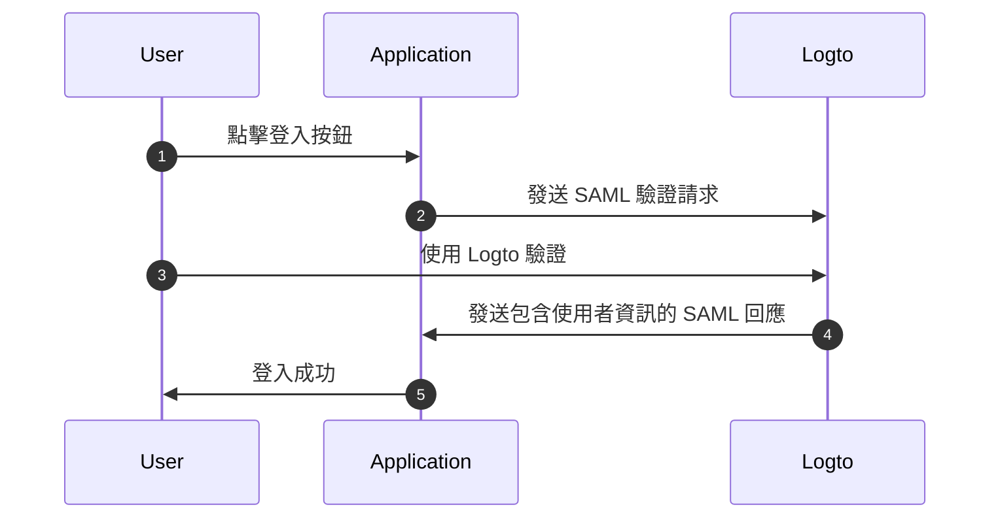

# 理解 OIDC 驗證 (Authentication) 流程

Logto 建立在 [OAuth 2.0](https://auth.wiki/oauth-2.0) 和 [OpenID Connect (OIDC)](https://auth.wiki/openid-connect) 標準之上。理解這些驗證標準將使整合過程更加順利和簡單。

### 使用者驗證 (Authentication) 流程 \{#user-authentication-flow}

以下是使用者透過 Logto 登入時的流程：

在此流程中，幾個關鍵概念對整合過程至關重要：

- `Application`：這代表你在 Logto 中的應用程式。你需要在 Logto Console 中創建應用程式配置，以建立實際應用程式與 Logto 服務之間的連接。了解更多關於 [Application](/integrate-logto/application-data-structure/#introduction)。
- `Redirect URI`：使用者在 Logto 登入頁面完成驗證後，Logto 透過此 URI 將他們重定向回你的應用程式。你需要在應用程式設置中配置 Redirect URI。詳情請參閱 [Redirect URIs](/integrate-logto/application-data-structure/#redirect-uris)。
- `Handle sign-in callback`：當 Logto 將使用者重定向回你的應用程式時，你的應用程式需要處理驗證數據並請求存取權杖和使用者資訊。不用擔心，Logto SDK 會自動處理這些。

此概述涵蓋了快速整合的基本要點。若需更深入的理解，請查看我們的 [Sign-in experience explained](/concepts/sign-in-experience/) 指南。

### 機器對機器驗證 (Authentication) 流程 \{#machine-to-machine-authentication-flow}

Logto 提供 [機器對機器 (M2M) 應用程式](/quick-starts/m2m) 類型，以啟用基於 [OAuth 2.0 Client Credentials flow](https://auth.wiki/client-credentials-flow) 的服務間直接驗證：

此機器對機器 (M2M) 驗證流程專為需要直接與資源通信而無需使用者互動（因此無 UI）的應用程式設計，例如在 Logto 中更新使用者數據的 API 服務或提取每日訂單的統計服務。

在此流程中，服務使用客戶端憑證進行驗證——[Application ID](/integrate-logto/application-data-structure/#application-id) 和 [Application Secret](/integrate-logto/application-data-structure/#application-secret) 的組合，這些憑證唯一識別並驗證服務。這些憑證在向 Logto 請求 [存取權杖](https://auth.wiki/access-token) 時作為服務的身分。

### SAML 驗證 (Authentication) 流程 \{#saml-authentication-flow}

除了 OAuth 2.0 和 OIDC，Logto 還支援 SAML（Security Assertion Markup Language）驗證，作為身分提供者 (IdP) 以實現與企業應用程式的整合。目前，Logto 支援 SP 發起的驗證流程：

#### SP 發起的流程 \{#saml-authentication-flow-sp-init}

在 SP 發起的流程中，驗證過程從服務提供者（你的應用程式）開始：

在此流程中：

- 使用者從你的應用程式（服務提供者）開始驗證過程
- 你的應用程式生成 SAML 請求並將使用者重定向至 Logto（身分提供者）
- 在 Logto 成功驗證後，SAML 回應被發送回你的應用程式
- 你的應用程式處理 SAML 回應並完成驗證

#### IdP 發起的流程 \{#saml-authentication-flow-idp-init}

Logto 將在未來版本中支援 IdP 發起的流程，使使用者能夠直接從 Logto 的入口網站開始驗證過程。請關注此功能的更新。

此 SAML 整合使企業應用程式能夠利用 Logto 作為其身分提供者，支援現代和傳統的基於 SAML 的服務提供者。

## 相關資源 \{#related-resources}

<Url href="https://blog.logto.io/secure-cloud-apps-with-oauth-and-openid-connect">
  部落格：使用 OAuth 2.0 和 OpenID Connect 保護雲端應用程式
</Url>

<Url href="https://blog.logto.io/sso-is-better">為何多應用程式的單一登入 (SSO) 更好</Url>

<Url href="https://blog.logto.io/centralized-identity-system">為何多應用業務需要集中式身分系統</Url>
