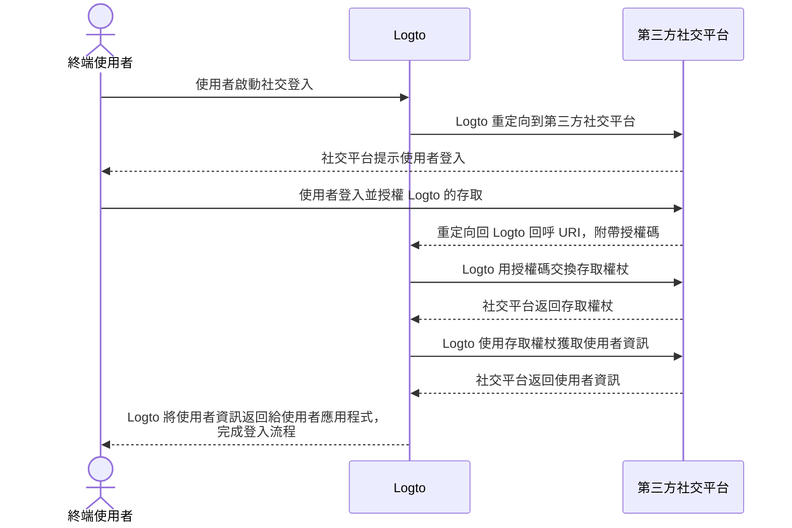

# 實作連接器

在了解連接器的檔案結構後，我們來討論開發連接器的實作和主要概念。

我們將通過一個簡單的社交和無密碼連接器範例，讓你可以用幾乎相同的概念來構建你的連接器。

在這部分，我們不會深入探討特定參數（如 `config`）的細節，因為這不是本指南的重點。實作新連接器的開發者應閱讀第三方服務供應商提供的文件，這些文件應詳細說明參數。

## 構建社交連接器 \{#build-a-social-connector}

讓我們以 GitHub 連接器為例。

大多數社交連接器的授權流程遵循 [OAuth 授權碼流程](https://openid.net/specs/openid-connect-basic-1_0.html)。

:::note
大多數 _社交連接器_，透過終端使用者的驗證獲取使用者資料遵循兩步驟方案（假設所有步驟成功）：

1. 開始驗證請求並獲得使用者的驗證。
2. 使用連接器供應商授予的 `authCode` 獲取 `存取權杖 (accessToken)`。
3. 使用 `存取權杖 (accessToken)` 請求公開可訪問的使用者資料。

:::



為了完成此流程，我們需要以下三個方法：

### getAuthorizationUri \{#getauthorizationuri}

`getAuthorizationUri` 生成一個重定向 URL，該 URL 可以將終端使用者導向需要使用者驗證的頁面。

此介面在 [`@logto/connector-kit`](https://github.com/logto-io/logto/blob/master/packages/toolkit/connector-kit/src/types/social.ts) 中定義為 `GetAuthorizationUri`。

你可以使用 `setSession`（`GetAuthorizationUri` 的第二個輸入參數）儲存與登入相關的必要資訊，以便於 `getUserInfo` 方法。

以下參數是必需的：

- `authorizationEndpoint` 可以在 GitHub OAuth 文件網站找到，這是終端使用者應前往進行驗證的頁面
- `config`，在 GitHub 情境中包括 `clientId` 和 `clientSecret`
- `state`，用於防止 CSRF 的隨機字串
- 終端使用者成功驗證後的登陸頁面 `redirectUri`

```typescript
const getAuthorizationUri = async ({ state, redirectUri }) => {
  const queryParameters = new URLSearchParams({
    client_id: config.clientId, // `config` 包含你的 GitHub 應用程式憑證
    redirect_uri: redirectUri,
    state,
  });

  return `${authorizationEndpoint}?${queryParameters.toString()}`;
};
```

### getAccessToken \{#getaccesstoken}

`getAccessToken` 使用終端使用者成功驗證後發出的授權碼獲取存取權杖。

除了我們在前面 `getAuthorizationUri` 方法中提到的 `config`，我們還需要獲取：

- 重定向登陸頁面帶來的授權 `code`
- `accessTokenEndpoint`，這是使用授權碼獲取存取權杖的端點

```typescript
const getAccessToken = async (config: GithubConfig, code: string) => {
  const { clientId: client_id, clientSecret: client_secret } = config;

  const httpResponse = await got.post({
    url: accessTokenEndpoint,
    json: {
      client_id,
      client_secret,
      code,
    },
    timeout: defaultTimeout,
  });

  const result = accessTokenResponseGuard.safeParse(qs.parse(httpResponse.body));

  if (!result.success) {
    throw new ConnectorError(ConnectorErrorCodes.InvalidResponse, result.error);
  }

  const { access_token: accessToken } = result.data;

  assert(accessToken, new ConnectorError(ConnectorErrorCodes.SocialAuthCodeInvalid));

  return { accessToken };
};
```

### getUserInfo \{#getuserinfo}

`getUserInfo` 使用在前一步獲得的存取權杖獲取使用者資訊。

此介面在 [`@logto/connector-kit`](https://github.com/logto-io/logto/blob/master/packages/toolkit/connector-kit/src/types/social.ts) 中定義為 `GetUserInfo`。

為了登入目的，你可以使用 `getSession` 函數檢索必要資訊。

`userInfoEndpoint` 是用來獲取使用者資訊的端點。

你可以查閱官方文件以找到可以在使用者資訊端點訪問的特定使用者資訊和相應的權限範圍。

由連接器的身分提供者（在此情境中為 GitHub）分配的 `id` 是必需的；其他資訊是可選的。如果你可以從使用者資料中獲取 `email` 或 `phone`，請確保它們是「已驗證」的。你還需要將返回的鍵與 [Logto 使用者資料](/user-management/user-data/#basic-data) 中的欄位名稱對齊。

```typescript
const getUserInfo = async (
  data: { code: string; config: GithubConfig },
  getSession: GetSession,
  { set: SetStorageValue, get: GetStorageValue }
) => {
  const { code, config } = data;
  const { accessToken } = await getAccessToken(config, code);

  try {
    const httpResponse = await got.get(userInfoEndpoint, {
      headers: {
        authorization: `token ${accessToken}`,
      },
      timeout: defaultTimeout,
    });

    const result = userInfoResponseGuard.safeParse(parseJson(httpResponse.body));

    if (!result.success) {
      throw new ConnectorError(ConnectorErrorCodes.InvalidResponse, result.error);
    }

    const { id, avatar_url: avatar, email, name } = result.data;

    return {
      id: String(id),
      avatar: conditional(avatar),
      email: conditional(email),
      name: conditional(name),
    };
  } catch (error: unknown) {
    if (error instanceof HTTPError) {
      const { statusCode, body: rawBody } = error.response;

      if (statusCode === 401) {
        throw new ConnectorError(ConnectorErrorCodes.SocialAccessTokenInvalid);
      }

      throw new ConnectorError(ConnectorErrorCodes.General, JSON.stringify(rawBody));
    }

    throw error;
  }
};
```

你可以在[這裡](https://github.com/logto-io/connectors/blob/master/packages/connector-github/src/index.ts)找到完整的實作。

有關可配置參數的更多詳細資訊，請參閱 GitHub 連接器 README 或 GitHub 官方文件。

:::note
我們討論的範例基於 OAuth 協議的授權碼授權類型，這在 Logto 的 GitHub 連接器中使用。然而，值得強調的是，另一種授權類型，即隱式授權類型，也可以用來檢索使用者的資料，並且實際上在驗證響應中直接提供 `access_token`。儘管如此，由於其更強的安全性，通常建議使用授權碼授權類型而非隱式類型。

你也可以基於 OIDC 或其他開放協議構建連接器，這取決於你的使用案例以及你想連接的社交供應商的相容性。
:::

## 構建無密碼連接器 \{#build-a-passwordless-connector}

讓我們通過 Aliyun 直郵連接器的實作來了解構建無密碼連接器的過程。

無密碼連接器用於向終端使用者的電子郵件或電話發送隨機碼。因此，需要一個 `sendMessage` 方法。

### sendMessage \{#sendmessage}

為了發送訊息，我們需要正確設置 `config` 和 `endpoint`。

- `endpoint` 是你的 API 呼叫連接的端點
- `config` 包含 `templates`（在不同使用者流程中發送密碼的內容模板）、`clientId` 和 `clientSecret`（用於訪問 API 請求）

```typescript
const sendMessage = async (data, inputConfig) => {
  const { to, type, payload } = data;
  const config = inputConfig ?? (await getConfig(defaultMetadata.id));
  validateConfig<AliyunDmConfig>(config, aliyunDmConfigGuard);
  const { accessKeyId, accessKeySecret, accountName, fromAlias, templates } = config;
  const template = templates.find((template) => template.usageType === type);

  assert(
    template,
    new ConnectorError(
      ConnectorErrorCodes.TemplateNotFound,
      `Cannot find template for type: ${type}`
    )
  );

  const parameters = {
    AccessKeyId: accessKeyId,
    AccountName: accountName,
    ReplyToAddress: 'false',
    AddressType: '1',
    ToAddress: to,
    FromAlias: fromAlias,
    Subject: template.subject,
    HtmlBody:
      typeof payload.code === 'string'
        ? template.content.replace(/{{code}}/g, payload.code)
        : template.content,
  };

  try {
    const httpResponse = await request(
      endpoint,
      { Action: 'SingleSendMail', ...staticConfigs, ...parameters },
      accessKeySecret
    );

    const result = sendEmailResponseGuard.safeParse(parseJson(httpResponse.body));

    if (!result.success) {
      throw new ConnectorError(ConnectorErrorCodes.InvalidResponse, result.error);
    }

    return result.data;
  } catch (error: unknown) {
    if (error instanceof HTTPError) {
      const {
        response: { body: rawBody },
      } = error;

      assert(typeof rawBody === 'string', new ConnectorError(ConnectorErrorCodes.InvalidResponse));

      errorHandler(rawBody);
    }

    throw error;
  }
};

const request = async (
  url: string,
  parameters: PublicParameters & Record<string, string>,
  accessKeySecret: string
) => {
  const finalParameters: Record<string, string> = {
    ...parameters,
    SignatureNonce: String(Math.random()),
    Timestamp: new Date().toISOString(),
  };
  const signature = getSignature(finalParameters, accessKeySecret, 'POST');

  const payload = new URLSearchParams();

  for (const [key, value] of Object.entries(finalParameters)) {
    payload.append(key, value);
  }
  payload.append('Signature', signature);

  return got.post({
    url,
    headers: {
      'Content-Type': 'application/x-www-form-urlencoded',
    },
    form: payload,
  });
};
```

你可以在[這裡](https://github.com/logto-io/connectors/blob/master/packages/connector-aliyun-dm/src/index.ts)找到完整的實作。

有關可配置參數的更多詳細資訊，請參閱 Aliyun 直郵連接器 README 或 Aliyun 直郵官方文件。

## 還有什麼？ \{#whats-more}

要查看連接器方法的定義並構建連接器介面設計的概念，請參閱 [`@logto/connector-kit`](https://github.com/logto-io/logto/tree/master/packages/toolkit/connector-kit)。你還可以在「[連接器 - ConnectorMetadata](/connectors/connector-data-structure/#connectors-local-storage-connectormetadata)」和「[連接器檔案結構](/logto-oss/develop-your-connector/connector-file-structure/)」中找到 _ConnectorMetadata_ 參考，這可以幫助你瞭解如何組織你的實作。

- 所有連接器的配置 [_Zod_](https://github.com/colinhacks/zod) 架構是必需的。這非常重要，因為我們在將 `config` 儲存到資料庫和呼叫需要 `config` 資訊的 API 之前進行類型檢查。
- 所有 _SMS 連接器_ 和 _電子郵件連接器_ 都需要一個 `sendMessage` 方法來使用資料庫中的配置呼叫服務供應商的訊息發送 API。開發者還可以在管理控制台中設置連接器時，使用此方法發送測試訊息，使用未儲存的配置。
- 授權 URL 生成器 `getAuthorizationUri` 和使用者資料檢索器 `getUserInfo` 是所有 _社交連接器_ 所需的（`getAccessToken` 被視為 `getUserInfo` 中的可選步驟）。
- 所有連接器的方法都通過 API 呼叫運作，因此連接器開發者需要檢查文件並處理可能不成功的 API 呼叫響應。

## 安裝你自己的連接器 \{#install-your-own-connectors}

我們假設你已經完成了自己的連接器構建。請按照以下步驟手動安裝它：

1. 將你實作的連接器資料夾複製到 [`logto-io/logto`](https://github.com/logto-io/logto) 的 `/packages/connectors` 目錄。
2. 在 logto 資料夾的根目錄輸入 `pnpm pnpm:devPreinstall && pnpm i` 來安裝連接器庫的依賴。
3. 使用 `pnpm connectors build` 構建連接器。
4. 使用 `pnpm cli connector link` 連結本地連接器。
5. 在 `logto-io/logto` 的根目錄使用 `pnpm dev` 重新啟動 Logto 實例，你可以看到連接器已成功安裝。

你現在可以測試並嘗試你的連接器，看看它是否如預期運作。

如果你想添加已經發佈到 NPM 或 Logto 官方連接器的連接器，你可以查看 [使用 Logto CLI - 管理連接器](/logto-oss/using-cli/manage-connectors/#add-connectors)。
