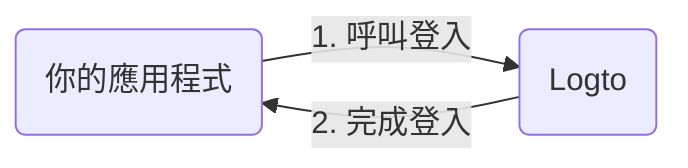

import RegardingRedirectBasedSignIn from './_regarding-redirect-based-sign-in.mdx';

在深入細節之前，以下是終端使用者體驗的快速概覽。登入流程可簡化如下：

1. 你的應用程式呼叫登入方法。
2. 使用者被重定向至 Logto 登入頁面。對於原生應用程式，系統瀏覽器會被開啟。
3. 使用者登入後被重定向回你的應用程式（配置為重定向 URI）。

<RegardingRedirectBasedSignIn />

---
