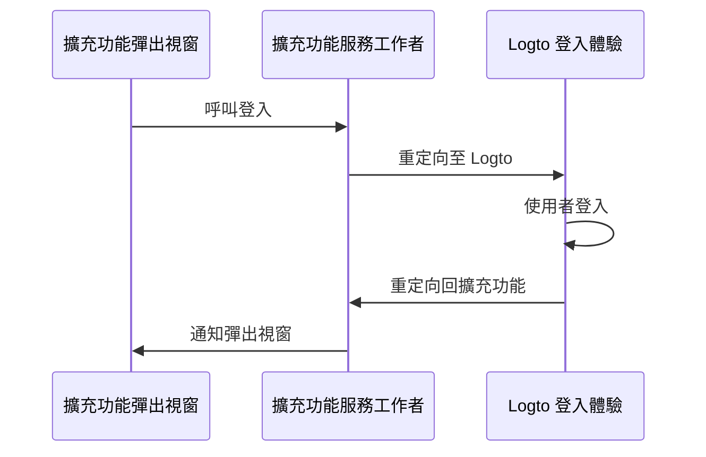

import RegardingRedirectBasedSignIn from '../../fragments/_regarding-redirect-based-sign-in.mdx';

### 驗證流程 \{#the-authentication-flow}

假設你在 Chrome 擴充功能的彈出視窗中放置了一個「登入」按鈕，驗證流程將如下所示：



對於擴充功能中的其他互動頁面，只需將 `擴充功能彈出視窗` 參與者替換為頁面的名稱。在本教程中，我們將專注於彈出頁面。

<RegardingRedirectBasedSignIn />

### 更新 `manifest.json` \{#update-the-manifestjson}

Logto SDK 需要在 `manifest.json` 中添加以下權限：

```json title="manifest.json"
{
  "permissions": ["identity", "storage"],
  "host_permissions": ["https://*.logto.app/*"]
}
```

- `permissions.identity`：需要用於 Chrome Identity API，用於登入和登出。
- `permissions.storage`：需要用於儲存使用者的會話。
- `host_permissions`：需要用於 Logto SDK 與 Logto API 進行通信。

:::note
如果你在 Logto Cloud 上使用自訂網域，則需要更新 `host_permissions` 以匹配你的網域。
:::

### 設定背景腳本（服務工作者）\{#set-up-a-background-script-service-worker}

在你的 Chrome 擴充功能的背景腳本中，初始化 Logto SDK：

```js title="service-worker.js"
import LogtoClient from '@logto/chrome-extension';

export const logtoClient = new LogtoClient({
  endpoint: '<your-logto-endpoint>'
  appId: '<your-logto-app-id>',
});
```

將 `<your-logto-endpoint>` 和 `<your-logto-app-id>` 替換為實際值。你可以在 Logto Console 中剛創建的應用程式頁面找到這些值。

如果你沒有背景腳本，可以按照 [官方指南](https://developer.chrome.com/docs/extensions/develop/concepts/service-workers/basics) 創建一個。

:::info
**為什麼需要背景腳本？**

普通擴充功能頁面如彈出視窗或選項頁無法在背景中運行，且在驗證過程中可能會被關閉。背景腳本確保驗證過程能夠正確處理。
:::

接著，我們需要監聽來自其他擴充功能頁面的訊息並處理驗證過程：

```js title="service-worker.js"
chrome.runtime.onMessage.addListener((message, sender, sendResponse) => {
  // 在下面的代碼中，由於我們為每個動作返回 `true`，因此需要調用 `sendResponse`
  // 來通知發送者。你也可以在這裡處理錯誤，或使用其他方式通知發送者。

  if (message.action === 'signIn') {
    const redirectUri = chrome.identity.getRedirectURL('/callback');
    logtoClient.signIn(redirectUri).finally(sendResponse);
    return true;
  }

  if (message.action === 'signOut') {
    const redirectUri = chrome.identity.getRedirectURL();
    logtoClient.signOut(redirectUri).finally(sendResponse);
    return true;
  }

  return false;
});
```

你可能注意到上面的代碼中使用了兩個重定向 URI。它們都是由 `chrome.identity.getRedirectURL` 創建的，這是一個 [內建的 Chrome API](https://developer.chrome.com/docs/extensions/reference/api/identity#method-getRedirectURL)，用於生成驗證流程的重定向 URL。這兩個 URI 將是：

- `https://<extension-id>.chromiumapp.org/callback` 用於登入。
- `https://<extension-id>.chromiumapp.org/` 用於登出。

注意這些 URI 是不可訪問的，它們僅用於 Chrome 觸發驗證過程的特定操作。

### 更新 Logto 應用程式設定 \{#update-logto-application-settings}

現在我們需要更新 Logto 應用程式設定，以允許我們剛創建的重定向 URI。

1. 前往 Logto Console 中的應用程式頁面。
2. 在「重定向 URI」部分，添加 URI：`https://<extension-id>.chromiumapp.org/callback`。
3. 在「登出後重定向 URI」部分，添加 URI：`https://<extension-id>.chromiumapp.org/`。
4. 在「CORS 允許的來源」部分，添加 URI：`chrome-extension://<extension-id>`。Chrome 擴充功能中的 SDK 將使用此來源與 Logto API 進行通信。
5. 點擊 **保存更改**。

記得將 `<extension-id>` 替換為你的實際擴充功能 ID。你可以在 `chrome://extensions` 頁面找到擴充功能 ID。

### 在彈出視窗中添加登入和登出按鈕 \{#add-sign-in-and-sign-out-buttons-to-the-popup}

我們快完成了！讓我們在彈出頁面中添加登入和登出按鈕及其他必要的邏輯。

在 `popup.html` 文件中：

```html title="popup.html"
<button id="sign-in">登入</button> <button id="sign-out">登出</button>
```

在 `popup.js` 文件中（假設 `popup.js` 已包含在 `popup.html` 中）：

```js title="popup.js"
document.getElementById('sign-in').addEventListener('click', async () => {
  await chrome.runtime.sendMessage({ action: 'signIn' });
  // 登入完成（或失敗），你可以在這裡更新 UI。
});

document.getElementById('sign-out').addEventListener('click', async () => {
  await chrome.runtime.sendMessage({ action: 'signOut' });
  // 登出完成（或失敗），你可以在這裡更新 UI。
});
```

### 檢查點：測試驗證流程 \{#checkpoint-test-the-authentication-flow}

現在你可以在 Chrome 擴充功能中測試驗證流程：

1. 打開擴充功能彈出視窗。
2. 點擊「登入」按鈕。
3. 你將被重定向到 Logto 登入頁面。
4. 使用你的 Logto 帳戶登入。
5. 你將被重定向回 Chrome。

### 檢查驗證狀態 \{#check-authentication-state}

由於 Chrome 提供統一的存儲 API，除了登入和登出流程外，所有其他 Logto SDK 方法都可以直接在彈出頁面中使用。

在你的 `popup.js` 中，你可以重用在背景腳本中創建的 `LogtoClient` 實例，或使用相同的配置創建一個新實例：

```js title="popup.js"
import LogtoClient from '@logto/chrome-extension';

const logtoClient = new LogtoClient({
  endpoint: '<your-logto-endpoint>'
  appId: '<your-logto-app-id>',
});

// 或重用在背景腳本中創建的 logtoClient 實例
import { logtoClient } from './service-worker.js';
```

然後你可以創建一個函數來加載驗證狀態和使用者的資料：

```js title="popup.js"
const loadAuthenticationState = async () => {
  const isAuthenticated = await logtoClient.isAuthenticated();
  // 根據驗證狀態更新 UI

  if (isAuthenticated) {
    const user = await logtoClient.getIdTokenClaims(); // { sub: '...', email: '...', ... }
    // 使用使用者的資料更新 UI
  }
};
```

你也可以將 `loadAuthenticationState` 函數與登入和登出邏輯結合：

```js title="popup.js"
document.getElementById('sign-in').addEventListener('click', async () => {
  await chrome.runtime.sendMessage({ action: 'signIn' });
  await loadAuthenticationState();
});

document.getElementById('sign-out').addEventListener('click', async () => {
  await chrome.runtime.sendMessage({ action: 'signOut' });
  await loadAuthenticationState();
});
```

以下是具有驗證狀態的彈出頁面示例：


### 其他考量 \{#other-considerations}

- **服務工作者打包**：如果你使用像 Webpack 或 Rollup 這樣的打包工具，你需要明確將目標設置為 `browser` 或類似選項，以避免不必要的 Node.js 模組打包。
- **模組解析**：Logto Chrome 擴充功能 SDK 是一個僅支持 ESM 的模組。

查看我們的 [範例專案](https://github.com/logto-io/js/tree/HEAD/packages/chrome-extension-sample) 以獲取完整的 TypeScript、Rollup 和其他配置示例。
