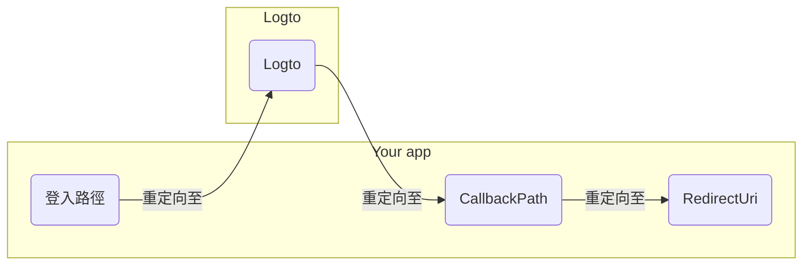

import RegardingRedirectBasedSignIn from '../../fragments/_regarding-redirect-based-sign-in.mdx';

在繼續之前，我們需要澄清 .NET Core 驗證中介軟體中的兩個容易混淆的術語：

1. **CallbackPath**：使用者登入後，Logto 將使用者重定向回的 URI（在 Logto 中稱為「重定向 URI」）
2. **RedirectUri**：在 Logto 驗證中介軟體中完成必要操作後將被重定向的 URI。

登入流程可以如下圖所示：

 

類似地，.NET Core 也有 **SignedOutCallbackPath** 和 **RedirectUri** 用於登出流程。

為了清晰起見，我們將它們稱為：

| 我們使用的術語         | .NET Core 術語        |
| ---------------------- | --------------------- |
| Logto 重定向 URI       | CallbackPath          |
| Logto 登出後重定向 URI | SignedOutCallbackPath |
| 應用程式重定向 URI     | RedirectUri           |

<RegardingRedirectBasedSignIn />
