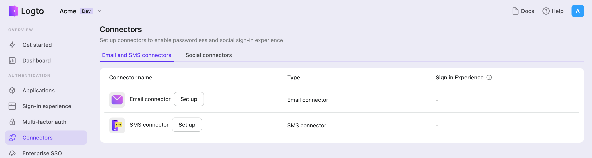

{props.connectorType} connector is a method used to send one-time passwords (OTPs) for authentication. It enables {props.passwordlessSignUpIdentifier} verification to support passwordless authentication, including {props.connectorType}-based registration, sign-in, two-factor authentication (2FA), and account recovery.
You can easily connect {props.connector} as your {props.connectorType} provider. With the Logto {props.connectorType} connector, you can set this up in just a few minutes.

To add a {props.connectorType} connector, simply follow these steps:

1. Navigate to [Console > Connector > Email and SMS connectors](https://cloud.logto.io/to/connectors/passwordless).
2. To add a new {props.connectorType} connector, click the "Set up" button and select "{props.connector}".
3. Review the README documentation for your selected provider.
4. Complete the configuration fields in the "Parameter Configuration" section.
5. Customize the {props.connectorType} template using the JSON editor.
6. Test your configuration by sending a verification code to your {props.passwordlessSignUpIdentifier}.

:::note
If you are following the in-place Connector guide, you can skip the next section.
:::
