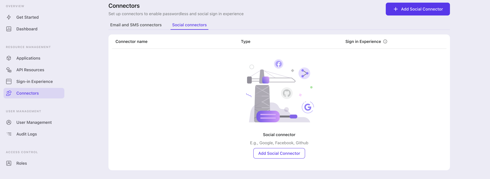

To add a social connector, go to the "Connector" tab in the Admin Console, then click on "Social Connectors". From there, click "Add Social Connector".

In the openning modal, select "{props.connector}" and click "Next".

On the next page, you will see a two-column layout with the README content on the left and configuration on the right.

Feel free to follow the README file in place or read the following section to complete the configuration process. If you follow the in-place guide, you can skip the next section.
