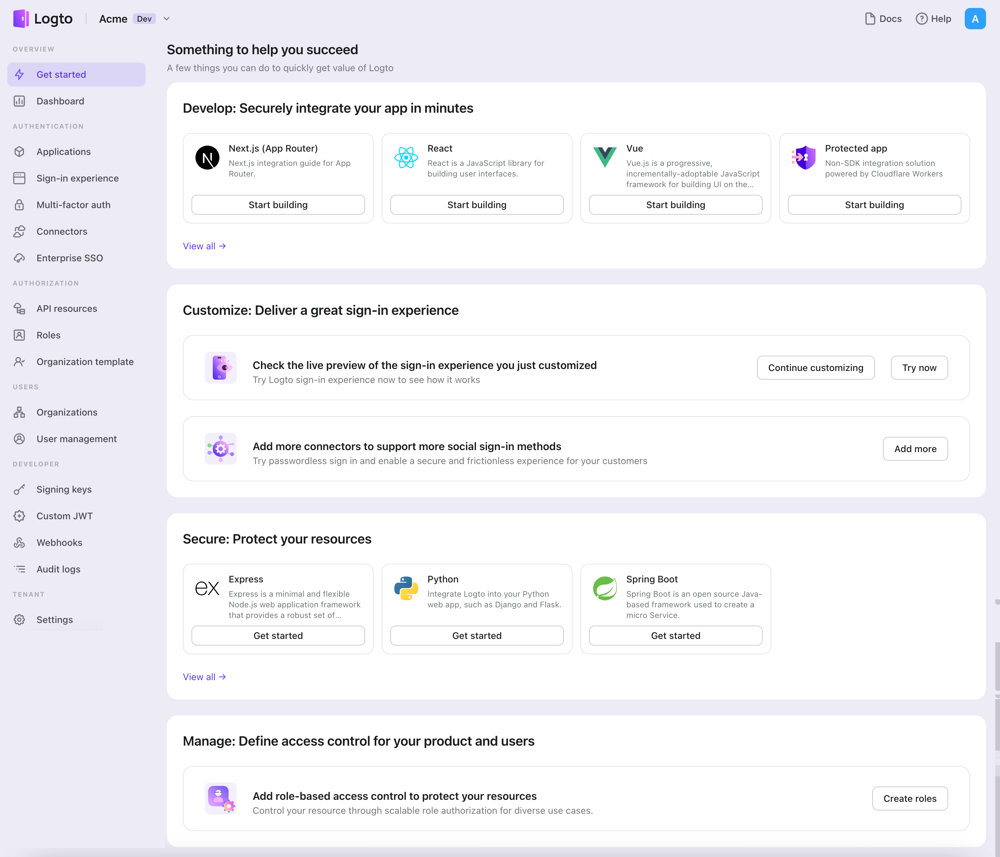

import createApp from '../assets/create-application-modal.png';

In you browser, open a new tab and enter the link of Logto Admin Console.

Once the page is loaded, in the "Get Started" section click the `View all` link to open the application framework list page.

### Choose your application type

  In the opening modal, scroll to the "{props.type}" section or filter all the available "
  {props.type}" frameworks using the quick filter checkboxes on the left.

  Click the{' '}
  {props.framework
    .split('or')
    .map((text) => `"${text.trim()}"`)
    .join(' or ')}{' '}
  framework card to start creating your application.

### Enter application name

  

Enter the application name, e.g., "Bookstore," and click "Create Application."

🎉 Ta-da! You just created your first application in Logto. You'll see a congrats page which includes a detailed integration guide. Follow the guide to see what the experience will be in your application.
