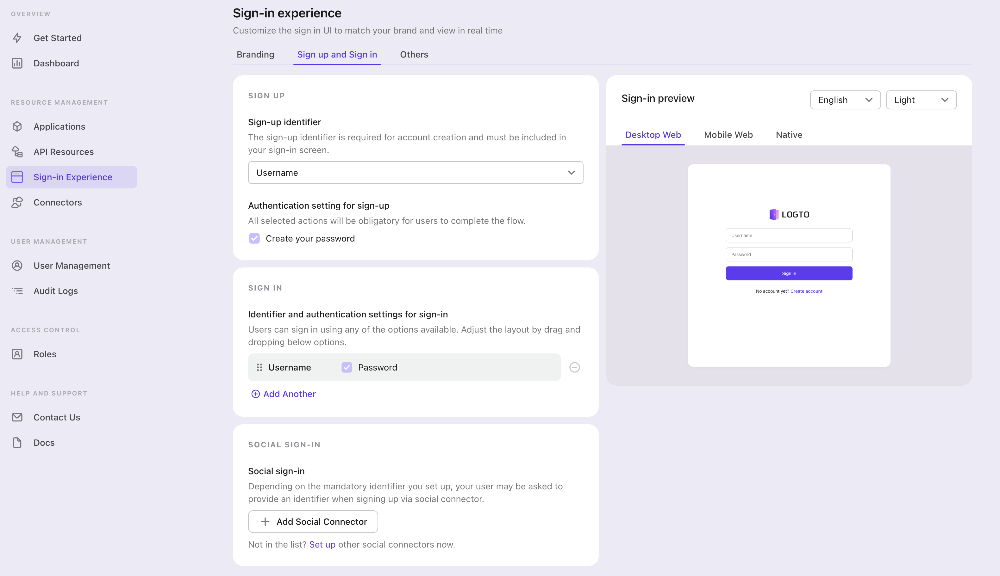

Switch to the "Sign-in Experience" tab, then click the "Sign-up and Sign-in" tab.

:::note
If it's the first time you enter the tab, you will see a quick introduction about Sign-in Experience and its basic configuration.
:::

  Select "{props.passwordlessSignUpIdentifier}" or "Email address or phone number" for the "Sign-up
  identifier" to provide sign-up for {props.connectorType} passwordless sign-in, which may increase
  your conversion rate.

Finally, click "Save Changes" on the bottom right corner.
