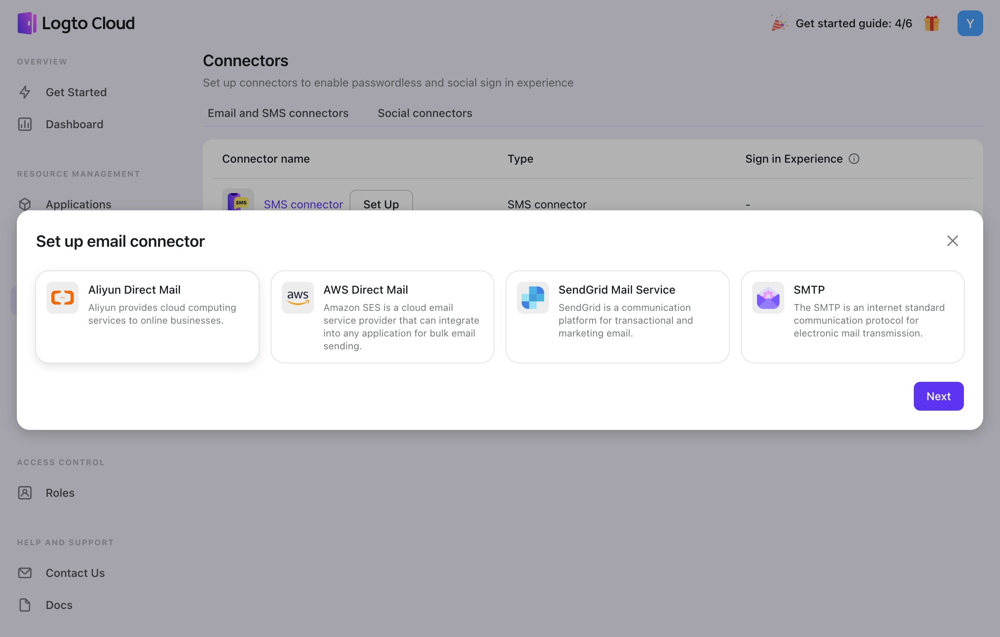
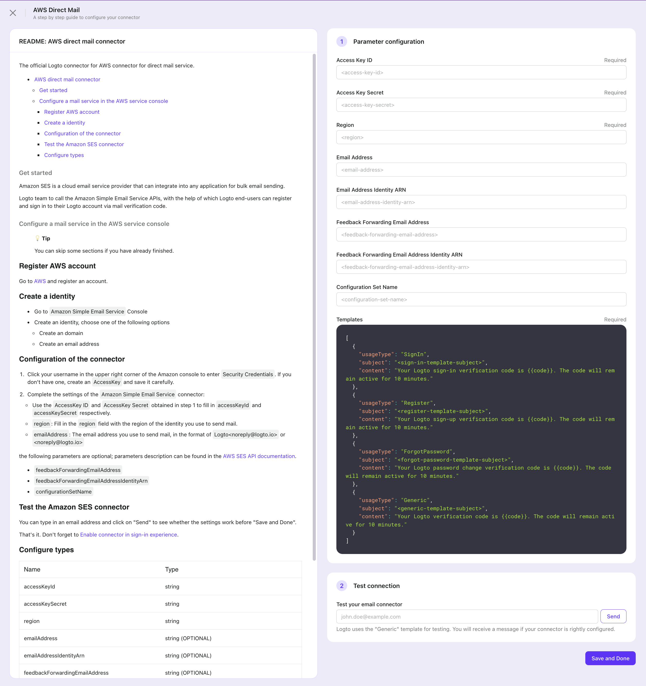
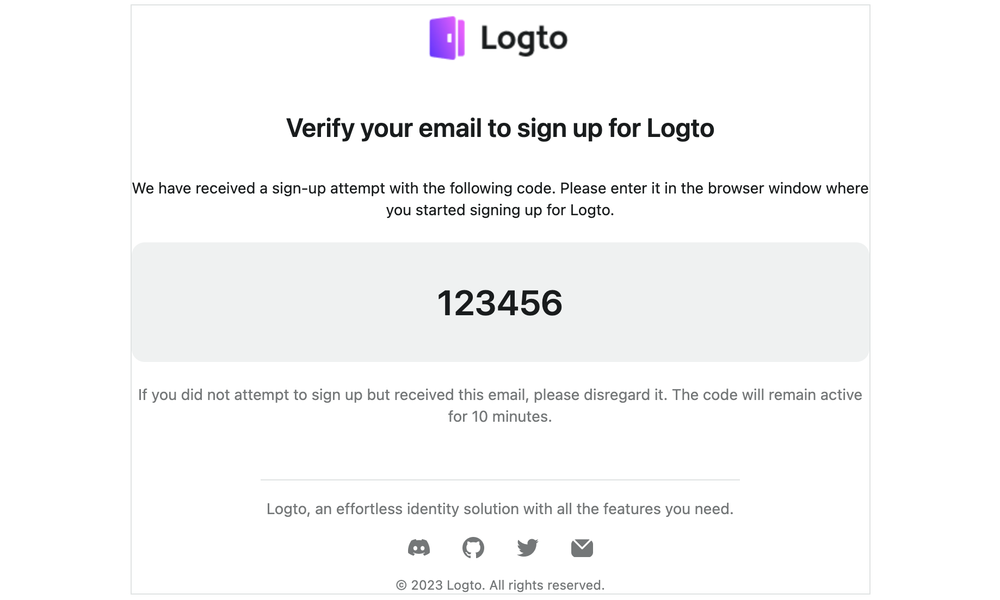

# Configure Email Connector

Configuring an Email connector allows you to send a one-time verification code (OTP) to the user's email address ( Magic link will be supported in the future ). Email connector usage is similar to SMS connector, which can be utilized in various scenarios, including sign-up, sign-in, forgot password, and link-account processes, to validate the user's identity.

Logto has some built-in email connectors which allow out-of-box usage:

- [AWS DM](https://github.com/logto-io/logto/tree/master/packages/connectors/connector-aws-ses)
- [SendGrid Mail](https://github.com/logto-io/logto/tree/master/packages/connectors/connector-sendgrid-email)
- [Aliyun DM](https://github.com/logto-io/logto/tree/master/packages/connectors/connector-aliyun-dm)
- [SMTP](https://github.com/logto-io/logto/tree/master/packages/connectors/connector-smtp)

:::tip
We're still working on more connectors! But If you don't see the connector you want, just let us know your needs in Discord or file a Feature Request on GitHub.
For those using the Logto Open-Source Version, we offer the flexibility to [create your own connector](../create-your-connector/README.md) to extend.
:::

## Configure steps

Navigate to “Connector > Email and SMS connectors” in Logto Console.

### Add a new Email connector

To add a new Email connector, click the “Add Social Connector” button, and select the desired Email connector.



In the configuration process, follow the steps below:

1. Go through the README doc for each type connector on the left, then follow the instructions.
2. Fill out any required forms in the Parameter Configuration section on the right.
3. Customize the Email template to fit your needs by editing the JSON code.
4. Test the configuration by sending an Email verification code to your email address using the “Generic” template.
5. Click "Save and Done" to finish.



### Change to another Email connector

If you wish to change the current Email connector, simply access the connector details page and click the “Change connector” button of the “More” menu in the top-right corner. Or you can delete the old connector first, then add a new Email connector.

:::note
You can bring ONLY ONE _SMS Connector_ alive.

If you change the living SMS connector and save changes, the previous Email connector will be disabled automatically. Also, the _config_ of past connectors will lose track. You may keep the old connectors' _config_ properly if you want to switch back to those connectors in the future.
:::

## Email template

Notice that:

- Logto provides four different templates for customizing Email content, which are categorized based on their usage type: Register, SignIn, ForgotPassword, and Generic. It is highly recommended that you use different templates for various use cases, or it could trigger flow control, leading to a temporary outage of your service.
- The verification code is valid for 10 minutes by default.
- The verification code number sent to users uses the variate of {{code}}.

| Usage          | Scenario                                                                                                                                                                |
| -------------- | ----------------------------------------------------------------------------------------------------------------------------------------------------------------------- |
| Register       | Users create an account using their phone number and verify by entering the verification code.                                                                          |
| SignIn         | Users sign in using their phone number and verify by entering verification code instead of entering a password.                                                         |
| ForgotPassword | If users forget their password during sign-in, they can choose to verify their identity using their phone number.                                                       |
| Generic        | This template can be used as a generic backup option for various scenarios, including linking a phone number to an existing account or testing connector configuration… |

There is a template example just for reference:



```jsx
<table cellpadding="0" cellspacing="0" border="0" width="100%"
  style="font-family: -apple-system, system-ui, 'BlinkMacSystemFont', 'Segoe UI', 'Roboto', 'Arial', sans-serif;">
  <tr>
    <td align="center" valign="center">
      <table cellpadding="0" cellspacing="0" border="0" width="100%"
        style="max-width: 680px; border-radius: 16px; border: 1px solid #E0E3E3; padding: 32px; background-color: #FFFFFF;">
        <tr>
          <td align="center" valign="center">
            
          </td>
        </tr>
        <tr>
          <td align="center" valign="center" style="padding-bottom: 16px;">
            <table cellpadding="0" cellspacing="0" border="0" width="100%" style="padding: 16px 32px;">
              <tr>
                <td align="center" valign="center" style="padding-bottom: 20px;">
                  <h1 style=" font-size: 24px; font-weight: 600; color: #191C1D; line-height: 32px;">
                    <a href="https://www.{{domain}}/account/verify?token={{token}}"
                      style="color: #191C1D; text-decoration: none;">Verify your email to sign up for Logto</a>
                  </h1>
                </td>
              </tr>
              <tr>
                <td align="center" valign="center" style="padding-bottom: 20px;">
                  <div style="font-size: 14px; font-weight: 400; color: #191C1D;  line-height: 20px;">
                    We have received a sign-up attempt with the following code. Please enter it in the browser window
                    where
                    you started signing up for Logto.
                  </div>
                </td>
              </tr>
              <tr>
                <td align="center" valign="center" style="background: #EFF1F1; padding: 35px; border-radius: 12px;">
                  <div style="font-size: 32px; font-weight: 600; color: #191C1D;  line-height: 40px;">
                    {{code}}
                  </div>
                </td>
              </tr>
              <tr>
                <td align="center" valign="center" style="padding-top: 20px;">
                  <div style="font-size: 14px; font-weight: 400; color: #747778; line-height: 20px;">
                    If you did not attempt to sign up but received this email, please disregard it. The code will remain
                    active for 10 minutes.
                  </div>
                </td>
            </table>
          </td>
        </tr>
        <tr>
          <td align="center" valign="center" style="padding-top: 32px;">
            <table cellpadding="0" cellspacing="0" border="0" width="100%">
              <tr>
                <td align="center" valign="center" width="100%" style="padding-bottom: 16px;">
                  <div style="border-top: 1px solid #E0E3E3; width: 65%;"></div>
                </td>
              </tr>
              <tr>
                <td align="center" valign="center" style="padding-bottom: 16px;">
                  <div style="font-size: 14px; font-weight: 400; color: #747778;  line-height: 20px;">
                    Logto, an effortless identity solution with all the features you need.
                  </div>
                </td>
              </tr>
              <tr>
                <td align="center" valign="center" style="padding-bottom: 16px;">
                  <table cellpadding="0" cellspacing="0" border="0" width="200px">
                    <tr>
                      <td align="center" valign="center">
                        <a href="https://discord.gg/UEPaF3j5e6" target="_blank" rel="noopener">
                          
                        </a>
                      </td>
                      <td align="center" valign="center">
                        <a href="https://github.com/logto-io/logto" target="_blank" rel="noopener">
                          
                        </a>
                      </td>
                      <td align="center" valign="center">
                        <a href="https://twitter.com/silverhand_io" target="_blank" rel="noopener">
                          
                        </a>
                      </td>
                      <td align="center" valign="center">
                        <a href="https://logto.io/subscribe" target="_blank" rel="noopener">
                          
                        </a>
                      </td>
                    </tr>
                  </table>
                </td>
              </tr>
              <tr>
                <td align="center" valign="center">
                  <div style="font-size: 12px; font-weight: 400; color: #747778; line-height: 16px;">
                    © 2023 Logto. All rights reserved.
                  </div>
                </td>
              </tr>
            </table>
          </td>
        </tr>
      </table>
    </td>
  </tr>
</table>
```

## Related Readings

You can check out [how to enable SMS or email passcode sign-in](../../tutorials/get-started/passwordless-sign-in-by-adding-connectors.mdx) as soon as you finish the setup.
