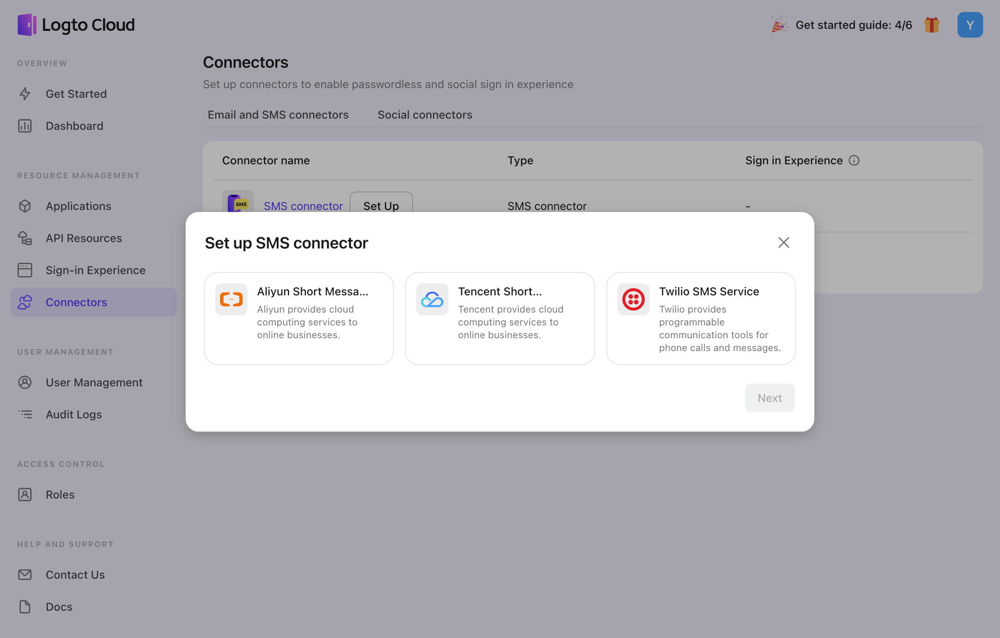
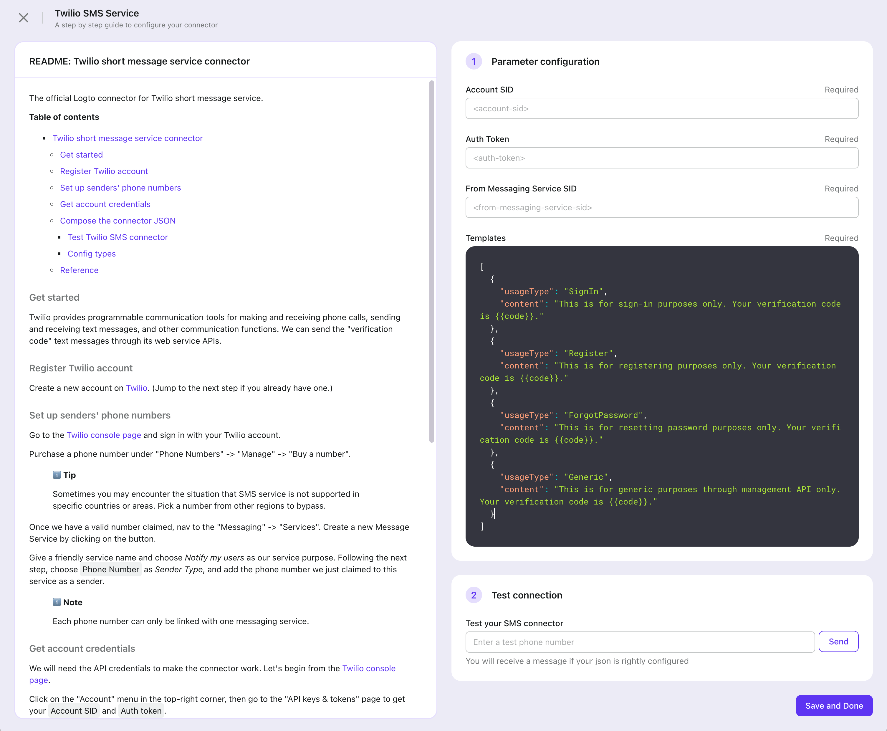

# Configure SMS Connector

Configuring an SMS connector allows you to send a one-time verification code (OTP) to the user's phone number. This passwordless authentication mechanism can be utilized in various scenarios, including sign-up, sign-in, forgot password, and link-account processes, to validate the user's identity. It streamlines user authentication and enhances security by minimizing the risk of password-related breaches.

Logto has some built-in SMS connectors which allow out-of-box usage:

- Twilio SMS
- Aliyun SMS
- Tencent SMS

:::tip
We're still working on more connectors! But If you don't see the connector you want, just let us know your needs in Discord or file a Feature Request on GitHub.
For those using the Logto Open-Source Version, we offer the flexibility to [create your own connector](../create-your-connector/README.md) to extend.
:::

## Configure steps

Navigate to “Connector > Email and SMS connectors” in Logto Console.

### Add a new SMS connector

To add a new SMS connector, click the “Set up” button, and select the desired SMS connector.

In the configuration process, follow the steps below:

1. Go through the README doc for each type connector on the left, then follow the instructions.
2. Fill out any required forms in the Parameter Configuration section on the right.
3. Customize the SMS template to fit your needs by editing the JSON code.
4. Test the configuration by sending an SMS verification code to your phone number using the “Generic” template.
5. Click "Save and Done" to finish.

### Change to another SMS connector

If you wish to change the current SMS connector, simply access the connector details page and click the “Change connector” button of the “More” menu in the top-right corner. Or you can delete the old connector first, then add a new SMS connector.

:::note
You can bring ONLY ONE _SMS Connector_ alive.

If you change the living SMS connector and save changes, the previous SMS connector will be disabled automatically. Also, the _config_ of past connectors will lose track. You may keep the old connectors' _config_ properly if you want to switch back to those connectors in the future.
:::

## SMS template

Notice that:

- Logto provides four different templates for customizing SMS content, which are categorized based on their usage type: Register, SignIn, ForgotPassword, and Generic. It is highly recommended that you use different templates for various use cases, or it could trigger flow control, leading to a temporary outage of your service.
- The verification code is valid for 10 minutes by default.
- The verification code number sent to users uses the variate of {{code}}.

There are some examples just for reference:
Follow the README to compose the connector config JSON with little effort.

| Usage          | Scenario                                                                                                                                                                | Template Example                                                                                      |
| -------------- | ----------------------------------------------------------------------------------------------------------------------------------------------------------------------- | ----------------------------------------------------------------------------------------------------- |
| Register       | Users create an account using their phone number and verify by entering the verification code.                                                                          | Your Logto sign-in verification code is {{code}}. The code will remain active for 10 minutes.         |
| SignIn         | Users sign in using their phone number and verify by entering verification code instead of entering a password.                                                         | Your Logto sign-up verification code is {{code}}. The code will remain active for 10 minutes.         |
| ForgotPassword | If users forget their password during sign-in, they can choose to verify their identity using their phone number.                                                       | Your Logto password change verification code is {{code}}. The code will remain active for 10 minutes. |
| Generic        | This template can be used as a generic backup option for various scenarios, including linking a phone number to an existing account or testing connector configuration… | Your Logto verification code is {{code}}. The code will remain active for 10 minutes.                 |

## Related Readings

You can check out [how to enable SMS or email passcode sign-in](../../tutorials/get-started/passwordless-sign-in-by-adding-connectors.mdx) as soon as you finish the setup.
