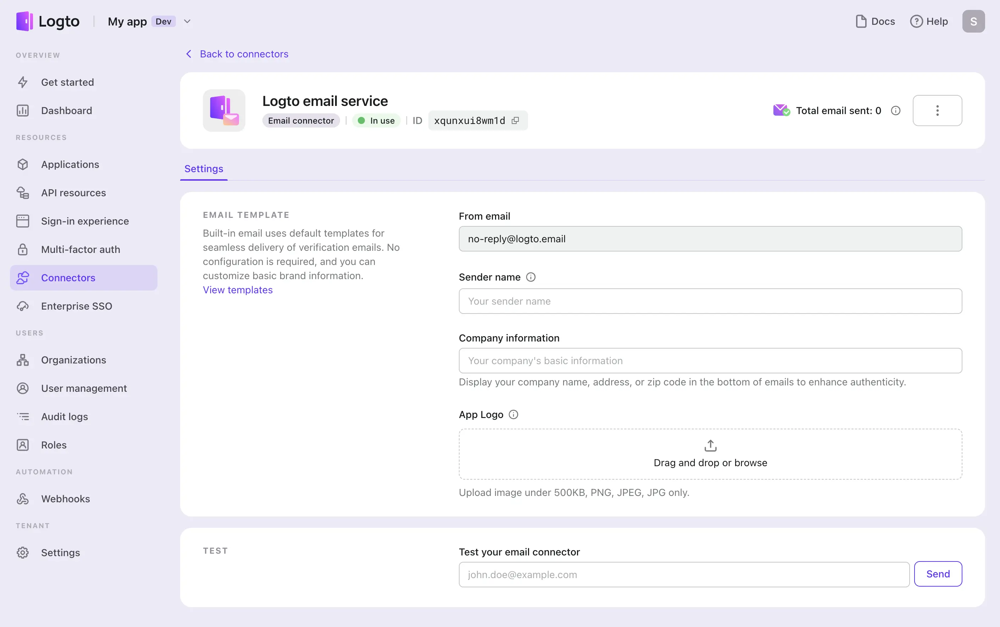
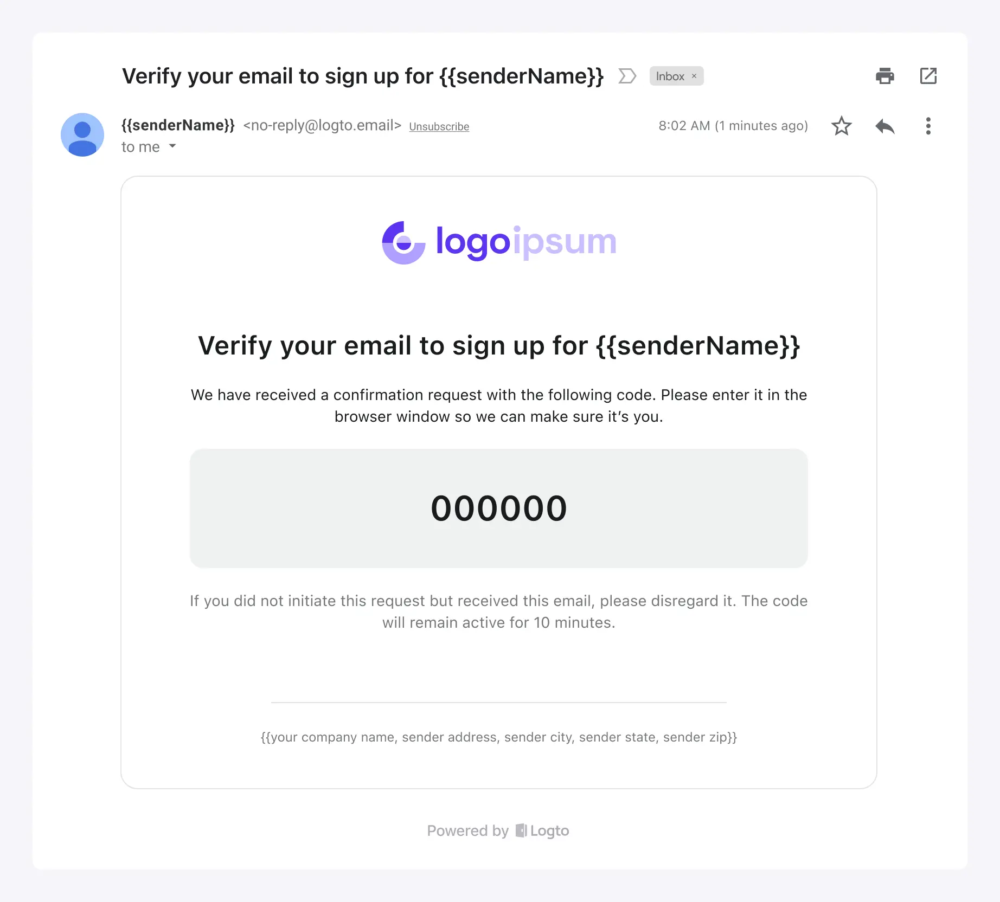
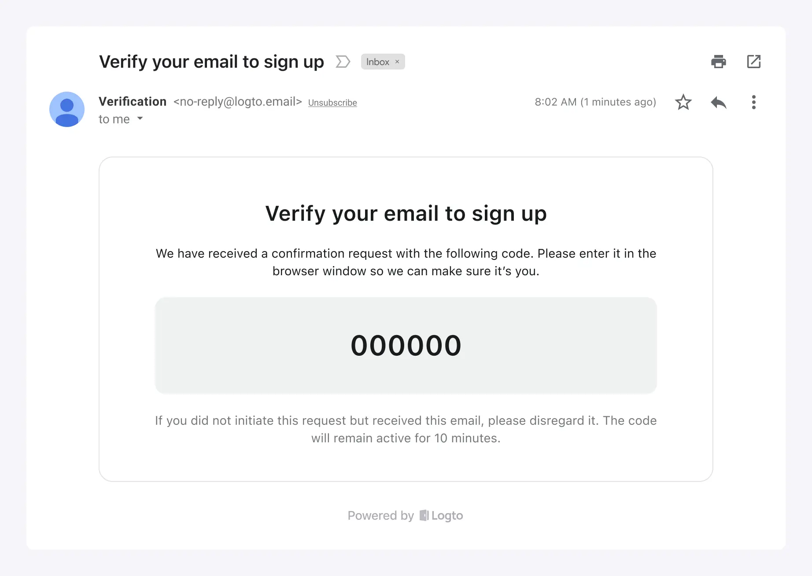

# Configure Logto email service

Logto provides built-in email service for your convenient usage in the following scenarios:

1. Rapidly explore or test the email sign-in experience capability of Logto.
2. Directly use for your online products, mainly for the new-started projects which are acceptable to use [Logto.email](http://Logto.email) as the sender email domain.

The characteristics of the Logto email service:

- **Free to use**: It’s completely free without any daily email usage limits, saving your cost.
- **Save your effort**: No configuration is needed to connect with a third-party email service provider. Simply customize your basic brand information for email templates.
- **Ensure delivery**: Count on Logto for stable service and reliable email delivery, ensuring users can access your product.

However, along with the convenience, there are certain constraints to consider. Currently, customization of the sender's email address and domain is not available. Based on your business requirements, you can choose to configure other reputable email providers.

:::note
Logto built-in free email service is currently only available for Cloud users. For users of the Open-source service, you have the flexibility to configure your email service provider for email login.
:::

## Configuration steps

Follow these steps to configure the Logto email service:

1. Go to "Connector > Email and SMS connectors" in the Logto Console.
2. To add a new Email connector, click the "Set up" button and select the Logto email service.
3. Once the Logto out-of-the-box email connector is successfully created, you can customize the basic brand information displayed in the email templates.
4. After making the necessary changes, remember to send a test email template to your email address.

Customization Options:

- **From email**: The sender email is set to **[no-reply@logto.email](mailto:no-reply@logto.email)** and cannot be modified.
- **Sender name**: Set your brand name as the sender name to ensure user recognition.
- **Company information**: Display your company name, address, or zip code to enhance user trust and meet compliance requirements. Note that URLs are not allowed.
- **App logo**: Upload a brand logo image that is compatible with both light and dark modes of the email. Only a single image is required.

## Unified email templates

Logto email service uses unified email templates tailored for specific authentication scenarios:

| Usage          | Scenario                                                                                                                                                          |
| -------------- | ----------------------------------------------------------------------------------------------------------------------------------------------------------------- |
| Register       | Users create an account using their email and verify by entering the verification code.                                                                           |
| SignIn         | Users sign in using their email and verify by entering verification code instead of entering a password.                                                          |
| ForgotPassword | If users forget their password during sign-in, they can choose to verify their identity using their email.                                                        |
| Generic        | This template can be used as a generic backup option for various scenarios, including linking an email to an existing account or testing connector configuration… |

An example of email templates for the “Register” usage type with custom brand information:

If no custom brand information is provided, the email template can still be used with a default display:

