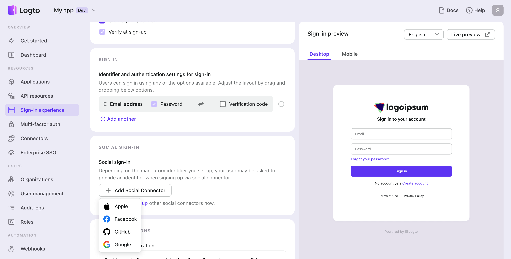

# Enable social sign-in

Once configured a social connector successfully, you can enable it as a Social Sign-in button in Sign-in Experience.

Navigate to the "Sign-in Experience" tab in the left navigation bar, and click "Sign-up and sign-in".

1. **Choose sign-up method**: If you only want to offer social sign-up, select "Not applicable" as the sign-up identifier. If you choose another sign-up identifier, such as email, the user should link an email to their social account during the sign-up flow.
2. **Set up the social sign-in button**: Click the connector you configured in the “Add another” menu to provide it as a social sign-in method. If you have multiple social connectors in use, you can drag and drop them to reorder.
3. Click "Save changes" to make the changes live.

Remember to open the “Live preview” to test the new sign-in experience.

