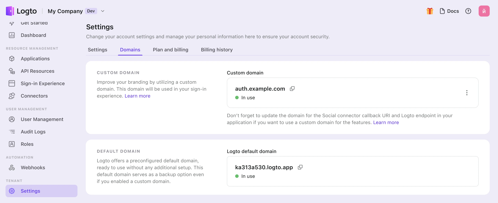

# Use custom domain

Once you've configured your settings, both your custom domain name and the default Logto domain name will be available for your tenant. However, certain configurations are required to activate your custom domain name.

:::note
In this article, we assume that your custom domain is `auth.example.com`.
:::



## Updating the SDK Endpoint for Applications

Alter your initialization code for the Logto SDK by modifying the domain name of the endpoint.

```ts
const client = new LogtoClient({
  ..., // other options
  endpoint: 'https://auth.example.com',
});
```

## Modifying Auth Endpoints for Other Applications

If you have applications that aren't using the Logto SDK, it's necessary to update their auth endpoints.

You can locate the auth endpoints at the well-known URL:

```
https://auth.example.com/oidc/.well-known/openid-configuration
```

## Updating the Social Connector's Callback URI

The social connector's callback URI will be updated automatically if your users are using the custom domain. You need to go to the social provider's developer console to update the callback URI.

When your users are using the custom domain, the social connector's callback URI will be using the new domain. Therefore, you need to navigate to the social provider's developer console to manually update the callback URI.
