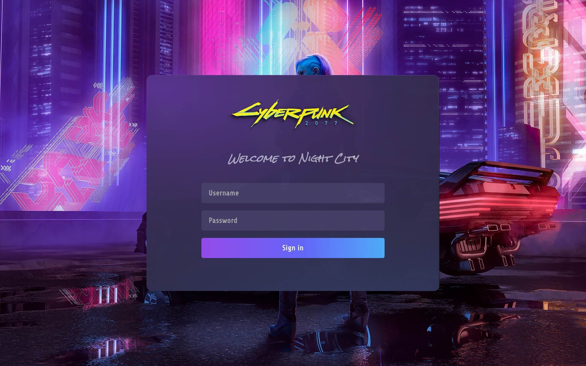

# Custom CSS

Logto continually enhances the user sign-in experience and has added a brand color option to the UI. However, we know that fine-tuning UI requirements can be unpredictable. While Logto is still exploring the best options for customization, we want to provide a programmatic method to unblock your development.

## Custom CSS in Logto Console

Go to "Sign-in Experience > Brand > Custom CSS in the Logto Console.

Editing CSS code in the left editor, it will render lively in the right preview modal immediately. Please note, the code editor only supports the CSS code so far. Not HTML or Javascript.

After saving changes, don’t forget to click the “Live Preview” button to check the changes on all pages.

To view the componentized interface design for Logto, you can either navigate to "Logto/packages/ui/src" on GitHub or open the browser’s "Inspect Elements" tool on the Logto Live preview page.

## Examples

For instance, if you want to give your sign-in page a feel of the **_Night City_** for web view, try this CSS:

```css
@font-face {
  font-family: 'Rock Salt';
  font-style: normal;
  font-weight: normal;
  font-display: swap;
  src: url('https://fonts.gstatic.com/s/rocksalt/v18/MwQ0bhv11fWD6QsAVOZrt0M6p7NGrQ.woff2') format('woff2');
  unicode-range: U+0000-00FF, U+0131, U+0152-0153, U+02BB-02BC, U+02C6, U+02DA, U+02DC, U+2000-206F,
    U+2074, U+20AC, U+2122, U+2191, U+2193, U+2212, U+2215, U+FEFF, U+FFFD;
}
@font-face {
  font-family: 'Share Tech';
  font-style: normal;
  font-weight: normal;
  font-display: swap;
  src: url('https://fonts.gstatic.com/s/sharetech/v17/7cHtv4Uyi5K0OeZ7bohU8H0JmBUhfrE.woff2') format('woff2');
  unicode-range: U+0000-00FF, U+0131, U+0152-0153, U+02BB-02BC, U+02C6, U+02DA, U+02DC, U+2000-206F,
    U+2074, U+20AC, U+2122, U+2191, U+2193, U+2212, U+2215, U+FEFF, U+FFFD;
}

#app * {
  font-family: 'Share Tech';
  letter-spacing: 0.5px;
}

#app > div[class$='viewBox'] {
  background-image: url('https://silverhand.io/assets/v-in-nc.jpg');
  background-size: cover;
}

#app main[class$='main'] {
  background-image: url('https://silverhand.io/assets/gentle-universe.png');
  background-size: cover;
  opacity: 98%;
  min-height: initial;
  padding: 24px;
  padding-bottom: 72px;
  border-radius: 12px;
}

#app main[class$='main'] img[class$='logo'] {
  content: url('https://silverhand.io/assets/cyberpunk-2077.png');
  margin: -20px 0 -12px;
  height: 160px;
}

#app main[class$='main'] div[class$='headline'] {
  visibility: hidden;
  height: 60px;
}

#app main[class$='main'] div[class$='headline']::before {
  content: 'Welcome to Night City';
  visibility: visible;
  display: block;
  font-family: 'Rock Salt';
  font-style: italic;
  line-height: 60px;
  font-size: 20px;
  color: rgba(245, 250, 255, 60%);
  padding: 0 20px;
}

#app form div[class$='inputField'] > div {
  outline: none;
  border: none;
  border-radius: 4px;
}

#app form div[class$='inputField'] > div > input,
#app form div[class$='inputField'] div[class$='countryCodeSelector'] {
  background: initial;
  background-color: #453f67;
  font-family: 'Share Tech';
  letter-spacing: 0.5px;
  font-size: 16px;
  font-weight: 600;
}

#app button {
  font-weight: 600;
  font-size: 16px;
  border-radius: 4px;
}

#app button[type='submit'] {
  background: linear-gradient(270.84deg, #2fd6fb -24.55%, #6369fc 44.33%, #a741eb 119.2%), #5d34f2;
}
```



:::note
Since Logto uses CSS Modules, you may see a hash value in the `class` property of DOM elements (e.g., a `<div>` with `vUugRG_container`). To override these, you can use the `$=` CSS selector to match elements that end with a specified value. In this case, it should be `div[class$=container]`.
:::

## Custom CSS by Management API

You also can use the Management API `PATCH /api/sign-in-exp` with body `{ "customCss": "arbitrary string" }` to set customized CSS for the sign-in experience. You should see the value of `customCss` attached after `<title>` of the page. If the style has a higher priority, it should be able to override.
