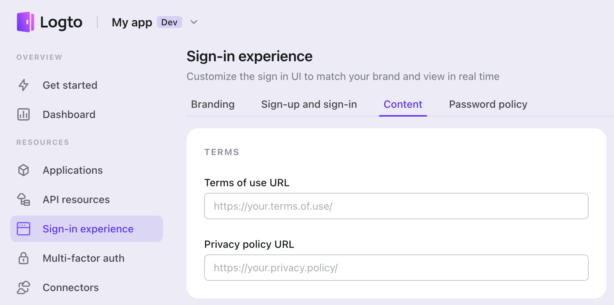
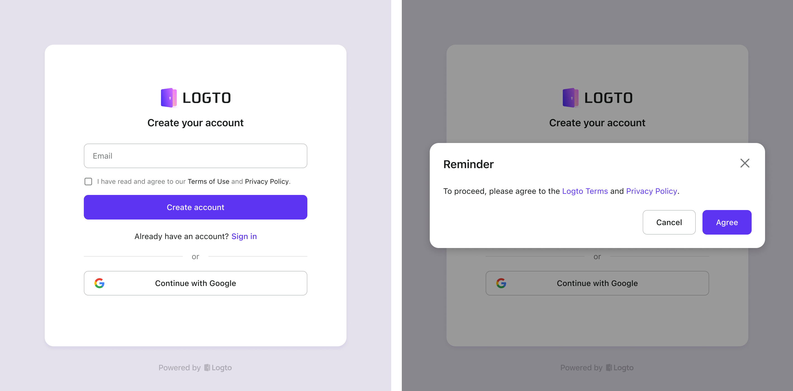

# Set your terms

When building an app, it's important to have a Terms of Use and Privacy Policy. These documents protect both the app developer and the user. The Terms of Use outline the rules and regulations for using the app, while the Privacy Policy explains how personal data is collected, stored, and used.

To do this, you need to provide the relevant URLs to these documents, which will be displayed on the sign-in and sign-up pages. Logto will load it via an `<iframe>`.

If the input box is left empty, the app will skip the "agree on terms" flow, and the legal agreements won't be displayed on the sign-in or sign-up pages.

In some regions, like the European Union, it's required to obtain explicit consent from users before collecting and using their personal data. To comply with these laws, in the default flow of Logto, users must confirm their agreement to the Terms of Use and Privacy Policy by clicking a checkbox or button when registering. The dialog for agreeing just appears when the user doesn't click the checkbox and continues, it’s more seamless to register.

Besides, we will support the statement "By continuing, the user agrees to terms without additional action.” in the feature.
