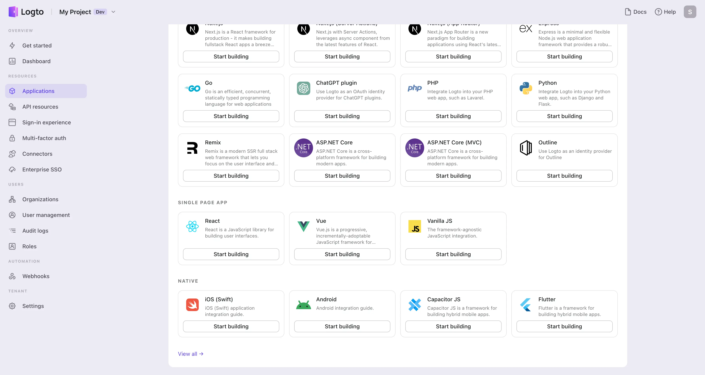
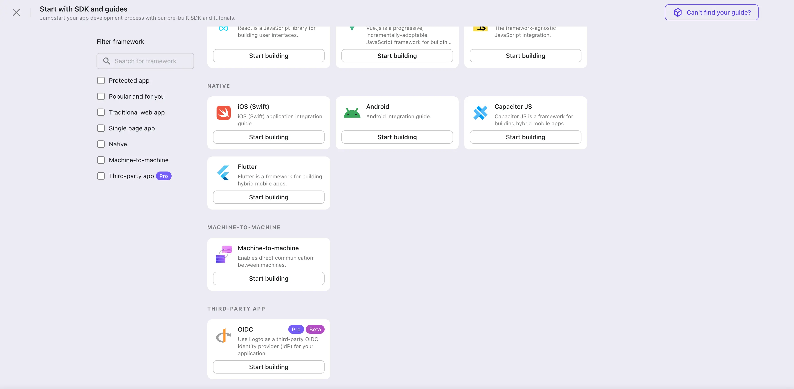
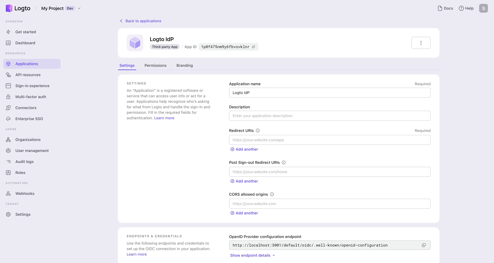

import Availability from '@components/Availability';

import ClientCredentials from './assets/client-credentials.webp';
import ConsentPage from './assets/consent-page.webp';
import DiscoveryEndpoint from './assets/discovery-endpoint.webp';
import EndpointDetails from './assets/endpoint-details.webp';
import RedirectUri from './assets/redirect-uri.webp';

# 🌐 Logto as an Identity Provider (IdP)

<Availability cloud="comingSoon" oss="comingSoon" />

Under the hood, Logto follows the [OpenID Connect (OIDC)](https://openid.net/connect/) protocol to authenticate users. This means that you can use Logto as an universal Identity Provider (IdP) to authenticate users for any third-party applications that support OIDC. This guide will walk you through the steps to set up Logto as an IdP for third-party applications.

## What is an Identity Provider (IdP)?

An Identity Provider (IdP) is a service that verifies user identities and manages their login credentials. After confirming a user's identity, the IdP generates authentication tokens or assertions and allows the user to access various applications or services without needing to log in again. Essentially, it's the go-to system for managing employee identities and permissions in your enterprise.

## Concepts of applications

**First-party applications**: These apps are developed and managed by the identity provider itself, ensuring higher security and trust. They provide a unified sign-in experience within the same domain, using consistent user credentials. Read “[Build multi-app products](https://logto.io/solutions/multi-app-product)” to learn more about Logto omni sign-in.

**Third-party applications**: External or partner services not directly affiliated with an Identity Provider (IdP) are considered third-party apps, acting as Relying Parties (RPs) or Service Providers (SPs). These apps integrate with the IdP using protocols like OAuth, OIDC, and SAML, facilitating user login and authorization through the IdP's accounts. e.g. Slack, Figma, Dropbox, etc. all support Google Workspace as an IdP.

## Consent page

Unlike first-party applications's auto consent. For security reasons, all the third-party applications will be redirected to a consent page for user authorization after they are authenticated by Logto. All the third-party requested user profile permissions, API resource scopes, and organization membership information will be displayed on the consent page. These requested permissions will be granted to the third-party applications only after the user clicks on the **Authorize** button.

  

## Create an third-party OIDC application in Logto

Just like how you create a first-party application in Logto, you can also create an application for third-party services that support OIDC. This application will act as an IdP for your third-party applications.

1. Go to the **Logto Console** and navigate to the **Applications** page.

2. Select "Third-party app -> OIDC" as the application type.

   If this is the first time you create an application, click on the **view all** link to see all application types.
   

   Otherwise, click on the **create application** button on the top right corner of the page and select "Third-party app -> OIDC" as the application type.
   

3. Just like creating a Logto first-party application, enter a **name** and **description** for your application and click on the **create** button. A new third-party OIDC application will be created.

   

## Setup the OIDC configurations

In order to set up Logto as an IdP for your third-party applications, you need to configure the OIDC settings under the application details page.

1. Provide the **redirect URI** of your third-party application. This is the URL that the third-party application will redirect users to after they are authenticated by Logto. You can usually find this information in the third-party application's IdP connection settings page.

   :::note
   Logto supports multiple redirect URIs. You can add more redirect URIs by clicking on the **Add another** button.
   :::

   

2. Retrieve the **client ID** and **client secret** from Logto application details page and enter them into your service provider's IdP connection settings page.

   

3. Retrieve the **authorization endpoint** and **token endpoint** from Logto application details page and provide them to your service provider.

   If your service provider supports OIDC discovery, you can simply copy the **discovery endpoint** from Logto application details page and provide it to your service provider. The service provider will be able to retrieve all the up to date OIDC authentication information from the discovery endpoint automatically.

   

   Otherwise, click on the **show endpoint details** button to view all the OIDC authentication endpoints.

   

## Manage your third-party applications

All third-party applications will be catalogued on the **Applications** page, specifically under the **Third-party apps** tab. This arrangement distinguishes them from first-party applications for you, ensuring easy management.

## Continue with

- [branding customization](./branding-customization)
- [permission management](./permissions-management)
- [application reference](../../references/applications/)
