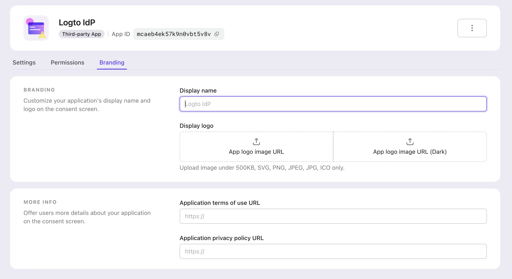

import ConsentPage from './assets/consent-page.webp';

# Consent page branding

It is important to ensure the third-party's branding information and terms link is properly displayed to the users when they are redirected to the third-party application's consent page.

Unlike first-party applications' universal sign-in experience, Logto allows you to customize the branding information of your third-party applications, including the application name, logo, and terms link.

## Customize the branding information

1. Go to the **Logto Console** and navigate to third-party application's details page.

2. Navigate to the **Branding** tab.

   

- **Display name**: The name of the third-party application that will be displayed on the consent page. It will represent the third-party application's name who is requesting access to your users' information. Application name will be used if this field is left empty.
- **Logo**: The logo of the third-party application that will be displayed on the consent page. It will represent the third-party application's brand who is requesting access to your users' information. Both third-party application's logo and Logto universal sign-in-experience logo will be displayed on the consent page if both are provided.
- **Dark logto**: Only available when dark-mode sign-in experience is enabled. Manage the dark-mode settings at the **Sign-in experience** page.
- **Terms link**: The terms link of the third-party application that will be displayed on the consent page.
- **Privacy link**: The privacy link of the third-party application that will be displayed on the consent page.

  

:::info
Make sure to well configure the branding information of your third-party applications to ensure a consistent and secure authentication experience for your users.
:::
