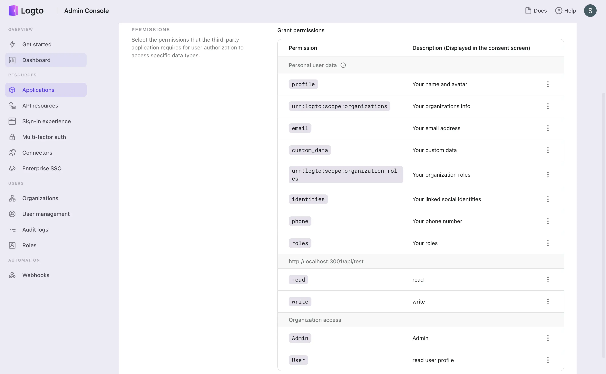

import APIResourcePermissions from './assets/api-resource-permissions.webp';
import ConsentPermissions from './assets/consent-permissions.webp';
import OrganizationPermissions from './assets/organization-permissions.webp';
import UserPermissions from './assets/user-permissions.webp';

# Third-party application permissions management

## Overview

Third-party applications are applications that are not owned by Logto. They are usually owned by third-party service providers and are integrated with Logto as an identity provider (IdP) to authenticate users. For example, Slack, Zoom, and Notion are all third-party applications.

It is important to ensure to grant the correct permissions to third-party applications when they are requesting access to your users' information. Logto allows you to manage the permissions of your third-party applications, including the user profile scopes, API resource scopes, and organization scopes.

Unlike first-party applications,requesting a non-enabled scopes will result in an error. This is to ensure that your users' information is protected and only accessible by the third-party applications that you trust. Once the scopes are enabled, the third-party applications may request access to the enabled scopes. These scopes will be displayed on the consent page for your users to review and grant access to the third-party applications.

## Manage the permissions of your third-party applications

Go to the **Application details** page and navigate to the **Permissions** tab and click on the **Add permissions** button to manage the permissions of your third-party applications.

### User permissions (User profile scopes)

Those permissions are OIDC standard and Logto's essential user profile scopes used for accessing user claims. User claims will be returned in the ID token and userinfo endpoint accordingly.

- **profile**: OIDC standard scope, used for accessing user name and avatar.
- **email**: OIDC standard scope, used for accessing user email.
- **phone**: OIDC standard scope, used for accessing user phone number.
- **custom_data**: Logto user profile scope, used for accessing [user custom data](../../references/users/custom-data.md).
- **identity**: Logto user profile scope, used for accessing user linked [social identities](../../references/users/social-identities.md) information.
- **role**: Logto user profile scope, used for accessing user [role](../rbac/README.mdx) information.
- **urn:logto:scope:organizations**: Logto user organization scope, used for accessing user organizations information. See [organization](../organizations/README.mdx) for more details.
- **urn:logto:scope:organization_roles**: Logto user organization scope, used for accessing user organization roles information.

:::caution
Requesting a non-enabled user profile scope in the authorization request will result in an error.
:::

### API resource permissions (API resource scopes)

Logto provides RBAC (Role-based access control) for API resources. API resources are the resources that are owned by your service and are protected by Logto. You may assign self-define API scopes to the third-party applications to access your API resources. Please refer to [RBAC](../rbac/README.mdx) and [protect your API](../protect-your-api/README.mdx) for more details.

You may create and manage your API resource scopes under the **API resources** page in Logto console.

:::caution
API resource scopes that are not enabled to the third-party applications will be ignored when sending an authorization request. It won't be displayed on the user consent page and won't be granted by Logto.
:::

### Organization permissions (Organization scopes)

[Organization permissions](../organizations/understand-how-it-works.mdx) are the scopes that defined exclusively for Logto organizations. They are used for accessing organization information and resources.

:::Note
In order to use Logto organization permissions, you need to enable the **urn:logto:scope:organizations** user scope. Otherwise the organization permissions will be ignored when sending an authorization request.
:::

You can define your own organization scopes under the organization template settings page. Please see [Configure organizations](../organizations/configuration.mdx) for more details.

:::caution
Organization scopes that are not enabled to the third-party applications will be ignored when sending an authorization request. It won't be displayed on the user consent page and won't be granted by Logto.
:::

### Consent page

Once all the permissions are enabled, the third-party applications may request access to the enabled permissions. These permissions will be displayed on the consent page for your users to review and grant access to the third-party applications.

By clicking on the **Authorize** button, the user will grant access to the third-party applications to access those requested permissions.

### User organization grant

If the **urn:logto:scope:organizations** user scope is enabled and requested by the third-party application, a organization selector will be displayed at the bottom of the consent page.

This allows your users to review and choose the organization they wish to grant access to. The third-party application will only receive access to the information and associated scopes of the selected organization.
