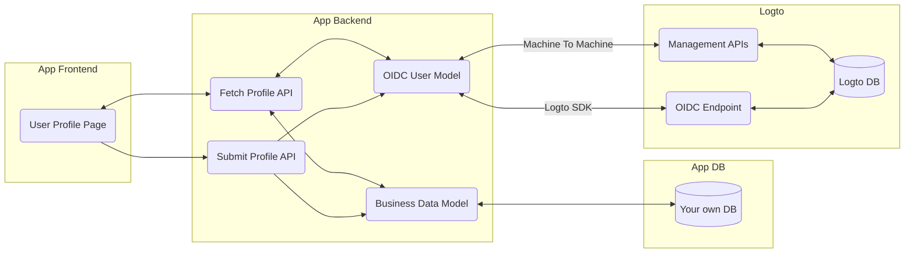

# 👤 User Profiles

In previous sections, we demonstrated how to manage your users [using Admin Console](/docs/recipes/manage-users/admin-console), or through [management APIs](/docs/recipes/manage-users/management-api). This is a straightforward process for those in the role of administrator. However, it is also important for the regular users to update their profiles on their own.

To enable this, you will need to create your own profile page with the help of the management APIs.

## Get Started

:::tip

- In order to call Logto management APIs, a backend service is required for your app.
- Make sure your backend service has acquired a pair of API key and API secret through the [Machine to Machine](/docs/recipes/integrate-logto/machine-to-machine) process.

:::

Assuming that your application has both frontend and backend, and your backend connects to Logto service through the M2M mechanism.

On your app's frontend, create a profile page for the user to input their profile information, such as their _name and email address_. Usually it also consists of your own business model, such as _age, gender, social security number, mailing address, payment methods, etc_.

Then in most cases your overall flow would be like this:

Now let's consolidate the steps:

### Bring your own backend service

Implement your own backend API services for your application, and protect your user requests with Logto. (See [protect your API](/docs/recipes/protect-your-api/) for details)

### Implement a user profile page

In your client application, create a new page for the user's profile. This can be done using a variety of front-end development frameworks. Check our [SDK integration guide](/docs/recipes/integrate-logto/) and choose your favorite language to get started.

It is always recommended to fetch the profile data in prior, and pre-fill the form fields. You can do it by calling these two functions from your client app (with integration of Logto SDK):

- SDK function `getIdTokenClaims` to decode basic user claims cached in ID Token on client side
- SDK function `fetchUserInfo` to fetch user data from Logto service

Alternatively, you can also call the management API `GET /api/users/:userId` from your backend service, through the M2M mechanism.

### Submit profile data

After the user has finished editing the form on their profile page, the new changes need to be saved.

Typically, your app client will call your backend service and send the new data in its request body. Your backend service should then dispatch the new data to either Logto or your own database, depending on your business model.

#### Basic user information

For basic user information, such as user name, email address, phone number, etc., you can use the `PATCH /api/users/:userId` API to update the user information in Logto. This API should be called from your backend service through M2M.

#### Verify and reset password

Before allowing the user to update their password, you should verify their identity. To do this, call `POST /api/users/:userId/password/verify` to check if the user knows their current password. If the user has forgotten their current password, they can use a verification code to help with identity verification.

To update the user's password, simply call `PATCH /api/users/:userId/password`.

You might also want to check if the user has a password set up already. To do this, use the `GET /api/users/:userId/has-password API`.

#### Extend your business model with custom data

In real-world scenarios, you might have specific business models associated with the user profile, such as age, gender, ethnicity, mailing address, payment methods, etc. Usually, sensitive information should be stored in your own database for security reasons. However, if no sensitive data is concerned, you can alternatively store the data in Logto using the custom data feature.

To fetch and update custom data, use the `GET /api/users/:userId/custom-data` and `PATCH /api/users/:userId/custom-data` APIs.

:::tip
Check the [Custom Data](/docs/references/users/custom-data) section for more details.
:::

### (Optional) Validate verification code

If your user wants to change either email address or phone number, you may want to validate them before submitting the entire form, as this ensures all emails and phone numbers are verified in your system, which plays a vital part if you want to enable passwordless sign-in methods (e.g. email and verification code) in your application.

In order to do this, you only have to:

- Configure an email or phone connector in Admin Console
- Make sure to add a message template with `Generic` usage type in the config of the above connector

Then, from your backend service, you can call the following Logto management APIs to send and validate the code:

- `POST /api/verification-code` to send verification code to a given email or phone
- `POST /api/verification-code/verify` to verify the code against a given email or phone

:::tip
Check the [API Documentation](/api#tag/Verification-Codes) for more details.
:::

## Recap

Implementing a user profile can be a complex task. While we initially considered providing an out-of-the-box solution, we abandoned this approach after thorough consideration. User profiles typically consist of a combination of standard OpenID Connect (OIDC) user claims and the unique requirements of your business model. As a result, the best approach is to create your own custom profile page and backend services and then connect them to Logto via our Management APIs.

To summarize:

- Develop your own custom frontend profile page and backend service.
- Connect your backend service to Logto through Machine-to-Machine (M2M) communication.
- Utilize Logto's Management APIs for interaction with Logto.
