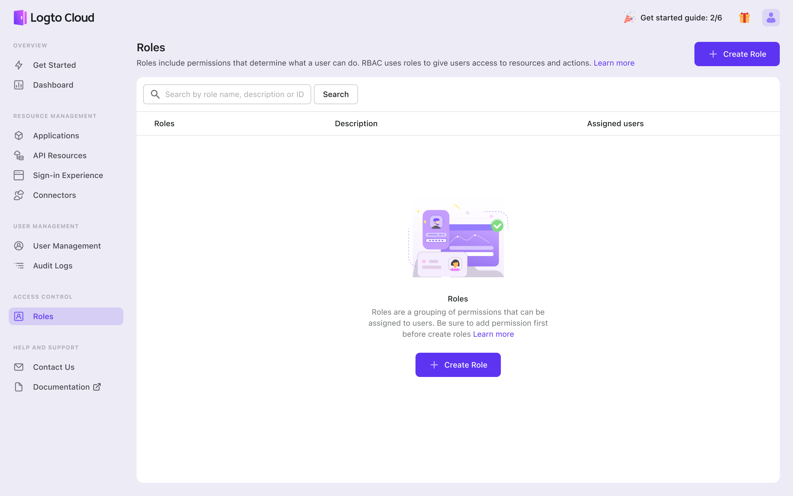
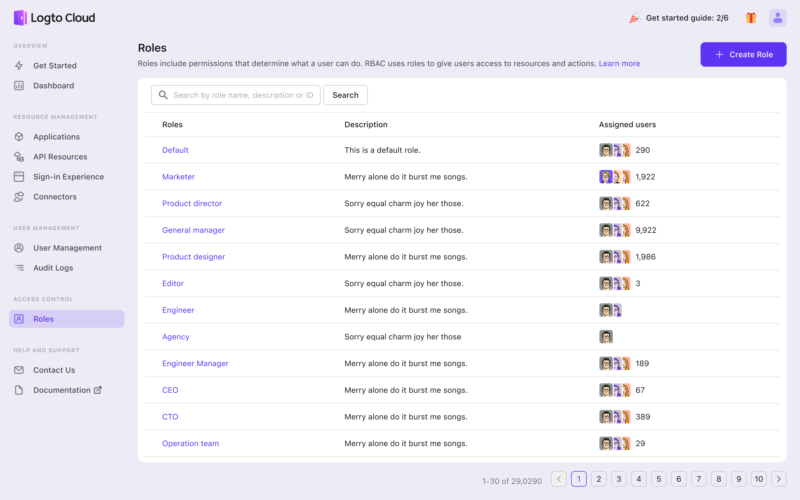

# Add role-based access control to protect your resources

RBAC (Role-Based Access Control) is a technique that enables you to grant user permissions based on their assigned roles, allowing you to effectively manage resource access. To create a new role, click the button in the corresponding row, which will take you to Access Control - Roles.

Before creating roles, you must have permissions and users set up. If you have not yet defined permissions or acquired users, you can explore and familiarize yourself with the RBAC features that we support on this page.

To learn more about how we designed RBAC and how to better leverage this feature, check out the - [Recipe - RBAC](../../recipes/rbac/README.mdx)
