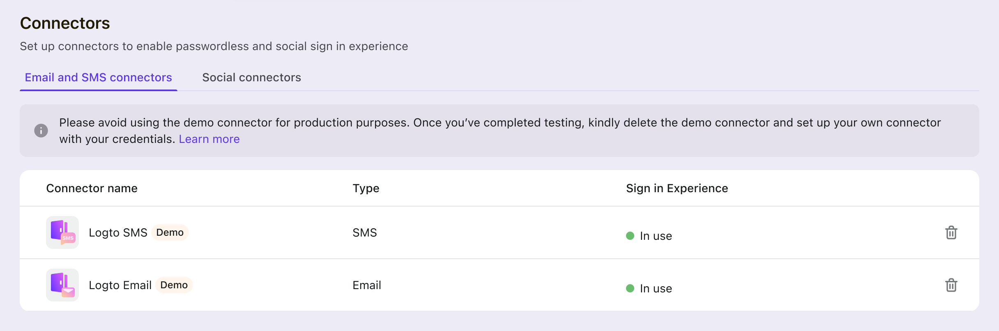
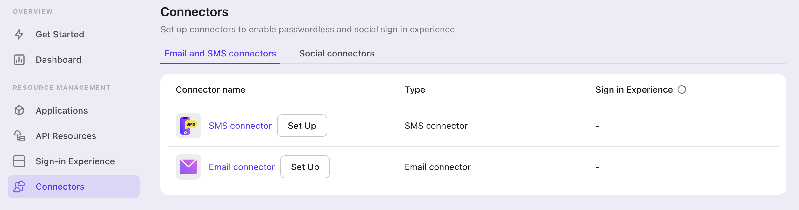
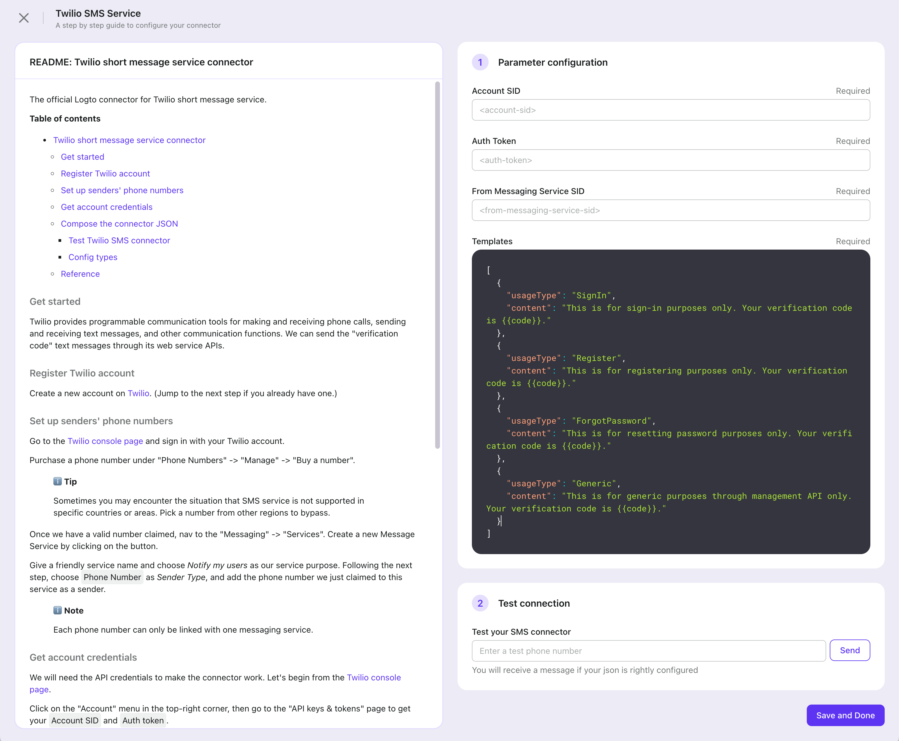
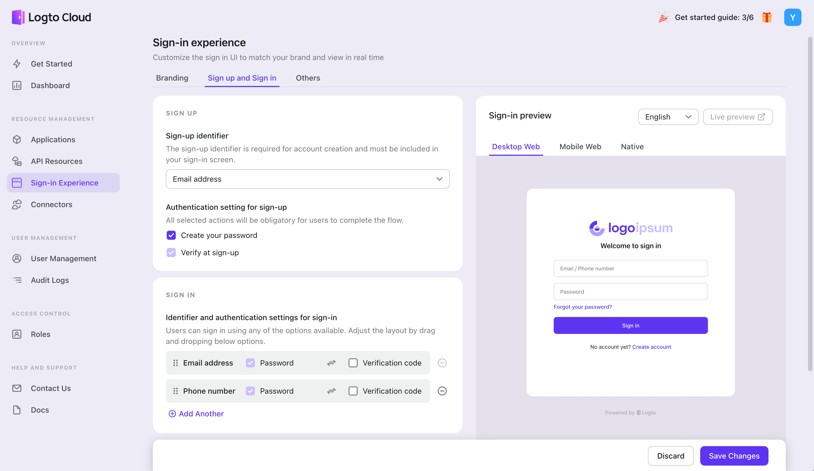
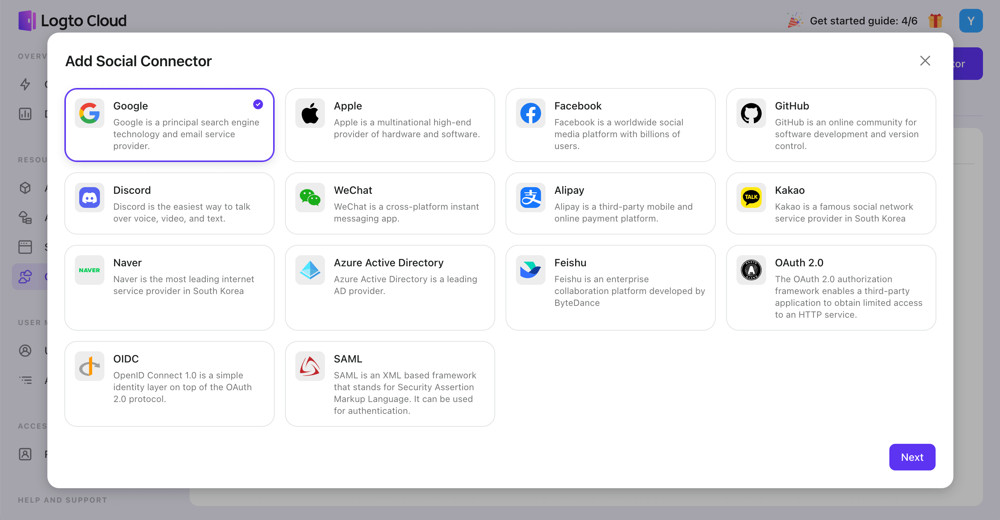
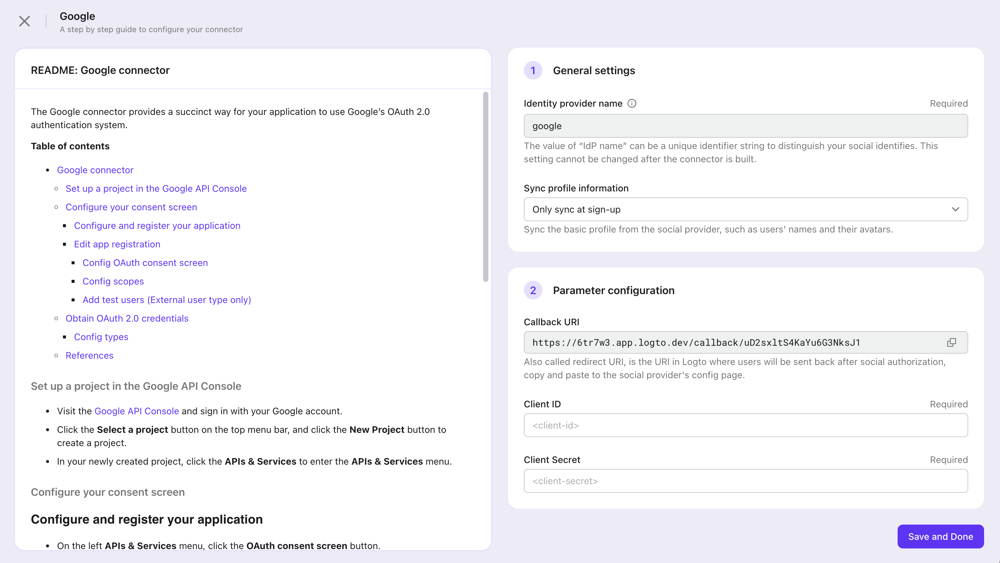
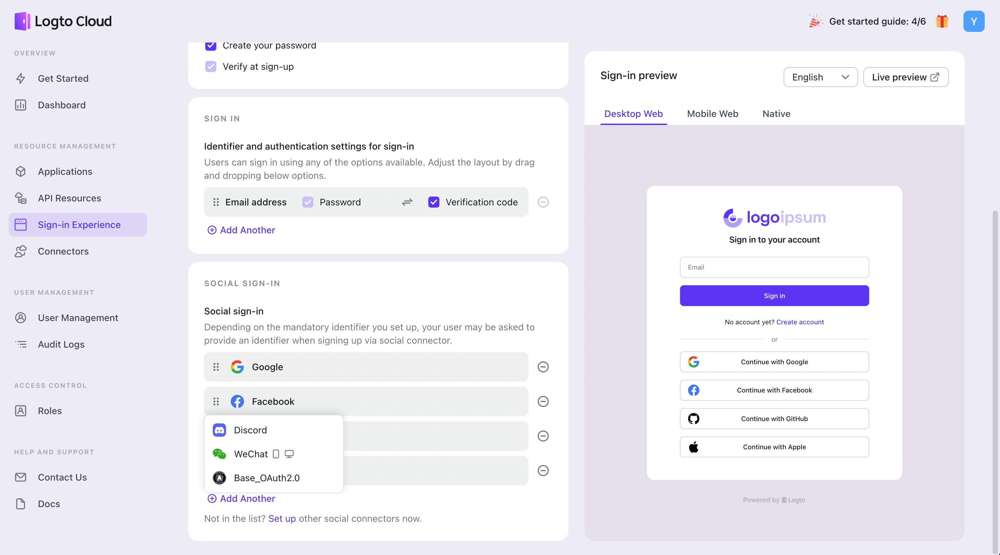

import ConnectorsIntro from './fragments/_connectors-intro.md';

# Passwordless sign-in by adding connectors

In the "Get Started" tab, click the "Enable" button on the right, and the browser will redirect to the "Connectors".

<ConnectorsIntro />

## Demo connectors for Cloud Preview

During the onboarding process of creating a Logto Cloud account, you have the option to select Demo connectors that are pre-configured by Logto Service just for trial. This allows you to experience the passwordless sign-in experience easily.

Note that Logto Demo connectors with a "Demo" tag have usage limitations, not for official use: Message sending capabilities - only 100 terms for Demo Email or SMS connectors, and the Demo social connector cannot be used actually to sign in to your application.

Once you have completed testing, you should delete the demo connectors and set up your own custom connectors to ensure long-term availability.

## Enable SMS or Email passwordless sign-in

Logto has some built-in connectors which allow out-of-box usage:

> SMS connectors: Twilio SMS, Aliyun SMS, Tencent SMS
> Email connectors: AWS Direct Mail, SendGrid Mail Service, Aliyun Direct Mail, SMTP

The process for enabling SMS and Email connectors is similar, so we have combined them into a single tutorial for your convenience.

### Step 1: Configure connector and test

To start configuring your connectors, navigate to the “Connectors” tab in the left navigation bar. By default, this tab is located under the "Email and SMS connectors" section.

Click the "Set Up" button on the SMS or Email connector column. Then choose your preferred connector from the modal list and click "Next" to proceed.

You will be directed to a full-screen page that will guide you through the setup process correctly. Follow the steps below:

1. Go through the README doc on the left, then follow the instructions.
2. Fill out any required forms on the right to complete the configuration, and you can customize the SMS or Email template by editing JSON code. Then test the configuration by sending an email or SMS to your email address or phone number.
3. Click "Save and Done" to finish.

### Step2: Enable connector in sign-in experience

Once you've successfully configured your SMS or Email connector, you can make it available as a sign-up or sign-in option according to your business needs.

Navigate to the "Sign-in Experience" tab in the left navigation bar, and click "Sign-in Methods".

1. **Set sign-up methods:** To enable passwordless sign-up via SMS or email, select "Email address," "Phone number," or "Email address or phone number" as the sign-up identifier. Please note that email or phone verification must be required during sign-up in the current version.
2. **Set sign-in methods:** The sign-up identifier will be automatically added as a sign-in method. To provide additional sign-in combinations, click "Add Another".
3. Click "Save changes" to make the changes live.

Remember to open the “Live preview” to test the new sign-in experience.

## Enable Social sign-in

Logto offers a variety of built-in connectors for out-of-the-box usage, including:

> Default social connectors: Google, Apple, Facebook, GitHub, Discord, WeChat, Alipay, Kakao, Naver, Azure AD.
> Standard connectors: OAuth 2.0, OIDC, SAML.

Default social connectors are the universal and popular social media platforms, which are preinstalled by Logto Console ready-to-use. Only one of each type can be created.

Standard connectors include the widely used industry-standard protocols for authentication and authorization purposes. These connectors typically provide flexibility and customization options for developers who want to create their own social connector.

### Step 1: Add a social connector

To start configuring your social connectors, navigate to the “Connectors” tab in the left navigation bar, and select the “Social connectors” tab.

Click the "Add social connector" button and choose the connector that best fits your needs.

Follow the instructions on the full-screen page to configure the connector by reviewing the README doc on the left, filling out the required forms on the right, and clicking "Save and Done" to complete the setup.

### Step 2: Enable connector in Sign-in Experience

Once configured a social connector successfully, you can enable it as a Social Sign-in button in Sign-in Experience.

Navigate to the "Sign-in Experience" tab in the left navigation bar, and click "Sign-in Methods".

1. **Choose sign-up method**: If you only want to offer social sign-up, select "Not applicable" as the sign-up identifier. If you choose another sign-up identifier, such as email, the user should link an email to their social account during the sign-up flow.
2. **Set up the social sign-in button**: Click the connector you configured in the “Add another” menu to provide it as a social sign-in method. If you have multiple social connectors in use, you can drag and drop them to reorder.
3. Click "Save changes" to make the changes live.

Remember to open the “Live preview” to test the new sign-in experience.

## Related Readings

For more detailed guidance on how to configure the Connector or Sign-in Experience, please refer to:

- See [Configure connectors](../../recipes/configure-connectors/README.md) for more notice tips about configuration process.
- See [Configure sign-in methods](../../recipes/customize-sie/README.md) for a complete picture of sign-in method combinations.
